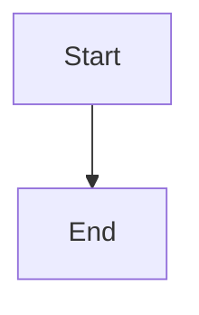

# Slidev 演示系统管理技术设计

## 文档信息

- **版本**: 1.0
- **日期**: 2026-04-16
- **状态**: 草案
- **关联需求**: `./requirements.md`

## 1. 架构设计

### 1.1 总体架构

```
┌─────────────────────────────────────┐
│       Slidev Workspace Root         │
│    (shared dependencies + tools)    │
└─────────────────────────────────────┘
              │
    ┌─────────┴─────────┐
    │                   │
┌───▼────────┐    ┌─────▼─────────┐
│ Common     │    │ Demo Topics   │
│ Config     │    │ (Decks)       │
└────────────┘    └───────────────┘
```

### 1.2 目录结构

```
slidev/
├── common/                  # 共享资源和配置
│   ├── styles/             # 共享样式
│   ├── components/         # Vue 组件
│   ├── layouts/            # 布局模板
│   └── themes/             # 主题配置
├── flutter-intro/          # Flutter 介绍
├── webassembly-intro/      # WebAssembly 介绍
├── webgl-basics/           # WebGL 基础
├── tailwindcss-deep-dive/  # TailwindCSS 深入
└── ...                     # 其他演示主题
```

## 2. 技术方案

### 2.1 Workspace 配置

#### 2.1.1 pnpm-workspace.yaml

```yaml
packages:
  - 'slidev/*'
```

#### 2.1.2 共享依赖

在 `slidev/common/package.json` 中声明共享依赖，各演示项目继承使用。

### 2.2 演示项目管理

#### 2.2.1 标准目录结构

```
slidev/topic-name/
├── components/             # 本地 Vue 组件
├── public/                 # 静态资源
├── snippets/               # 代码片段
├── styles/                 # 本地样式
├── slides.md               # 演示内容
├── package.json            # 项目配置
└── README.md               # 说明文档
```

#### 2.2.2 package.json 模板

```json
{
  "name": "@workspace/slidev-topic-name",
  "type": "module",
  "scripts": {
    "dev": "slidev slides.md --port 3030",
    "build": "slidev build slides.md",
    "export": "slidev export slides.md",
    "preview": "slidev preview slides.md"
  },
  "dependencies": {
    "@slidev/cli": "^0.49.0",
    "vue": "^3.4.0"
  },
  "devDependencies": {
    "@slidev/theme-default": "latest",
    "@slidev/theme-seriph": "latest"
  }
}
```

### 2.3 开发服务器配置

#### 2.3.1 端口分配

为避免冲突，每个演示使用不同端口：

```
flutter-intro:       3030
webassembly-intro:   3031
webgl-basics:        3032
tailwindcss-deep:    3033
...
```

#### 2.3.2 配置方式

方案 1: package.json scripts
```json
{
  "scripts": {
    "dev": "slidev slides.md --port 3030"
  }
}
```

方案 2: `.env` 文件
```
SLIDEV_PORT=3030
```

### 2.4 主题和样式设计

#### 2.4.1 基础主题配置

```yaml title=frontmatter
---
theme: default
title: 'Flutter 介绍'
author: '作者名'
class: text-center
highlighter: shiki
transition: slide-left
---
```

#### 2.4.2 自定义样式

```vue title=styles/custom.css
:root {
  --slidev-theme-primary: #3498db;
}

.slidev-code {
  font-size: 14px;
}
```

#### 2.4.3 共享主题

在 `slidev/common/themes/` 下创建组织统一的视觉风格。

### 2.5 布局设计

#### 2.5.1 标准布局

```yaml
---
layout: center  # 居中布局
---

# 标题页
```

#### 2.5.2 两列布局

```markdown
---
layout: two-cols
---

# 左侧内容

::right::

# 右侧内容
```

#### 2.5.3 自定义布局

在 `layouts/` 目录下创建自定义布局组件。

## 3. 内容组织

### 3.1 Markdown 结构

```markdown
---
theme: default
---

# 演示标题

## 第一章节

### 要点 1

- 要点说明
- 代码示例

```ts
function hello() {
  return 'Hello, World!'
}
```

---

# 下一节
```

### 3.2 代码示例

#### 3.2.1 基础代码块

````markdown
```ts
const message = 'Hello'
```
````

#### 3.2.2 代码高亮

````markdown
```ts {1,3-5}
const message = 'Hello'
const name = 'World'

function greet() {
  console.log(message + ' ' + name)
}
```
````

#### 3.2.3 Monaco 编辑器

````markdown
```ts {monaco}
const message = 'Hello'
```
````

### 3.3 图表支持

#### 3.3.1 Mermaid

````markdown

````

#### 3.3.2 LaTeX 公式

```markdown
公式行内：$x = \frac{-b \pm \sqrt{b^2 - 4ac}}{2a}$

块级公式：
$$
x = \frac{-b \pm \sqrt{b^2 - 4ac}}{2a}
$$
```

### 3.4 图片资源

```
/public/images/
├── flutter-logo.png
├── architecture-diagram.png
└── ...
```

使用方式：
```markdown

```

## 4. 构建和导出

### 4.1 开发模式

```bash
pnpm run dev
```

启动本地开发服务器，支持热更新。

### 4.2 生产构建

```bash
pnpm run build
```

生成 SPA 静态站点（`dist/` 目录）。

### 4.3 PDF 导出

```bash
pnpm run export
```

生成 PDF 文件（`export.pdf`）。

#### 4.3.1 导出优化

- 调整页面大小（A4 / 16:9）
- 优化字体嵌入
- 减少文件大小

### 4.4 PNG 导出

```bash
pnpm run export:png
```

将每页导出为 PNG 图片。

## 5. 预览和部署

### 5.1 本地预览

```bash
pnpm run preview
```

在浏览器中预览构建结果。

### 5.2 在线部署

#### 5.2.1 静态托管

支持的部署平台：

| 平台 | 部署方式 |
|------|----------|
| GitHub Pages | 推送到 gh-pages 分支 |
| Vercel | 连接 Git 仓库自动部署 |
| Netlify | 拖拽 dist 目录或 Git 集成 |
| Cloudflare Pages | Git 集成 |

#### 5.2.2 部署配置示例

```yaml #vercel.json
{
  "outputDirectory": "dist",
  "installCommand": "pnpm install"
}
```

### 5.3 演示录制

使用 Slidev 内置录制功能：

1. 启动开发服务器
2. 按 `R` 键进入录制模式
3. 开始录制和演讲

## 6. 接口设计

### 6.1 Slidev CLI 接口

所有操作通过 Slidev CLI 完成：

```bash
slidev dev slides.md     # 开发模式
slidev build slides.md   # 生产构建
slidev export slides.md  # 导出 PDF
```

### 6.2 Vue 组件接口

自定义组件通过 props 接收数据：

```vue
<script setup>
defineProps({
  title: String,
  data: Object
})
</script>
```

## 7. 错误处理

### 7.1 编译错误

- Slidev 会提示 Markdown 语法错误
- Vue 组件编译错误会高亮显示
- 代码语法错误会有详细堆栈

### 7.2 资源丢失

- 图片路径错误会显示占位符
- 缺失的文件会有警告日志

### 7.3 端口冲突

- 自动检测端口占用
- 建议切换端口或关闭冲突应用

## 8. 迁移计划

### 8.1 阶段 1: 整理现有演示

- [ ] 统计 slidev/ 下所有演示
- [ ] 检查每个演示的完整性
- [ ] 更新过时的依赖

### 8.2 阶段 2: 配置标准化

- [ ] 统一 package.json 结构
- [ ] 配置共享依赖
- [ ] 创建公共主题和布局

### 8.3 阶段 3: 文档完善

- [ ] 为每个演示添加 README
- [ ] 创建使用指南
- [ ] 配置 CI/CD（可选）

## 9. 工具和插件

### 9.1 VS Code 扩展

推荐安装插件：

- `antfu.slidev` - Slidev 支持
- `Markdown Preview Enhanced` - Markdown 预览
- `Prettier` - 格式化

### 9.2 Prettier 配置

```js title=prettier.config.js
export default {
  plugins: ['prettier-plugin-slidev'],
  overrides: [{ files: 'slides.md', options: { parser: 'slidev' } }]
}
```

### 9.3 Eject 主题

如需深度自定义主题：

```bash
slidev theme eject
```

## 10. 最佳实践

### 10.1 内容组织

- 每页聚焦一个主题
- 使用清晰的标题层级
- 适度使用动画效果

### 10.2 代码示例

- 保持代码简洁
- 使用语法高亮
- 添加必要的注释

### 10.3 视觉设计

- 保持一致的配色
- 适度使用图片
- 注意对比度和可读性

## 11. 参考资料

- Slidev 官方文档：https://sli.dev
- Slidev GitHub: https://github.com/slidevjs/slidev
- 主题库：https://sli.dev/resources/theme-gallery
- 示例集：https://sli.dev/resources/showcases
