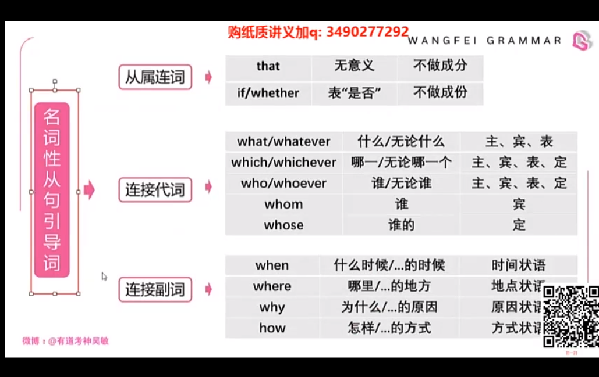

## 概述

* 需要用 `连词+句子` 做主句中某个名词性成分，相当于主句被挖出来一部分，但是这个句子需要从属连词连接，变成从句；
* 可以是名词的有，主语，表语，宾语，宾补，同位语；
* 名词性从句的语序必须是陈述语气；`即：连接词+主语+谓语`

## 引导词

* that
  - 无实际意义的that+简单句构成名词性从句，`即陈述句做名词性从句`；

* whether/if
  - 表“是否”的whether/if+简单句构成名词性从句，`即一般疑问句做名词性成分`；

* 特殊疑问词（what,who,whose,which,when,where,how,why）
  - 疑问词引导的名词性从句，`即特殊疑问句作名词性成分`；

## 原则

* 主句只是奠定了时态的基调，并不能完全左右从句时态，要根据说话人想表达的意思去决定时态的选择，从句的时态并没有什么特殊性。

## 主语从句

## 表语从句

## 宾语从句

* 动宾：在动词后面
* 介宾：在介词后面（动词词组以介词结尾：be interested in）
* 形容词后

## 同位语从句

## 连接词

