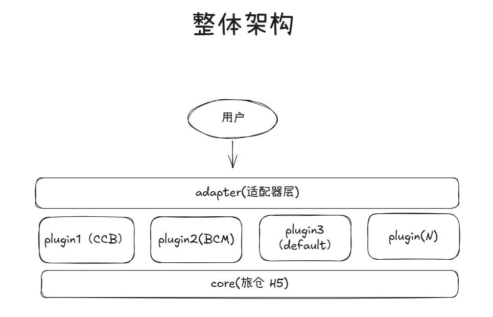
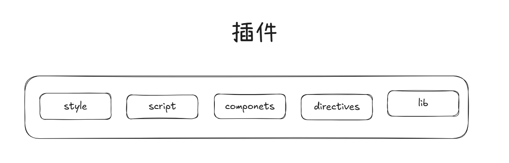
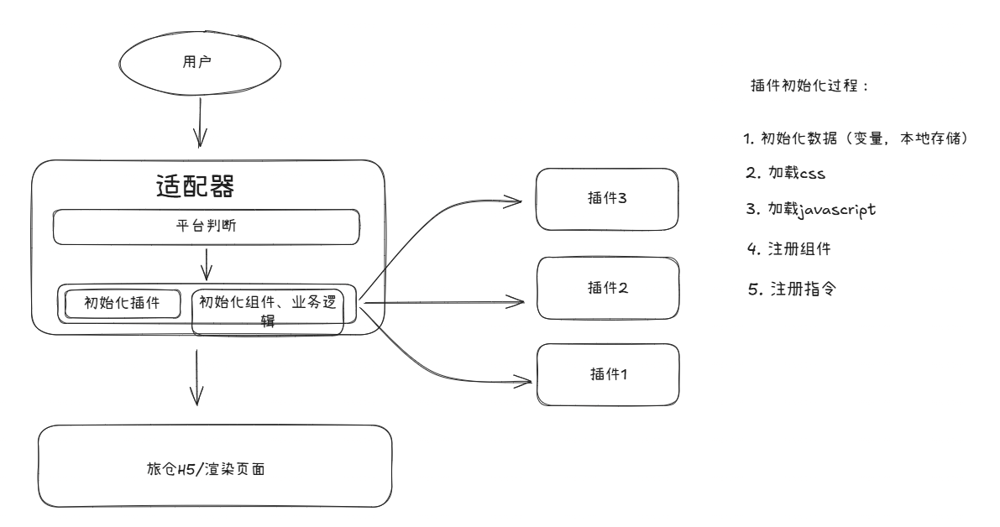

# 旅仓H5插件化架构改造

## 改造背景

  旅仓H5分销系统，首先是旅仓平台的分销系统，所以旅仓平台就是我们默认的分销商，为了扩大业务规模，我们就需要支持更多的分销商接入分销系统，一般来说，分销商通过嵌入我们的h5分销系统以及指定的接口参数，就可以接入我们的分销系统中来。

  但是也难免会有一些分销商，他们希望能够定制自己的分销系统，不如主题，能力（登录，支付等），这样的话，我们就需要支持分销商定制化的分销系统了。

  目前的开发方案都是在核心旅仓项目中直接根据环境判断进行开发处理，所以有以下问题：

 
  
  1. 可维护性差：各个平台判断以及处理逻辑都散落在各个页面中，维护困难，容易遗漏。
  2. 可读性差：各种平台逻辑混杂在一起，导致代码可读性差，难以理解和维护。
  3. 扩展性差：当需要添加新的分销商平台时，需要修改大量的代码，容易引入新的bug。

  这些问题会导致开发效率低下，维护成本高，甚至可能会影响到系统的稳定性和用户体验，项目逐渐腐化的情况。

## 改造方案

  为了解决上述问题，我们决定采用插件化架构来改造旅仓H5分销系统。插件化架构是一种将系统功能模块化、独立化的设计方法，可以提高系统的可维护性、可扩展性，同时也是制定了基本的开发标准。

  我们将核心旅仓H5项目作为一个基础平台，提供公共的页面和核心逻辑，然后将不同分销商的定制化功能封装成独立的插件，这些插件可以根据需要进行加载，从而实现分销商定制化的分销系统。

  通过这种方式，我们可以将不同分销商的逻辑隔离开来，避免了代码混杂的问题，提高了代码的可读性和维护性。同时，当需要添加新的分销商平台时，只需要开发一个新的插件，而不需要修改核心旅仓项目的代码，从而提高了系统的扩展性。

## 架构图

## 适配器层

1. 组件适配模块：用于适配不同分销商平台的组件差异，比如登录组件，支付组件等。

2. 业务适配模块：用于适配不同分销商平台的业务逻辑差异，比如下单处理逻辑，支付逻辑等。

## 插件层

1. style：分销商平台的样式，比如主题色，字体等。
2. script：分销商平台的脚本，比如平台 SDK。
3. component：分销商平台需要提供的特定的Vue组件。
4. directive：分销商平台需要提供的特定的Vue指令。
5. lib: 分销商平台的能力封装库，js sdk 封装，定制逻辑封装等。

## 流程图

