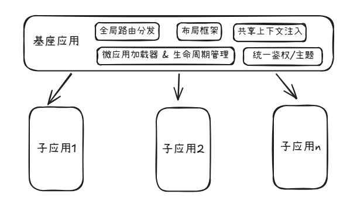

## 基于Micro-Frontend架构的系统设计与实现

## 一、术语：请对本领域的技术词语进行解释说明，如果有英文要给出中文注释或解释

1. 架构设计（Architecture Design）：指在软件开发过程中，对系统的整体结构进行规划和设计，包括系统的组成部分、各部分之间的关系以及系统的运行环境等方面的设计。
2. 架构实现（Architecture Implementation）：指将设计好的架构方案转化为实际可运行的软件系统的过程，包括编码、测试、部署等步骤。
3. Micro-Frontend（微前端）：指将前端应用拆分成多个独立的、可部署的模块，每个模块由不同的团队负责开发和维护，通过特定的机制将这些模块集成到一起，从而实现前端应用的灵活性和可扩展性。
4. 无界（wujie）： 指一种基于微前端架构的前端集成方案，能够实现多个前端子应用的稳定集成与高效协同，满足大型复杂业务系统对灵活扩展、独立运维和高可用运行的技术要求。
5. 前端应用重构（Front-end Application Refactoring）：指对现有前端系统进行重新设计和实现的过程，旨在解决现有系统中存在的技术问题，提高系统的灵活性、可扩展性和可维护性。
6. JS （JavaScript）：一种广泛使用的编程语言，主要用于开发网页和前端应用。
7. TS （TypeScript）：一种由微软开发的开源编程语言，是 JavaScript 的一个超集，添加了静态类型和面向对象编程的特性，能够提高代码的可维护性和可读性。
8. Vue2：Vue.js 的第二个主要版本，提供了响应式数据绑定和组件化开发的能力，广泛应用于前端开发领域。
9. Vue3：Vue.js 的第三个主要版本，引入了 Composition API、Teleport 等新特性，提升了性能和开发体验。
10. Vuex：Vue.js 的状态管理库，提供了集中式的状态管理方案，适用于中大型应用。
11. Pinia：Vue.js 的新一代状态管理库，提供了更简洁的 API 和更好的 TypeScript 支持，适用于各种规模的应用。
12. bug: 指软件系统中的错误或缺陷，可能导致系统功能异常、性能下降或安全漏洞等问题。


## 二、本技术方案的发明点概述：请用一段话描述本发明相对于现有技术的改进之处。

  以往的前端应用在进行较大的技术栈升级时，往往需要对整个前端应用进行重构，导致开发周期长、上线风险高以及系统稳定性较差等问题。
    
  本方案提出了一种基于微前端架构的前端应用重构设计与实现方案，通过微前端系统将新老前端应用进行拆分和集成，使得新老应用可以同时运行，从而达到渐进式重构老系统，降低了开发周期和上线风险，大大提高了系统的稳定性和可维护性。系统重构，从全量变为了增量。
     

## 三、背景技术：做这项发明之前该技术现状的详细描述。

  微前端系统出现之前，前端应用的重构通常需要对整个前端应用进行重构，技术栈的升级往往伴随着全量的应用重构。

  框架的升级往往会引入新的特性和改动，导致现有代码无法兼容，新的编程范式，新的组件库等都可能导致现有代码无法兼容，因此需要对整个前端应用进行重构，以适应新的技术栈。

  编程语言从JS升级到TS，框架从Vue2升级到Vue3，状态管理库从Vuex升级到Pinia等，这些技术栈的升级往往伴随着全量的应用重构。


## 四、背景技术的技术问题（指出背景技术在哪些地方存在哪些缺陷和不足）。

```text
解决的问题必须是技术问题，例如传输速度低、硬件成本高等，而非个人体验（如美观）

如果技术问题有多个，需要都列出来，并指出最主要解决的技术问题
```

系统重构的全量化方式存在以下技术问题：
  
1. 导致开发周期长: 由于需要对整个前端应用进行重构，开发团队需要投入大量的时间和资源来完成重构工作，导致开发周期长，影响业务的快速迭代和响应市场需求的能力。

2. 上线风险高: 由于重构涉及到整个前端应用的改动，任何一个环节出现问题都可能导致系统上线失败，影响用户体验和业务连续性。同时，在重构过程中，可能会引入新的 bug，增加系统的不稳定性。

3. 系统稳定性较差: 由于重构过程中涉及到大量的代码改动和系统调整，可能会导致系统在重构过程中出现不稳定的情况，影响用户体验和业务连续性。给系统的维护和升级带来了很大的挑战，尤其是在需要频繁迭代和快速响应市场需求的情况下，更是难以满足业务发展的需求。

  这种全量的应用重构方式，不仅需要大量的开发资源和时间，还可能导致系统在重构过程中出现不稳定的情况，影响用户体验和业务连续性。给系统的维护和升级带来了很大的挑战，尤其是在需要频繁迭代和快速响应市场需求的情况下，更是难以满足业务发展的需求。


## 五、本案的详细阐述，即您是通过怎样的技术手段和方法解决的上述技术问题的。（本部分为重点内容，需要将代码在运行时所要实现的步骤进行详细描述。）说明：

```text
技术方案描述中需要写清楚数据的流向，包括数据如何产生、中间涉及到哪些处理以及最终输出的是什么数据的整个过程；

用文字结合图示来描述技术方案，其中图示包括但不限于流程图、界面图、时序图、系统架构图、网络拓扑图、原理图、应用环境图等；

写清楚每个步骤的执行主体，例如是由终端执行还是由服务器来执行；
请多举例和结合具体的应用场景进行描述；

注意同一个东西请用同一个词来表述；

不要粘贴代码，如果确实需通过代码说明，交底中的代码不能超过10行,并需要提供每一行代码的注释。

具体包括以下几种情况：

1）如果涉及软件产品，分别从产品侧和技术侧两个角度进行描述，产品侧可描述软件产品即前端的形态（提供界面图），技术侧描述后台的数据处理（请提供流程图）；

2）如果涉及到多端交互，需要从每一端出发写出该端所涉及到的处理（请提供时序图）

3）如果涉及到界面，需要写出界面展示了哪些内容（请提供界面图）；

4）如果涉及到算法，需要写出具体的算法逻辑规则；

5）如果涉及到公式，需要写出具体的公式形式，并给出公式中每个参数的物理含义；

6）如果涉及到系统架构，需要描述系统中各组成部分的作用、各组成部分之间的关系以及各组成部分之间的交互过程（请提供系统架构图、网络拓扑图等）。
```

  为解决上述技术问题，本方案采用基于微前端架构的系统设计与实现方案。具体而言，本方案将前端应用拆分成多个独立的模块，每个模块由不同的开发人员负责开发，通过特定的机制将这些模块集成到一起，从而实现了前端应用的灵活性与渐进式的重构。

  微前端架构是也被称为前端的微服务架构，能够将前端应用拆分成多个独立的模块，每个模块由不同的开发人员负责开发，通过特定的机制基座应用将这些模块集成到一起，实现子系统的调度。


1） 基本的微前端架构图




1. 基座应用：负责整个前端系统的调度和管理，协调各个子应用的运行和交互。

  1.1 全局路由分发：基座应用负责管理前端应用的路由，根据用户的操作和请求，动态加载和卸载子应用，实现页面的切换和功能的展示。

  1.2 布局框架：基座应用提供统一的布局框架，确保各个子应用在视觉和交互上的一致性，提升用户体验。

  1.3 共享上下文注入：基座应用负责注入共享的上下文信息，例如用户信息、权限信息等，使得各个子应用能够共享这些信息，提升系统的协同能力和用户体验。

  1.4 微应用通信机制：基座应用提供微应用之间的通信机制，例如事件总线、全局状态管理等，使得各个子应用能够进行数据交换和功能协同，提升系统的灵活性和可扩展性。

  1.5 微应用加载器：基座应用负责加载和卸载子应用，根据用户的操作和请求，动态加载和卸载子应用，实现页面的切换和功能的展示。

  1.6 微应用生命周期：基座应用管理微应用的生命周期，包括初始化、挂载、更新和卸载等阶段，确保微应用在不同状态下的正确运行。

  1.7 鉴权：基座应用负责管理系统的鉴权机制，确保用户的身份验证和权限控制，提升系统的安全性。

  1.8 主题：基座应用提供统一的主题管理机制，确保各个子应用在视觉上的一致性，提升用户体验。


2. 子应用（也叫微应用）：独立的前端模块，由不同的开发人员负责开发和维护，可以独立部署和运行。

  2.1 独立开发和部署：每个子应用由不同的开发人员负责开发和维护，可以独立部署和运行，提升系统的灵活性和可扩展性。

  2.2 技术栈独立：每个子应用可以使用不同的技术栈进行开发，例如 Vue、React、Angular 等，满足不同团队的技术偏好和业务需求。

  2.3 独立路由：每个子应用可以拥有自己的路由系统，管理自己的页面和功能，实现页面的切换和功能的展示。

  2.4 独立状态管理：每个子应用可以拥有自己的状态管理系统，管理自己的数据和状态，实现数据的共享和功能的协同。

  2.5 独立生命周期：每个子应用可以拥有自己的生命周期管理机制，确保在不同状态下的正确运行。
    

所以，基于微前端架构，我们可以将重构的目标新系统作为基座应用，将现有的老旧系统作为子应用，通过微前端框架将老系统的页面根据路由加载到基座应用中，实现新老系统的同时运行，从而达到渐进式重构老系统的目的，降低了开发周期和上线风险，大大提高了系统的稳定性和可维护性。当新系统的功能逐步完善和稳定后，可以逐步替换掉老系统的功能，最终实现整个前端应用的重构。

2）基于微前端架构的系统执行流程


  如上图所示，基于微前端架构的系统执行流程可描述为：当用户在终端页面中访问目标业务页面或者执行菜单切换、链接跳转等操作时，首先触发浏览器地址变化；基座应用监听到路由变化后，对当前访问路径进行拦截和识别，并根据预先配置的路由映射关系判断应当加载的目标子应用。

  在确定目标子应用后，基座应用通过微前端加载器动态请求该子应用对应的入口资源，包括 JavaScript 文件和 CSS 文件。所述入口资源从子应用部署地址获取后，由基座应用进行页面入口解析，并据此创建对应的子应用实例，以便后续执行子应用生命周期调度。

  在子应用实例创建完成后，基座应用优先调用子应用的 bootstrap 生命周期，用于完成子应用运行所需的初始化处理，包括基础配置装载、运行上下文准备以及必要的全局能力注册。随后，基座应用继续调用子应用的 mount 生命周期，将子应用挂载到指定的页面容器中，从而使子应用界面能够在基座应用内展示。

  为保证各子应用在同一浏览器环境下运行时互不干扰，基座应用在挂载过程中为子应用创建独立的沙箱环境。所述沙箱环境用于隔离子应用对全局变量、样式作用域以及运行时上下文的影响，降低不同子应用之间发生资源冲突和状态污染的风险。

  在完成沙箱创建及挂载容器准备后，子应用进一步执行其内部路由初始化逻辑，根据当前访问路径匹配对应的功能页面和组件树，并驱动前端渲染引擎生成对应的 DOM 结构，最终将子应用页面内容渲染到基座应用指定区域，实现用户可见的业务界面展示。通过上述流程，可以在不停止原有系统运行的前提下，将不同技术栈或不同版本的前端模块按路由进行动态接入，从而支持前端系统的渐进式重构与平滑迁移。


3）真实的业务场景下的系统架构图


     

  基座作为新系统主体，包含统一路由层、Vue 核心运行时及多个功能模块（首页、列表页等），其中绿色区域标识由微前端框架托管的“子应用容器”，用于动态嵌入老系统。老系统作为独立子应用，保留完整 Vue 技术栈与内部路由结构，仅通过入口被基座按需加载，实现“零侵入”集成。

  此架构优势在于：
  1. 业务不中断，新老功能并行运行；②
  2. 技术栈兼容（均为 Vue），降低通信成本；
  3. 利用沙箱机制保障样式/JS 隔离，避免污染。

4）目录结构

```
webapp                         # 前端项目根目录
├─ .env                        # 环境变量基础配置
├─ .env.development            # 开发环境变量
├─ .env.production             # 生产环境变量
├─ .env.qa                     # 测试环境变量
├─ .env.staging                # 预发布环境变量
├─ .eslintignore               # ESLint 忽略配置
├─ .eslintrc.js                # ESLint 配置文件
├─ .npmrc                      # npm 配置文件
├─ .prettierrc.js              # Prettier 配置文件
├─ .yarnrc                     # Yarn 配置文件
├─ build-front-product.sh      # 生产环境构建脚本
├─ build-front-qa.sh           # QA 环境构建脚本
├─ build-front-stage.sh        # 预发布环境构建脚本
├─ build-front-test.bat        # Windows 测试环境构建脚本
├─ doc                         # 项目文档目录
├─ index.html                  # Vite HTML 入口模板
├─ package-lock.json           # npm 依赖锁定文件
├─ package.json                # 项目依赖与脚本配置
├─ public                      # 静态资源目录
│  └─ icon.ico                 # 网站图标
├─ README.md                   # 项目说明文档
├─ src                         # 源代码目录
│  ├─ api                      # 接口请求相关代码
│  │  ├─ api                   # 接口封装实现
│  │  └─ types                 # 接口类型定义
│  ├─ App.vue                  # 应用根组件
│  ├─ assets                   # 本地静态资源
│  ├─ components               # 通用组件目录
│  ├─ constants                # 常量定义
│  ├─ directives               # 自定义指令
│  ├─ hooks                    # 组合式 Hooks
│  ├─ layout                   # 布局模块
│  ├─ main.ts                  # 应用入口文件（子应用注册入口）
│  ├─ router                   # 路由配置
│  ├─ stores                   # Pinia 状态管理
│  ├─ theme                    # 主题样式目录
│  ├─ types                    # 全局类型声明
│  ├─ utils                    # 工具函数
│  └─ views                    # 页面模块目录
│     ├─ error                 # 错误页面
│     │  ├─ 401.vue            # 401 页面
│     │  └─ 404.vue            # 404 页面
│     ├─ home                  # 首页模块
│     │  ├─ index.scss         # 首页样式
│     │  └─ index.vue          # 首页页面
│     ├─ login                 # 登录页面模块
│     │  ├─ component          # 登录页子组件
│     │  │  └─ account.vue     # 账号登录表单
│     │  ├─ cross-login.vue    # 跨系统登录页
│     │  └─ index.vue          # 登录主页
│     └─ multPlatform          # 子应用容器模块
│        └─ index.vue          # 子应用容器入口
├─ tsconfig.json               # TypeScript 配置文件
└─ vite.config.ts              # Vite 构建配置文件

```

## 六、第五项的技术手段产生了什么技术效果（通常为克服了第四项所指出的技术问题）。

    通过采用基于微前端架构的系统设计与实现方案，本方案能够实现前端应用的渐进式重构，降低了开发周期和上线风险，提高了系统的稳定性和可维护性。系统重构，从全量变为了增量。
    
1. 降低开发周期: 通过将前端应用拆分成多个独立的模块，不同开发人员可以同时进行开发和维护，从而大大缩短了开发周期，提升了业务的快速迭代和响应市场需求的能力。
2. 降低上线风险: 通过微前端架构的设计，新老应用可以同时运行，逐步替换旧系统的功能，从而降低了上线风险，确保了系统的稳定性和业务连续性。
3. 提高系统稳定性: 通过渐进式重构的方式，系统在重构过程中保持稳定，避免了全量重构可能带来的不稳定情况，提升了用户体验和业务连续性。

    这种基于微前端架构的系统设计与实现方案，不仅能够满足业务发展的需求，还能够提高系统的灵活性和可扩展性，为前端应用的持续迭代和升级提供了有力的支持。
    


## 八、参考文献（对于理解交底书中的技术方案有帮助的专利/论文/期刊，如有则填写）

1. 微前端（Micro-Frontends）: https://micro-frontends.org/
2. 无界（wujie）: https://wujie-micro.github.io/doc/
3. 乾坤（qiankun）: https://qiankun.umijs.org/zh/guide
4. 无界微前端是如何渲染子应用的：https://zhuanlan.zhihu.com/p/618063377
5. 微前端的那些事儿：https://github.com/phodal/microfrontends