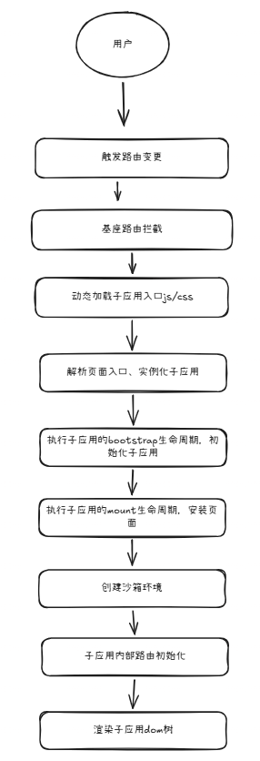
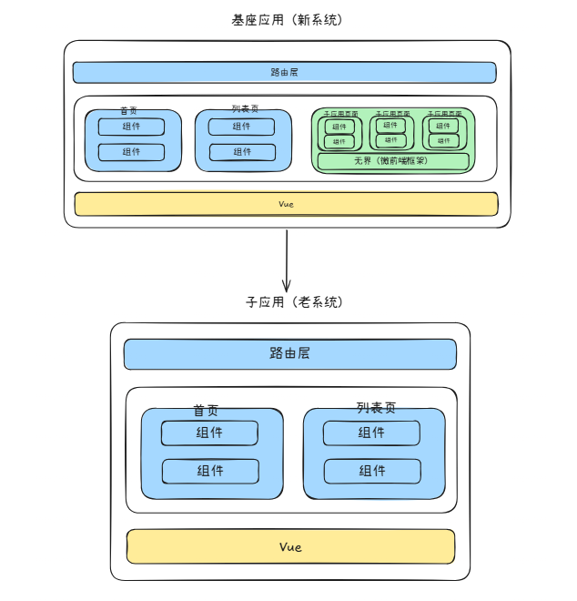

## 基于Micro-Frontend架构的系统重构设计方案

## 一、术语：请对本领域的技术词语进行解释说明，如果有英文要给出中文注释或解释

1. 架构设计（Architecture Design）：指在软件开发过程中，对系统的整体结构进行规划和设计，包括系统的组成部分、各部分之间的关系以及系统的运行环境等方面的设计。
2. 架构实现（Architecture Implementation）：指将设计好的架构方案转化为实际可运行的软件系统的过程，包括编码、测试、部署等步骤。
3. Micro-Frontend（微前端）：指将前端系统拆分成多个独立的、可部署的模块，每个模块由不同的团队负责开发和维护，通过特定的机制将这些模块集成到一起，从而实现前端系统的灵活性和可扩展性。
4. 无界（wujie）：指一种基于微前端架构的前端集成方案，能够实现多个前端子应用的稳定集成与高效协同，满足大型复杂业务系统对灵活扩展、独立运维和高可用运行的技术要求。
5. 前端系统重构（Front-end System Refactoring）：指对现有前端系统进行重新设计和实现的过程，旨在解决现有系统中存在的技术问题，提高系统的灵活性、可扩展性和可维护性。
6. JS（JavaScript）：一种广泛使用的编程语言，主要用于开发网页和前端系统。
7. TS（TypeScript）：一种由微软开发的开源编程语言，是 JavaScript 的一个超集，添加了静态类型和面向对象编程的特性，能够提高代码的可维护性和可读性。
8. Vue2：Vue.js 的第二个主要版本，提供了响应式数据绑定和组件化开发的能力，广泛应用于前端开发领域。
9. Vue3：Vue.js 的第三个主要版本，引入了 Composition API、Teleport 等新特性，提升了性能和开发体验。
10. Vuex：Vue.js 的状态管理库，提供了集中式的状态管理方案，适用于中大型应用。
11. Pinia：Vue.js 的新一代状态管理库，提供了更简洁的 API 和更好的 TypeScript 支持，适用于各种规模的应用。
12. bug：指软件系统中的错误或缺陷，可能导致系统功能异常、性能下降或安全漏洞等问题。
13. 上线风险：指在软件系统发布或更新过程中可能出现的问题或挑战，可能导致系统不稳定、用户体验下降或业务中断等情况。
14. 系统稳定性：指软件系统在不同环境和条件下能够持续正常运行的能力。
15. React：是一个用于构建用户界面的 JavaScript 库，提供了组件化开发的能力，广泛应用于前端开发领域。
16. Angular：是一个由 Google 维护的开源前端框架，提供了全面的解决方案，包括数据绑定、依赖注入和组件化开发等，适用于构建大型复杂的前端系统。


## 二、本技术方案的发明点概述：请用一段话描述本发明相对于现有技术的改进之处。

  以往的前端系统在进行较大的技术栈升级，甚至为了提升系统性能而切换到底层框架时，往往需要对整个前端系统进行重构。
  
  通常会基于新版本的开发框架，甚至全新的开发框架，重新创建一个新的前端系统，以便对老项目进行迁移和重构，并在全部迁移完成后再投入使用。该方式容易导致开发周期长、上线风险高以及系统稳定性较差等问题。
    
  本方案提出了一种基于微前端架构的前端系统重构设计与实现方案，通过微前端架构对新老前端系统进行拆分和集成，使新老系统可以同时运行，从而实现对老系统的渐进式重构，降低开发周期和上线风险，并显著提高系统的稳定性和可维护性。系统重构由全量模式转变为增量模式。
     

## 三、背景技术：做这项发明之前该技术现状的详细描述。

  在微前端架构应用于系统重构之前，前端系统在进行技术栈升级时通常需要对整个前端系统进行整体重构，技术栈升级往往伴随着全量的应用重构。

  为了通过框架升级提升性能和技术先进性，框架升级往往会引入新的特性和改动，导致现有代码无法兼容；新的编程范式和新的组件库等也可能导致现有代码无法兼容，因此需要对整个前端系统进行重构，以适应新的技术栈。

  为了实现类型安全与大规模编程，编程语言从 JS 升级到 TS，框架从 Vue2 升级到 Vue3，状态管理库从 Vuex 升级到 Pinia 等，这些技术栈升级往往伴随着全量的应用重构。

  为了提升性能而替换开发框架，例如从 Vue 切换到 React，或者从 React 切换到 Angular 等，这些框架切换往往需要对整个前端系统进行重构，以适应新的框架特性和开发模式。

  这些决策需要等到全部迁移重构完成后，应用才会投入使用，这会导致开发周期长、上线风险高以及系统稳定性较差等问题。

## 四、背景技术的技术问题（指出背景技术在哪些地方存在哪些缺陷和不足）。

系统重构的全量化方式存在以下技术问题：
  
1. 导致开发周期长: 由于需要对整个前端系统进行重构，开发团队需要投入大量的时间和资源来完成重构工作，导致开发周期长，影响业务的快速迭代和响应市场需求的能力。

2. 上线风险高: 由于重构涉及到整个前端系统的改动，任何一个环节出现问题都可能导致系统上线失败，影响用户体验和业务连续性。同时，在重构过程中，可能会引入新的 bug，增加系统的不稳定性。

3. 系统稳定性较差: 由于重构过程中涉及到大量的代码改动和系统调整，可能会导致系统在重构过程中出现不稳定的情况，影响用户体验和业务连续性。给系统的维护和升级带来了很大的挑战，尤其是在需要频繁迭代和快速响应市场需求的情况下，更是难以满足业务发展的需求。

  这种全量的应用重构方式，不仅需要大量的开发资源和时间，还可能导致系统在重构过程中出现不稳定的情况，影响用户体验和业务连续性。给系统的维护和升级带来了很大的挑战，尤其是在需要频繁迭代和快速响应市场需求的情况下，更是难以满足业务发展的需求。


## 五、本案的详细阐述，即您是通过怎样的技术手段和方法解决的上述技术问题的。（本部分为重点内容，需要将代码在运行时所要实现的步骤进行详细描述。）说明：

  为解决上述技术问题，本方案采用基于微前端架构的系统设计与实现方案。具体而言，本方案将前端系统拆分成多个独立的模块，每个模块由不同的开发人员负责开发，通过特定的机制将这些模块集成到一起，从而实现了前端系统的灵活性与渐进式的重构。

  微前端架构也被称为前端的微服务架构，能够将前端系统拆分成多个独立的模块，每个模块由不同的开发人员负责开发，并通过基座应用以特定机制将这些模块集成到一起，实现对子系统的统一调度。


1） 基本的微前端架构图


1. 基座应用：负责整个前端系统的调度和管理，协调各个子应用的运行和交互。

   - 全局路由分发：基座应用负责管理前端系统的路由，根据用户的操作和请求，动态加载和卸载子应用，实现页面的切换和功能的展示。

   - 布局框架：基座应用提供统一的布局框架，确保各个子应用在视觉和交互上的一致性，提升用户体验。

    - 共享上下文注入：基座应用负责注入共享的上下文信息，例如用户信息、权限信息等，使得各个子应用能够共享这些信息，提升系统的协同能力和用户体验。

   - 微应用通信机制：基座应用提供微应用之间的通信机制，例如事件总线、全局状态管理等，使得各个子应用能够进行数据交换和功能协同，提升系统的灵活性和可扩展性。

   - 微应用加载器：基座应用负责加载和卸载子应用，根据用户的操作和请求，动态加载和卸载子应用，实现页面的切换和功能的展示。

   - 鉴权：基座应用负责管理系统的鉴权机制，确保用户的身份验证和权限控制，提升系统的安全性。

   - 主题：基座应用提供统一的主题管理机制，确保各个子应用在视觉上的一致性，提升用户体验。


2. 子应用（也叫微应用）：独立的前端模块，由不同的开发人员负责开发和维护，可以独立部署和运行。

   - 独立开发和部署：每个子应用由不同的开发人员负责开发和维护，可以独立部署和运行，提升系统的灵活性和可扩展性。

   - 技术栈独立：每个子应用可以使用不同的技术栈进行开发，例如 Vue、React、Angular 等，满足不同团队的技术偏好和业务需求。

    - 独立路由：每个子应用可以拥有自己的路由系统，管理自己的页面和功能，实现页面的切换和功能的展示。

   - 独立状态管理：每个子应用可以拥有自己的状态管理系统，管理自己的数据和状态，实现数据的共享和功能的协同。

   - 独立生命周期：每个子应用可以拥有自己的生命周期管理机制，确保在不同状态下的正确运行。
    

  因此，基于微前端架构，可以将重构目标中的新系统作为基座应用，将现有老旧系统作为子应用，通过微前端框架按照路由规则将老系统页面加载到基座应用中，实现新老系统同时运行，从而达到渐进式重构老系统的目的，降低开发周期和上线风险，并显著提高系统的稳定性和可维护性。当新系统功能逐步完善并稳定后，可以逐步替换老系统的功能，最终实现整个前端系统的重构。

2）基于微前端架构的系统执行流程



  基于微前端架构的系统执行流程可描述为：当用户在终端页面中访问目标业务页面或者执行菜单切换、链接跳转等操作时，首先触发浏览器地址变化；基座应用监听到路由变化后，对当前访问路径进行拦截和识别，并根据预先配置的路由映射关系判断应当加载的目标子应用。

  在确定目标子应用后，基座应用通过微前端加载器动态请求该子应用对应的入口资源，包括 JavaScript 文件和 CSS 文件。所述入口资源从子应用部署地址获取后，由基座应用进行页面入口解析，并据此创建对应的子应用实例，以便后续执行子应用生命周期调度。

  在子应用实例创建完成后，基座应用优先调用子应用的 bootstrap 生命周期，用于完成子应用运行所需的初始化处理，包括基础配置装载、运行上下文准备以及必要的全局能力注册。随后，基座应用继续调用子应用的 mount 生命周期，将子应用挂载到指定的页面容器中，从而使子应用界面能够在基座应用内展示。

  为保证各子应用在同一浏览器环境下运行时互不干扰，基座应用在挂载过程中为子应用创建独立的沙箱环境。所述沙箱环境用于隔离子应用对全局变量、样式作用域以及运行时上下文的影响，降低不同子应用之间发生资源冲突和状态污染的风险。

  在完成沙箱创建及挂载容器准备后，子应用进一步执行其内部路由初始化逻辑，根据当前访问路径匹配对应的功能页面和组件树，并驱动前端渲染引擎生成对应的 DOM 结构，最终将子应用页面内容渲染到基座应用指定区域，实现用户可见的业务界面展示。通过上述流程，可以在不停止原有系统运行的前提下，将不同技术栈或不同版本的前端模块按路由进行动态接入，从而支持前端系统的渐进式重构与平滑迁移。


3）真实的业务场景下的系统架构图


     

  在真实业务场景下，整个前端系统由基座应用和至少一个子应用协同构成。其中，基座应用作为重构后的新系统主体，负责统一路由管理、页面布局编排、用户认证状态维护、共享上下文注入以及微应用调度控制；子应用作为待迁移的老系统模块，保留原有业务页面、内部路由及运行逻辑，并通过预设接入入口被基座应用按需加载。

  基座应用中设置有路由判定单元，用于在检测到用户访问请求后，根据当前访问路径、菜单标识或者预配置的迁移规则，判断目标功能由新系统模块处理还是由老系统子应用处理。当判定结果对应于老系统子应用时，基座应用将目标子应用加载至预设的子应用容器中。

  基座应用通过对页面容器、导航状态以及公共能力进行统一控制，使得未完成迁移的业务功能仍由老系统承载，已完成迁移的业务功能则由新系统模块直接承载，由此实现按页面粒度或按功能粒度逐步替换老系统的渐进式重构过程。

  在该业务架构下，基座应用可基于迁移进度持续调整路由映射关系。当某一业务页面或者业务模块完成重构并达到上线条件后，基座应用将对应访问路径由老系统子应用切换为新系统模块；对于尚未迁移完成或者运行异常的页面，仍保持由老系统子应用承接访问请求。通过上述方式，无需等待全部功能重构完成即可逐步上线新系统功能，从而在保障业务持续运行的前提下完成前端系统由旧架构向新架构的平滑迁移。

  该架构至少具有以下技术效果：

  1. 通过基座应用统一调度新旧系统模块，实现业务连续运行，避免全量替换导致的系统停机风险；
  2. 通过路由映射与子应用容器机制，实现待迁移功能按页面粒度逐步切换，提升重构过程的可控性；
  3. 通过共享上下文注入机制，保持新老系统之间登录态的一致性，降低跨系统切换带来的状态丢失风险；
  4. 通过隔离运行环境，降低并行运行过程中样式污染、全局变量覆盖和脚本冲突对系统稳定性的影响。

4）目录结构

```
webapp                         # 前端项目根目录
├─ .env                        # 环境变量基础配置
├─ .env.development            # 开发环境变量
├─ .env.production             # 生产环境变量
├─ .env.qa                     # 测试环境变量
├─ .env.staging                # 预发布环境变量
├─ .eslintignore               # ESLint 忽略配置
├─ .eslintrc.js                # ESLint 配置文件
├─ .npmrc                      # npm 配置文件
├─ .prettierrc.js              # Prettier 配置文件
├─ .yarnrc                     # Yarn 配置文件
├─ build-front-product.sh      # 生产环境构建脚本
├─ build-front-qa.sh           # QA 环境构建脚本
├─ build-front-stage.sh        # 预发布环境构建脚本
├─ build-front-test.bat        # Windows 测试环境构建脚本
├─ doc                         # 项目文档目录
├─ index.html                  # Vite HTML 入口模板
├─ package-lock.json           # npm 依赖锁定文件
├─ package.json                # 项目依赖与脚本配置
├─ public                      # 静态资源目录
│  └─ icon.ico                 # 网站图标
├─ README.md                   # 项目说明文档
├─ src                         # 源代码目录
│  ├─ api                      # 接口请求相关代码
│  │  ├─ api                   # 接口封装实现
│  │  └─ types                 # 接口类型定义
│  ├─ App.vue                  # 应用根组件
│  ├─ assets                   # 本地静态资源
│  ├─ components               # 通用组件目录
│  ├─ constants                # 常量定义
│  ├─ directives               # 自定义指令
│  ├─ hooks                    # 组合式 Hooks
│  ├─ layout                   # 布局模块
│  ├─ main.ts                  # 应用入口文件（子应用注册入口）
│  ├─ router                   # 路由配置
│  ├─ stores                   # Pinia 状态管理
│  ├─ theme                    # 主题样式目录
│  ├─ types                    # 全局类型声明
│  ├─ utils                    # 工具函数
│  └─ views                    # 页面模块目录
│     ├─ error                 # 错误页面
│     │  ├─ 401.vue            # 401 页面
│     │  └─ 404.vue            # 404 页面
│     ├─ home                  # 首页模块
│     │  ├─ index.scss         # 首页样式
│     │  └─ index.vue          # 首页页面
│     ├─ login                 # 登录页面模块
│     │  ├─ component          # 登录页子组件
│     │  │  └─ account.vue     # 账号登录表单
│     │  ├─ cross-login.vue    # 跨系统登录页
│     │  └─ index.vue          # 登录主页
│     └─ multPlatform          # 子应用容器模块
│        └─ index.vue          # 子应用容器入口
├─ tsconfig.json               # TypeScript 配置文件
└─ vite.config.ts              # Vite 构建配置文件
```


## 六、第五项的技术手段产生了什么技术效果（通常为克服了第四项所指出的技术问题）。

  通过采用基于微前端架构的系统设计与实现方案，本方案能够实现前端系统的渐进式重构，降低了开发周期和上线风险，提高了系统的稳定性和可维护性。系统重构，从全量变为了增量。
    
  1. 降低开发周期: 通过将前端系统拆分成多个独立的模块，不同开发人员可以同时进行开发和维护，从而大大缩短了开发周期，提升了业务的快速迭代和响应市场需求的能力。
  2. 降低上线风险: 通过微前端架构的设计，新老系统可以同时运行，逐步替换旧系统的功能，从而降低了上线风险，确保了系统的稳定性和业务连续性。
  3. 提高系统稳定性: 通过渐进式重构的方式，系统在重构过程中保持稳定，避免了全量重构可能带来的不稳定情况，提升了用户体验和业务连续性。

  这种基于微前端架构的系统设计与实现方案，不仅能够满足业务发展的需求，还能够提高系统的灵活性和可扩展性，为前端系统的持续迭代和升级提供了有力的支持。
    


## 七、参考文献（对于理解交底书中的技术方案有帮助的专利/论文/期刊，如有则填写）

1. 微前端（Micro-Frontends）: https://micro-frontends.org/
2. 无界（wujie）: https://wujie-micro.github.io/doc/
3. 乾坤（qiankun）: https://qiankun.umijs.org/zh/guide
4. 无界微前端是如何渲染子应用的：https://zhuanlan.zhihu.com/p/618063377
5. 微前端的那些事儿：https://github.com/phodal/microfrontends