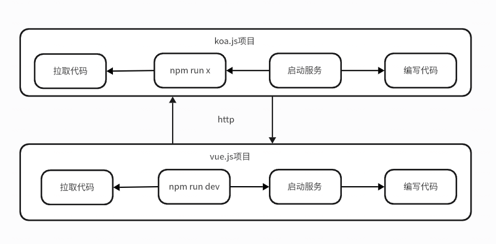
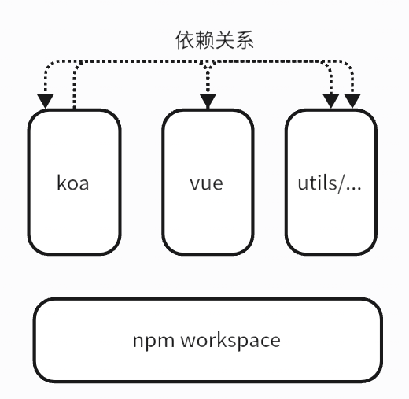
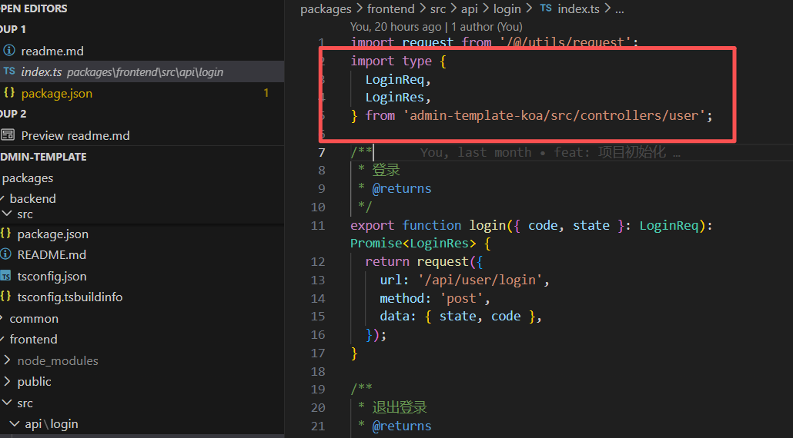
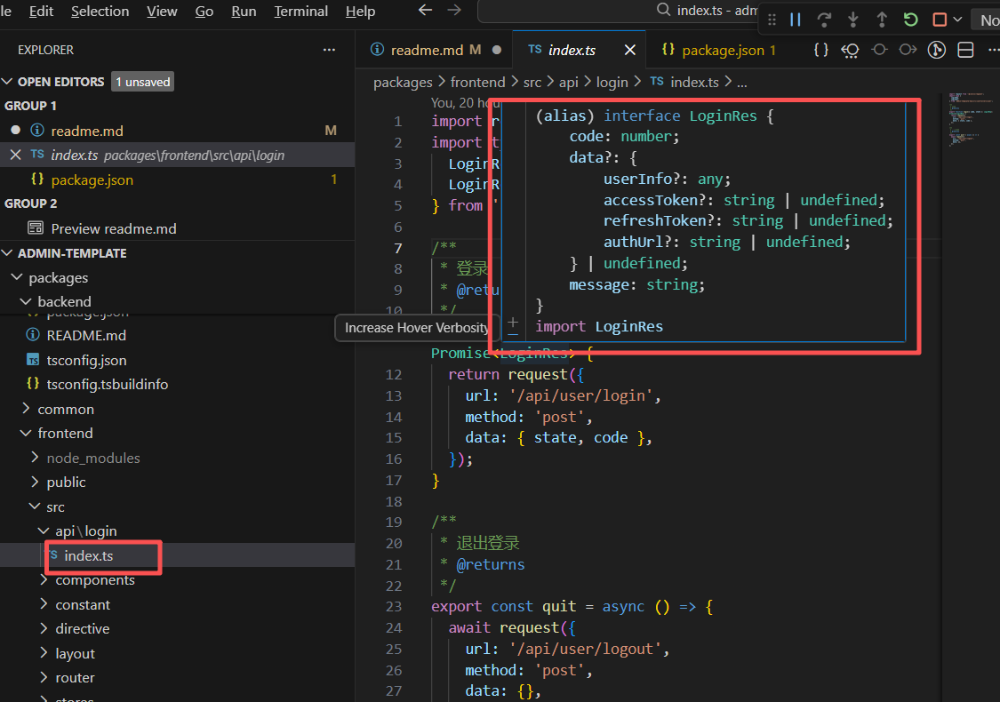
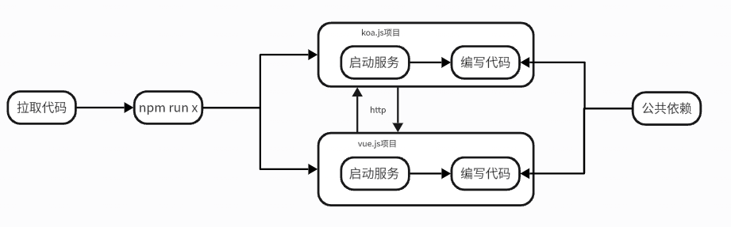

# 基于Monorepo架构的全栈开发脚手架                  


## 一、术语：请对本领域的技术词语进行解释说明，如果有英文要给出中文注释或解释

1. 脚手架: 项目的结构与开箱即用的一系列集成好的功能。
2. Monorepo: 单一代码库，指将多个项目的代码存放在同一个版本控制仓库中的开发模式。
3. Koa: 基于Node.js的Web框架，常用于构建服务器端应用程序。
4. Vue: 前端JavaScript框架，用于构建用户界面。
5. Workspaces: 一种Monorepo管理工具，允许在同一代码库中管理多个包和项目。
6. Npm: Node.js的包管理器，用于安装和管理JavaScript包。
7. Package: 软件包，包含代码和资源的集合，可以通过包管理器进行分发和安装。
8. Pakcage.json: Node.js项目的配置文件，包含项目的元数据和依赖信息。
9. TypeScript: JavaScript的超集，添加了静态类型和其他特性，编译后生成纯JavaScript代码。
10. NCU: npm-check-updates的缩写，是一个工具，用于检查和更新项目中的npm依赖包到最新版本。
11. Prettier: 代码格式化工具，用于统一代码风格。
12. ESLint: 代码检查工具，用于发现和修复代码中的问题。
13. Tailwind CSS: 实用优先的CSS框架，提供大量的实用类，帮助开发者快速构建响应式和现代化的用户界面。


## 二、本技术方案的发明点概述：请用一段话描述本发明相对于现有技术的改进之处。

本发明提出了一种基于Monorepo架构的全栈开发脚手架，针对现有技术中前端项目与后端项目分离管理导致的工具链割裂、依赖重复安装、跨项目协作效率低以及开发流程不统一等技术问题，通过基于npm workspaces技术将前端Vue框架项目与后端Koa框架项目整合至同一代码仓库中，实现了前后端项目的依赖统一管理、公共模块共享复用以及构建部署流程的一体化。

相较于传统的多仓库（Multi-repo）开发模式，本方案减少了重复依赖的安装与维护成本，消除了前后端项目间版本同步困难的问题，并通过统一的工作流配置降低了全栈开发的环境搭建复杂度，从而提升了全栈项目的开发效率和工程可维护性。


## 三、背景技术：做这项发明之前该技术现状的详细描述。

在现代Web应用开发中，全栈开发已成为一种主流的开发模式。为了让前端开发人员能够胜任全栈开发任务，业界通常采用基于Node.js生态的技术栈来统一前后端的开发语言。具体而言，后端服务通常基于Koa框架构建一套服务端业务开发框架，负责处理API接口、数据库访问、业务逻辑等服务端功能；前端界面则基于Vue框架构建一套客户端业务开发框架，负责页面渲染、用户交互、状态管理等前端功能。

在传统的多仓库（Multi-repo）开发模式下，前端项目与后端项目分别存放在各自独立的代码仓库中，各自拥有独立的package.json配置文件、独立的依赖管理体系以及独立的构建与部署流程。尽管前端项目与后端项目均采用TypeScript作为开发语言，具备语言层面的统一性，但在实际的工程实践中，两个项目仍然需要独立初始化开发环境、独立安装依赖包、独立运行开发服务器以及独立执行构建与部署操作。

此外，在多仓库模式下，前后端项目之间的公共模块（如类型定义、工具函数、常量配置、数据校验逻辑等）无法直接共享复用，开发人员往往需要在两个项目中重复编写相同的代码，或者通过发布独立的npm包来实现共享，这增加了额外的发布与版本管理成本。同时，前后端项目各自独立维护的基础工具链（如代码格式化工具、代码检查工具、单元测试框架、提交规范工具等）和生态类库（如日志库、配置管理库等）也无法在项目间共享配置与复用，导致工具链配置分散、维护成本倍增。

在团队协作场景下，由于前后端项目处于不同的代码仓库中，开发人员在进行涉及前后端联动的功能开发时，需要频繁在两个仓库之间切换，手动同步接口变更，协调版本发布节奏，这进一步降低了全栈开发的协作效率和整体开发体验。

以下是之前的开发工作流：



## 四、背景技术的技术问题（指出背景技术在哪些地方存在哪些缺陷和不足）。

```text
解决的问题必须是技术问题，例如传输速度低、硬件成本高等，而非个人体验（如美观）

如果技术问题有多个，需要都列出来，并指出最主要解决的技术问题
```

1. 前后端项目分离管理导致的工具链割裂问题：前端与后端项目各自独立维护的代码格式化工具、代码检查工具、单元测试框架等基础工具链无法共享配置与复用，导致工具链配置分散、维护成本倍增。

2. 依赖重复安装与版本同步困难问题：前后端项目各自独立安装依赖包，导致重复安装相同依赖，增加存储与网络成本；同时，前后端项目间的依赖版本难以保持同步，易引发兼容性问题。

3. 跨项目协作效率低问题：前后端项目处于不同代码仓库，开发人员在进行涉及前后端联动的功能开发时，需要频繁在两个仓库之间切换，手动同步接口变更，协调版本发布节奏，降低了协作效率。

4. 开发流程不统一问题：前后端项目各自独立初始化开发环境、运行开发服务器、执行构建与部署操作，导致开发流程不统一，增加了全栈开发的环境搭建复杂度和运维难度。


综上所述，最主要的技术问题是：前后端项目分离管理导致的工具链割裂与公共模块无法共享复用的问题，该问题直接造成了依赖重复安装、开发流程不统一以及跨项目协作效率低等一系列连锁性工程效率瓶颈。

## 五、本案的详细阐述，即您是通过怎样的技术手段和方法解决的上述技术问题的。（本部分为重点内容，需要将代码在运行时所要实现的步骤进行详细描述。）说明：

```text
技术方案描述中需要写清楚数据的流向，包括数据如何产生、中间涉及到哪些处理以及最终输出的是什么数据的整个过程；

用文字结合图示来描述技术方案，其中图示包括但不限于流程图、界面图、时序图、系统架构图、网络拓扑图、原理图、应用环境图等；

写清楚每个步骤的执行主体，例如是由终端执行还是由服务器来执行；
请多举例和结合具体的应用场景进行描述；

注意同一个东西请用同一个词来表述；

不要粘贴代码，如果确实需通过代码说明，交底中的代码不能超过10行,并需要提供每一行代码的注释。

具体包括以下几种情况：

1）如果涉及软件产品，分别从产品侧和技术侧两个角度进行描述，产品侧可描述软件产品即前端的形态（提供界面图），技术侧描述后台的数据处理（请提供流程图）；

2）如果涉及到多端交互，需要从每一端出发写出该端所涉及到的处理（请提供时序图）

3）如果涉及到界面，需要写出界面展示了哪些内容（请提供界面图）；

4）如果涉及到算法，需要写出具体的算法逻辑规则；

5）如果涉及到公式，需要写出具体的公式形式，并给出公式中每个参数的物理含义；

6）如果涉及到系统架构，需要描述系统中各组成部分的作用、各组成部分之间的关系以及各组成部分之间的交互过程（请提供系统架构图、网络拓补图等）。
```

为了解决上述技术问题，本发明提出了一种基于Monorepo架构的全栈开发脚手架，具体技术手段和方法如下：

1. 项目架构设计：采用Monorepo架构，将前端Vue框架项目与后端Koa框架项目整合至同一代码仓库中。通过在根目录下配置package.json文件，利用npm workspaces技术定义多个子包（packages），分别对应前端项目、后端项目以及公共模块。

1.1 系统架构图



1.2 目录结构

```text
admin-template/
├── build/                    # 构建相关脚本
├── packages/
│   ├── backend/             # 后端服务 (Koa)
│   │   ├── config/          # 环境配置
│   │   ├── logs/            # 日志文件
│   │   └── src/
│   │       ├── controllers/ # 控制器
│   │       ├── services/    # 业务逻辑
│   │       ├── middlewares/ # 中间件
│   │       ├── router/      # 路由
│   │       ├── lib/         # 库文件（数据库、Redis等）
│   │       ├── types/       # 类型定义
│   │       └── utils/       # 工具函数
│   ├── frontend/            # 前端应用 (Vue 3)
│   │   ├── public/          # 静态资源
│   │   └── src/
│   │       ├── api/         # API 接口
│   │       ├── components/  # 通用组件
│   │       ├── directive/   # 自定义指令
│   │       ├── layout/      # 布局组件
│   │       ├── router/      # 路由配置
│   │       ├── stores/      # Pinia 状态管理
│   │       ├── theme/       # 主题样式
│   │       ├── types/       # 类型定义
│   │       ├── utils/       # 工具函数
│   │       └── views/       # 页面组件
│   └── common/              # 公共代码包
└── package.json             # 根配置文件
```

3. 项目引用（Project References）

项目引用允许你将TypeScript程序构建成更小的部分，在TypeScript 3.0和更新版本中都可以使用。通过这样做，您可以大大缩短构建时间，强制组件之间的逻辑分离，并以新的和更好的方式组织代码。

3.1 增量编译和构建优化

3.1.1 TypeScript 只重新编译发生变化的项目引用
3.1.2 显著提升大型 Monorepo 项目的构建速度
3.1.3 支持并行编译多个子项目

4. 端到端的类型检查

4.1 通过项目引用实现前后端类型安全


4.2 子项目之间的类型引用


5. 统一代码风格

通过在根目录下集成 Prettier 代码格式化工具和 ESLint 代码检查工具，所有子项目共享同一套代码风格与检查规则配置，确保前端项目、后端项目及公共模块的代码风格保持一致，避免因项目分散管理导致的编码规范不统一问题。

6. 统一的命令行管理

通过在根目录下配置统一的命令行工具脚本，实现对前端项目、后端项目及公共模块的开发环境初始化、依赖安装、开发服务器运行、构建与部署等操作的统一管理。开发人员只需在根目录下执行相应命令，即可完成各子项目的相关操作，简化了全栈开发的工作流程，降低了环境搭建复杂度和运维难度。

7. 配置koa中间件, koa-static, 让后端支持静态资源访问

通过在后端Koa项目中配置koa-static中间件，将前端项目构建产生的静态资源目录挂载为后端服务的静态文件访问路径。当客户端浏览器发起对HTML、CSS、JavaScript及图片等静态资源的HTTP请求时，后端Koa服务器通过koa-static中间件拦截该请求，直接从指定的静态资源目录中读取对应文件并返回给客户端，无需额外部署独立的静态资源服务器，从而实现前后端项目的一体化部署。


8. 前后端打包构建编排,通过在根目录下配置构建脚本，实现对前端项目和后端项目的打包构建流程的统一编排。开发人员只需执行单一的构建命令，即可同时完成前端资源的打包和后端服务的构建，简化了部署流程，提高了发布效率。

9.  Tailwind CSS

集成Tailwind CSS，提供实用的CSS工具类，帮助开发者快速构建响应式和现代化的用户界面。

10. 保持项目依赖到最新版本

通过在根目录下统一管理所有子项目的依赖版本，并借助npm workspaces提供的依赖提升机制以及NCU工具，定期对项目依赖进行版本检查与升级。当检测到依赖包存在新版本时，开发人员可在根目录下执行统一的依赖更新命令，一次性完成前端项目、后端项目及公共模块的依赖版本升级，避免了在多仓库模式下需要逐个仓库手动更新依赖的繁琐操作，确保所有子项目始终使用一致且最新的依赖版本，从而降低因依赖版本滞后引发的安全漏洞风险和兼容性问题。

11. 多环境支持

支持development、qa、stage、production四种环境配置与切换。

## 六、第五项的技术手段产生了什么技术效果（通常为克服了第四项所指出的技术问题）。

1. 通过基于Monorepo架构的统一代码仓库管理，消除了前后端项目工具链割裂问题，实现了代码格式化工具、代码检查工具等基础工具链的共享配置与复用，显著降低了工具链的维护成本。

2. 利用npm workspaces技术实现了前后端项目依赖的统一管理，避免了重复安装相同依赖包，节省了存储与网络资源；同时，通过统一的依赖版本配置，解决了前后端项目间版本同步困难的问题，提升了系统的兼容性与稳定性。

3. 通过将前后端项目整合至同一代码仓库，简化了跨项目协作流程，开发人员无需频繁切换仓库即可进行前后端联动功能开发，提高了协作效率和整体开发体验。

4. 实现了前后端项目开发流程的统一化，开发人员可以通过统一的命令行工具初始化开发环境、运行开发服务器、执行构建与部署操作，降低了全栈开发的环境搭建复杂度和运维难度。 

以下是当前的开发工作流：



## 八、参考文献（对于理解交底书中的技术方案有帮助的专利/论文/期刊，如有则填写）

1. Koa官网: https://koajs.com/
2. Vue官网: https://vuejs.org/
3. Npm Workspaces文档: https://docs.npmjs.com/cli/v11/using-npm/workspaces
4. TypeScript官网: https://www.typescriptlang.org/
5. Monorepo: https://monorepo.tools/
6. packages：https://nodejs.org/docs/latest/api/packages.html#nodejs-packagejson-field-definitions
 
