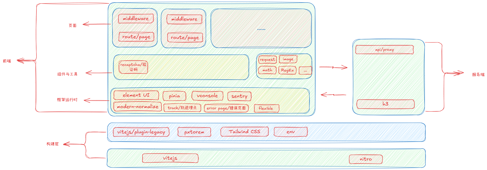

## 一、术语：请对本领域的技术词语进行解释说明，如果有英文要给出中文注释或解释

Nuxt: 基于Vue.js的服务端渲染的全栈开发框架。

C端：client(客户端)，主要指大众用户使用的客户端，通常指移动端web。

脚手架：运行Nuxt项目的结构与开箱即用的一系列功能。

## 二、本技术方案的发明点概述：请用一段话描述本发明相对于现有技术的改进之处。

    当前工作中与社区中，都在从纯客户端渲染的技术方案向基于客户端组件化技术为基础的服务端渲染技术转移，因为它能够带来更好的用户体验，开发体验（相对于以前的服务端渲染技术）。

    本技术方案的发明点在于提供了一个基于Nuxt的技术脚手架，能够满足移动端，PC端服务端页面开发的需求，能够让开发者快速上手并且专注于业务开发，而不需要花费大量时间在基础设施的搭建和封装上。

## 三、背景技术：做这项发明之前该技术现状的详细描述。

    目前在社区中能够找到的Nuxt技术脚手架都比较粗糙，即便是官方公开的脚手架都没有对于实战开发中的功能，需要开发者自行封装或者实现。比如移动端开发的响应式技术，移动端调试的vconsole技术，前后端同构的请求库等等。

    我在知名的技术社区github上搜索了相关的Nuxt脚手架，发现大多数都是基于老版本的Nuxt开发的，且常用功能得不到封装，缺少一个能够让开发者快速就能够在实际项目中开发的脚手架。

    第一封装程度不够，请求库来说，对于需要再实战中进行开发的项目来说，我们的客户端请求与服务端请求都会有自己的特殊的业务逻辑，并且需要支持请求拦截器，响应拦截器等功能，请求头处理，请求重试，错误上报，鉴权处理等，这些都是需要再业务中实现的功能缺失,这是一个实战项目必备的请求库的基本程序结构，而官方脚手架并没有提供这些功能，开发者需要自行封装。

    第二功能缺失，移动端的页面开发需要页面具备自适应的能力，上线的页面也需要具备监控预警的能力，移动端页面远程调试的能力，页面路由鉴权的能力，应用错误处理的完善，服务端可观测能力，日志，存储等等。

    第三架构不完善，Nuxt是一个以约定大于配置的理念设计的框架，虽然它能够让开发者快速上手，但是在实战开发中，往往需要对项目的架构进行一定的调整和封装，以满足业务需求，比如目录结构的调整，插件的封装，模块的划分等等。

    以上这些功能都是在实战开发中非常常见的功能，如果没有一个成熟的脚手架，开发者就需要花费大量的时间在这些基础设施的搭建和封装上，而无法专注于业务开发。

## 四、背景技术的技术问题（指出背景技术在哪些地方存在哪些缺陷和不足）。

```text
解决的问题必须是技术问题，例如传输速度低、硬件成本高等，而非个人体验（如美观）

如果技术问题有多个，需要都列出来，并指出最主要解决的技术问题
```

    本项目主要解决的是基于Nuxt的应用程序架构问题，Nuxt原生的项目架构并不适合实际的业务开发场景，社区当中目前也很难找到符合业务开发人员开箱即用的Nuxt开发脚手架，开发者需要根据自己的业务需求对项目架构进行大量调整和封装，工作繁琐且重复，浪费人力智力成本来搭建项目架构。

    且架构设计工作不是一个简单的工作，需要考虑到项目的可维护性、可扩展性、性能优化、安全性，公共功能开发与集成等多个方面，开发者往往需要花费大量时间和精力来设计和实现一个合适的项目架构，影响业务开发进度。

## 五、本案的详细阐述，即您是通过怎样的技术手段和方法解决的上述技术问题的。（本部分为重点内容，需要将代码在运行时所要实现的步骤进行详细描述。）说明：

```text
技术方案描述中需要写清楚数据的流向，包括数据如何产生、中间涉及到哪些处理以及最终输出的是什么数据的整个过程；

用文字结合图示来描述技术方案，其中图示包括但不限于流程图、界面图、时序图、系统架构图、网络拓扑图、原理图、应用环境图等；

写清楚每个步骤的执行主体，例如是由终端执行还是由服务器来执行；
请多举例和结合具体的应用场景进行描述；

注意同一个东西请用同一个词来表述；

不要粘贴代码，如果确实需通过代码说明，交底中的代码不能超过10行,并需要提供每一行代码的注释。

具体包括以下几种情况：

1）如果涉及软件产品，分别从产品侧和技术侧两个角度进行描述，产品侧可描述软件产品即前端的形态（提供界面图），技术侧描述后台的数据处理（请提供流程图）；

2）如果涉及到多端交互，需要从每一端出发写出该端所涉及到的处理（请提供时序图）

3）如果涉及到界面，需要写出界面展示了哪些内容（请提供界面图）；

4）如果涉及到算法，需要写出具体的算法逻辑规则；

5）如果涉及到公式，需要写出具体的公式形式，并给出公式中每个参数的物理含义；

6）如果涉及到系统架构，需要描述系统中各组成部分的作用、各组成部分之间的关系以及各组成部分之间的交互过程（请提供系统架构图、网络拓补图等）。
```

    通过重新设计Nuxt脚手架的架构，集成实际开发中常用的功能模块，提供完善的项目结构和配置，实现一个基于Nuxt的C端应用脚手架，帮助开发者快速上手并专注于业务开发。

1. 构建层

1.1 兼容性处理

集成@vitejs/plugin-legacy vite插件，自动为不支持ESM的浏览器生成兼容代码，提升应用的兼容性和用户覆盖面。

1.2 支持移动端自适应开发

集成pxtorem postcss插件，页面元标签配置viewport, 配合监听屏幕大小改变根标签字体大小脚本，实现移动端自适应布局。

1.3 集成Tailwind CSS

集成Tailwind CSS，提供实用的CSS工具类，帮助开发者快速构建响应式和现代化的用户界面。

1.4 环境变量配置

通过环境变量区分不同的运行环境（开发、qa、测试、生产），实现配置的灵活管理和切换，提升应用的可维护性。

1. 框架运行时层

2.1 集成UI组件库

集成了流行的UI组件库（如Vant UI,Element Plus UI），提供丰富的预设组件，帮助开发者快速构建美观且一致的用户界面，并根据页面类型选择性集成。

2.2 集成状态管理

集成Pinia作为状态管理库，提供简洁且高效的状态管理解决方案，支持模块化状态管理，方便维护和扩展。

2.3 集成移动端调试工具

集成VConsole移动端调试工具，方便开发者在移动设备上进行调试和问题排查，提高开发效率。

2.4 集成Sentry进行错误监控和性能追踪

集成Sentry服务，实时监控前端后端中的错误和性能问题，帮助开发者及时发现和解决问题，提升应用的稳定性和用户体验。

2.5 集成modern-normalize

集成modern-normalize，确保不同浏览器之间的样式一致性，减少浏览器默认样式差异带来的问题。

2.6 错误处理

实现友好的错误页面，在页面路由错误，页面渲染错误等，可提升用户体验。

2.7 中间件

实现前端路由守卫中间件，处理路由权限验证、提升应用的安全性和用户体验。

3. 应用功能层

3.1 集成图片验证码组件

实现图片验证码组件，增强应用的安全性，防止恶意请求和自动化攻击。为了提供组件的灵活性，通过vue的插槽提供无头的设计，允许开发者自定义触发容器，从而更好地适应不同的UI需求。

3.2 集成轨迹数据收集

集成轨迹数据收集功能，帮助开发者了解用户行为和应用使用情况，支持数据分析和优化决策。同时补充类型定义，提升代码的类型安全性和开发体验。

3.3 实现服务端代理接口

服务端代理接口，解决跨域问题，因为nuxt中的接口调用分为客户端调用和服务端调用两种场景，客户端请求场景下存在跨域问题。

3.4 工具库

3.4.1 封装请求库

基于框架提供的$fetch封装客户端与服务端使用的请求库，简化API请求流程，提供统一的错误处理和数据转换机制，提高代码的可维护性和复用性。

3.4.2 图片工具库

封装图片处理工具库，提供常用的图片操作功能，如压缩、裁剪、格式转换等，简化图片处理流程，提升应用的性能和用户体验。

3.4.3 数学工具库

封装数学计算工具库，解决js精度问题，简化复杂计算流程，提升代码的可读性和维护性。

3.4.4 正则工具库

封装常用正则表达式工具库，提供便捷的字符串验证和处理功能，提升代码的效率和可靠性。

1. 以下为本技术方案的系统架构图：



5. 目录结构

```text
nuxt/
├─ app/                              # 前端应用（Nuxt App）
│  ├─ error.vue                      # 全局错误页
│  ├─ assets/                        # 静态资源（参与构建）
│  │  ├─ css/
│  │  │  └─ main.css
│  │  ├─ img/
│  │  └─ js/
│  ├─ components/
│  │  └─ recaptcha.vue               # 图片验证码组件
│  ├─ composables/                   # 组合式函数（hooks）
│  ├─ constants/                     # 常量定义
│  ├─ middleware/
│  │  └─ auth.ts                     # 前端路由守卫
│  ├─ pages/                         # 页面路由
│  │  ├─ index.vue
│  │  ├─ about.vue
│  │  └─ user.vue
│  ├─ plugins/
│  │  └─ error-handler.ts            # 前端错误处理插件
│  ├─ stores/
│  │  └─ user.ts                     # Pinia store
│  ├─ types/
│  │  └─ global.d.ts                 # 全局类型补充
│  └─ utils/                         # 工具库
│     ├─ image.ts
│     ├─ math.ts
│     ├─ request.ts
│     ├─ storage.ts
│     └─ validator.ts
├─ server/                           # Nitro Server（服务端逻辑）
│  ├─ api/
│  │  └─ proxy/
│  │     └─ [...].ts                 # 代理转发入口（解决跨域/统一网关）
│  └─ middleware/
│     └─ error.ts                    # 服务端错误中间件
├─ public/                           # 纯静态资源（原样输出）
│  ├─ css/
│  │  └─ common/
│  │     └─ modern-normalize.css
│  └─ js/
│     └─ common/
│        ├─ flexible.js              # rem 适配脚本
│        ├─ track.js                 # 轨迹/埋点脚本
│        └─ vconsole.min.js          # 移动端调试
├─ modules/
│  └─ fixViteLegacyPlugin.ts         # 构建层：legacy 兼容处理
├─ .env.dev                          # 多环境配置
├─ .env.qa
├─ .env.stage
├─ .env.prod
├─ eslint.config.ts
├─ nuxt.config.ts
├─ tsconfig.json
├─ sentry.client.config.ts
├─ sentry.server.config.ts
├─ package.json
└─ package-lock.json
```

## 六、第五项的技术手段产生了什么技术效果（通常为克服了第四项所指出的技术问题）。

    通过本技术方案，开发者可以快速搭建一个基于Nuxt的C端应用脚手架，集成了实战开发中常用的功能模块，提供完善的项目结构和配置，帮助开发者专注于业务开发，提高开发效率和应用质量。

    具体技术效果包括：

    1. 提升应用的兼容性和用户覆盖面，支持更多浏览器和设备。
    2. 实现移动端自适应布局，提升用户体验。
    3. 提供丰富的UI组件和状态管理解决方案，简化前端开发流程。
    4. 集成移动端调试工具和错误监控服务，提高应用的稳定性和可维护性。
    5. 提供完善的项目架构和目录结构，方便开发者进行项目管理和扩展。

## 八、参考文献（对于理解交底书中的技术方案有帮助的专利/论文/期刊，如有则填写）

1. Nuxt.js 官方文档：https://nuxtjs.org
2. Vite 官方文档：https://vitejs.dev
3. Tailwind CSS 官方文档：https://tailwindcss.com
4. Pinia 官方文档：https://pinia.vuejs.org
5. Sentry 官方文档：https://docs.sentry.io
6. Vant UI 官方文档：https://vant.pro/vant/#/en-US
7. Element Plus UI 官方文档：https://element-plus.org
8. Vue.js 官方文档：https://vuejs.org
9. Nitro 官方文档：https://nitro.build
