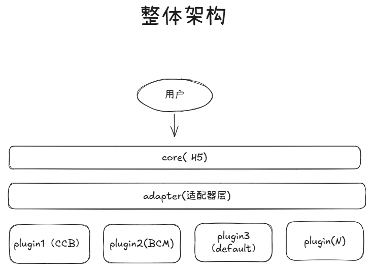
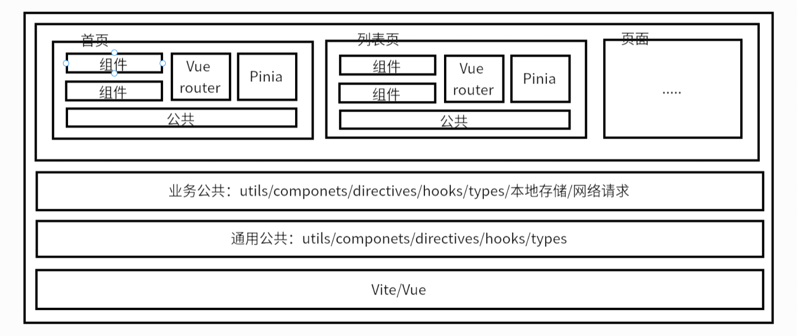
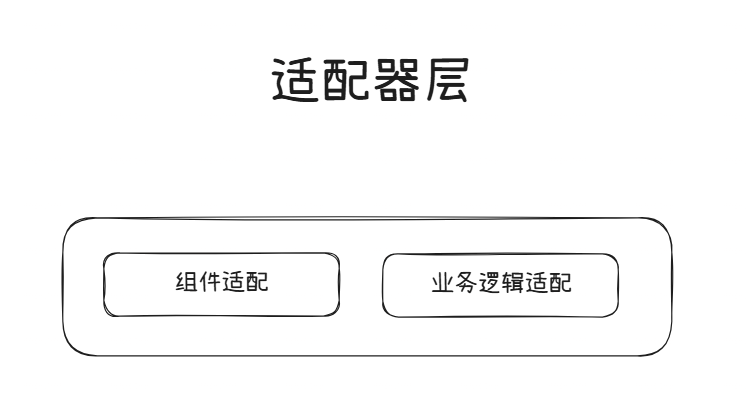
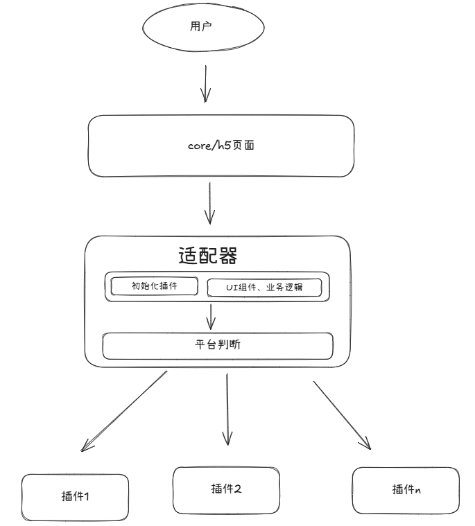

## 基于Plug-in架构的系统设计与实现

## 一、术语：请对本领域的技术词语进行解释说明，如果有英文要给出中文注释或解释

1. 架构设计（Architecture Design）：指在软件开发过程中，对系统的整体结构进行规划和设计，包括系统的组成部分、各部分之间的关系以及系统的运行环境等方面的设计。
2. 架构实现（Architecture Implementation）：指将设计好的架构方案转化为实际可运行的软件系统的过程，包括编码、测试、部署等步骤。
3. 插件（Plugin）：指在软件系统中可以独立开发、独立部署，并能够在不修改主程序的情况下，通过特定接口与主程序进行交互，从而扩展主程序功能的模块。
4. 适配层（Adapter Layer）：指在软件系统中用于实现不同模块之间接口兼容的层，通过适配层可以将一个模块的接口转换为另一个模块所期望的接口，从而实现模块之间的协作。
5. 页面（Page）：指在软件系统中展示信息和提供交互功能的界面，用户通过页面与系统进行交互。
6. 组件（Component）：指在软件系统中具有独立功能的模块，可以被复用和替换，通常通过接口与其他组件进行交互。
7. 样式（Style）：指在软件系统中定义界面元素的外观和布局的规则和规范，包括颜色、字体、大小、位置等方面的设计。
8. 脚本（Script）：指在软件系统中用于实现特定功能的代码，通常是指前端的JavaScript代码，用于实现页面的交互逻辑和动态效果。
9. js sdk（JavaScript Software Development Kit）：指为开发者提供的一套工具和库，用于简化特定平台或服务的开发过程，通常包括API接口、示例代码、文档等资源。
10. js bridge（JavaScript Bridge）：指在混合应用开发中，用于实现JavaScript与原生代码之间通信的机制，通过js bridge可以让JavaScript调用原生功能，也可以让原生代码调用JavaScript函数，从而实现混合应用的功能扩展。
11. bug: 指软件系统中的错误或缺陷，可能导致系统功能异常、性能下降或安全漏洞等问题。
12. Vue: 是一个用于构建用户界面的渐进式JavaScript框架，提供了响应式数据绑定和组件化开发的能力，广泛应用于前端开发领域。

## 二、本技术方案的发明点概述：请用一段话描述本发明相对于现有技术的改进之处。

   本发明提出了一种插件化的架构设计与实现方案，通过将不同渠道的功能封装为独立的插件模块，使核心系统通过适配层与插件功能解耦，从而降低系统复杂度和维护成本，提高系统的灵活性、稳定性和扩展性以及程序的可读性。

## 三、背景技术：做这项发明之前该技术现状的详细描述。

   以电商分销系统为例，该类系统通常需要运行于不同渠道。随着接入渠道数量增加，订单来源也会相应增多，因此往往需要将分销系统接入多个渠道平台。相关渠道平台可能包括 App、小程序等不同的容器环境，因此需要针对不同渠道对分销系统进行定制化开发，定制内容包括界面主题、功能模块以及专属页面等。
   
   目前市面上的大多数开发方案，通常是在核心分销系统中进行耦合式开发，通过平台判断以及大量条件分支语句来实现不同渠道的适配，同时造成程序的不同渠道的状态随着渠道数量的增加而变得复杂且混乱，程序的可读性也会随之降低，大大增加了项目的维护成本。

## 四、背景技术的技术问题（指出背景技术在哪些地方存在哪些缺陷和不足）。

```text
解决的问题必须是技术问题，例如传输速度低、硬件成本高等，而非个人体验（如美观）

如果技术问题有多个，需要都列出来，并指出最主要解决的技术问题
```

低内聚、高耦合：核心系统与不同渠道的功能模块之间存在紧密耦合关系，会导致以下问题：

1. 维护性差：各渠道的判断与处理逻辑散落于各个页面中，维护困难，且容易遗漏。
2. 可读性差：各类渠道逻辑与状态相互混杂，导致代码可读性较差，难以理解和维护。
3. 扩展性差：当需要新增分销渠道时，往往需要修改大量零散代码，容易引入新的 bug。

## 五、本案的详细阐述，即您是通过怎样的技术手段和方法解决的上述技术问题的。（本部分为重点内容，需要将代码在运行时所要实现的步骤进行详细描述。）说明：

```text
技术方案描述中需要写清楚数据的流向，包括数据如何产生、中间涉及到哪些处理以及最终输出的是什么数据的整个过程；

用文字结合图示来描述技术方案，其中图示包括但不限于流程图、界面图、时序图、系统架构图、网络拓扑图、原理图、应用环境图等；

写清楚每个步骤的执行主体，例如是由终端执行还是由服务器来执行；
请多举例和结合具体的应用场景进行描述；

注意同一个东西请用同一个词来表述；

不要粘贴代码，如果确实需通过代码说明，交底中的代码不能超过10行,并需要提供每一行代码的注释。

具体包括以下几种情况：

1）如果涉及软件产品，分别从产品侧和技术侧两个角度进行描述，产品侧可描述软件产品即前端的形态（提供界面图），技术侧描述后台的数据处理（请提供流程图）；

2）如果涉及到多端交互，需要从每一端出发写出该端所涉及到的处理（请提供时序图）

3）如果涉及到界面，需要写出界面展示了哪些内容（请提供界面图）；

4）如果涉及到算法，需要写出具体的算法逻辑规则；

5）如果涉及到公式，需要写出具体的公式形式，并给出公式中每个参数的物理含义；

6）如果涉及到系统架构，需要描述系统中各组成部分的作用、各组成部分之间的关系以及各组成部分之间的交互过程（请提供系统架构图、网络拓扑图等）。
```

   为解决上述问题，本方案采用插件化架构对 H5 分销系统进行改造。插件化架构是一种将系统功能模块化、独立化的设计方法，能够提高系统的可维护性和可扩展性，同时形成一套基础开发规范。

   本方案将核心 H5 分销系统作为基础平台，用于提供公共页面和核心逻辑；同时，将不同分销商的定制化功能封装为独立插件，并在需要时进行加载，从而实现面向不同分销商的定制化分销系统。

   通过上述方式，可以将不同分销商的逻辑有效隔离，避免代码混杂，提高代码的可读性和维护性。同时，当需要新增分销商平台时，仅需开发对应的新插件，而无需修改核心 H5 分销系统代码，从而提高系统的扩展性。

## 架构图



### 核心层

核心层用于承载与渠道无关的核心分销系统的逻辑和页面，提供基础功能与服务，并仅与适配器层进行交互。



### 适配器层

适配器层用于实现核心层与插件层之间的接口适配，向核心层提供统一调用接口，同时负责将插件功能适配至核心系统。适配器层主要包括以下两个模块：



1. 组件适配模块：用于适配不同分销渠道之间的组件差异，例如登录组件、支付组件等。
2. 业务适配模块：用于适配不同分销渠道之间的业务逻辑差异，例如下单处理逻辑、支付逻辑等。

### 插件层

插件层用于封装不同渠道的定制化功能，提供与核心系统接口兼容的页面、组件、样式、脚本以及能力库等资源。每个插件对应一个分销渠道，包含以下内容：


1. index.ts：插件的入口文件，用于导出插件的页面、组件、功能库，以及初始化分销渠道的样式、脚本以及初始化数据。
2. pages：分销渠道的页面，例如专属登录页等。
3. script：分销渠道的脚本，例如平台JS SDK。
4. style：分销渠道的样式，例如主题色、字体等。
5. components：分销渠道需要定制开发的 Vue 组件。
6. directives：分销渠道需要提供的特定 Vue 指令。
7. libs：分销渠道的能力封装库，用于基于 JS SDK 进行封装及定制逻辑封装，例如混合 App 场景下的 JS Bridge。

## 流程图



上述流程图展示了本方案在终端侧的插件化处理流程。首先，用户在终端发起访问请求并进入 core 层的 H5 页面，core 层负责承载与渠道无关的基础页面结构和通用业务入口。随后，core 层将当前页面所需的能力请求传递至适配器层，由适配器层统一接收并处理。

适配器层首先执行渠道判断，用于识别当前访问环境所属的目标渠道；在完成渠道识别后，适配器层进一步执行插件初始化过程，这个过程中会将插件需要依赖的资源加载完成，例如，样式，脚本，数据等。

并根据识别结果对 UI 组件和业务逻辑进行适配，使核心页面在不修改自身代码的前提下获得对应渠道所需的界面能力与业务能力。

在适配完成后，适配器层将请求路由至对应的渠道插件。不同渠道分别对应插件 1、插件 2 至插件 n，各插件中封装该渠道的页面、组件、样式、脚本以及能力库。

这样，当终端用户访问同一套 core 页面时，系统能够通过适配器层自动加载目标插件，并输出对应渠道的定制化页面与功能，从而实现核心系统与渠道差异逻辑的解耦，并提升后续新增插件时的扩展效率。

## 目录结构

```text
├─ .editorconfig            # 编辑器配置文件
├─ .eslintignore            # ESLint 忽略配置文件
├─ .eslintrc.yml            # ESLint 配置文件
├─ .prettierignore          # Prettier 忽略配置文件
├─ .prettierrc.yml          # Prettier 配置文件
├─ package-lock.json        # npm 锁定文件
├─ package.json             # npm 包配置文件
├─ postcss.config.js        # PostCSS 配置文件
├─ README.md                # 项目说明文件
├─ src                      # 项目源代码目录
│  ├─ assets                # 静态资源目录
│  ├─ common                # 公共模块目录
│  │  ├─ components         # 公共组件目录
│  │  ├─ constant           # 常量目录
│  │  ├─ less               # 公共样式目录
│  │  └─ utils              # 工具函数目录
│  ├─ enums                 # 枚举目录
│  ├─ hooks                 # 自定义 Hook 目录
│  ├─ pages                 # 页面目录
│  ├─ adapter               # 适配器目录
│  │  ├─ business           # 业务适配模块
│  │  │  └─ index.ts
│  │  ├─ components             # 组件适配模块
│  │  │  └─ index.vue
│  │  └─ index.ts
│  ├─ plugins                   # 插件目录
│  │  ├─ bcm                    # 分销商 A 的插件
│  │  │  ├─ components          # 组件目录
│  │  │  │  └─ navbar
│  │  │  │     └─ index.vue
│  │  │  ├─ directives          # 指令目录
│  │  │  │  └─ index.ts
│  │  │  ├─ index.ts
│  │  │  ├─ lib                 # 能力库目录
│  │  │  │  ├─ index.ts
│  │  │  ├─ pages               # 页面目录
│  │  │  │  └─ auth
│  │  │  │     ├─ App.vue
│  │  │  └─ styles              # 样式目录
│  │  │     └─ theme.less       # 主题样式
│  │  ├─ default                # 默认插件
│  │  │  ├─ components          # 组件目录
│  │  │  │  └─ index.vue
│  │  │  ├─ directives          # 指令目录
│  │  │  │  └─ index.ts
│  │  │  ├─ index.ts
│  │  │  ├─ lib                 # 能力库目录
│  │  │  │  └─ index.ts
│  │  │  ├─ pages               # 页面目录
│  │  │  │  └─ index.vue
│  │  │  └─ styles              # 样式目录
│  │  │     └─ theme.less       # 主题样式
│  │  └─ type.ts                # 类型定义文件
│  └─ types                     # 类型定义目录
├─ tailwind.config.js           # Tailwind CSS 配置文件
├─ tsconfig.json                # TypeScript 配置文件
└─ vite.config.ts               # Vite 配置文件

```
     

## 六、第五项的技术手段产生了什么技术效果（通常为克服了第四项所指出的技术问题）。

   通过上述方式，可以将不同分销渠道的功能根据类型，组件，页面，功能库等都开发到对应的插件当中去，将不同分销渠道的逻辑隔离开来，避免代码混杂，提高代码的可读性和维护性。
   
   同时，当需要新增分销渠道时，仅需开发对应的新插件，实现对应的功能，而无需修改核心 H5 分销系统代码，从而提高系统的扩展性。

## 八、参考文献（对于理解交底书中的技术方案有帮助的专利/论文/期刊，如有则填写）

1. Vue.js Plugin：https://vuejs.org/guide/reusability/plugins.html
2. Nuxt.js Module：https://nuxt.com/docs/4.x/guide/modules/getting-started
3. Pinia Plugin：https://pinia.vuejs.org/core-concepts/plugins.html
4. 从VS Code看优秀插件系统的设计思路: https://cloud.tencent.com/developer/article/2324807