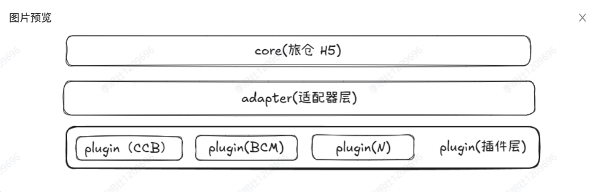
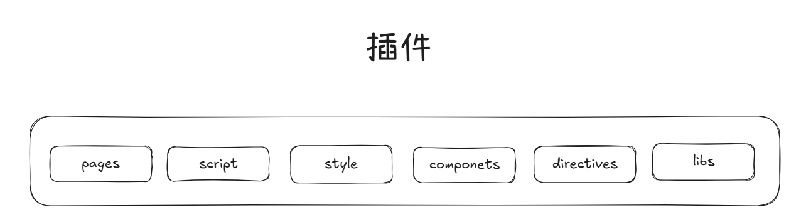

## 插件化的架构设计与实现

## 一、术语：请对本领域的技术词语进行解释说明，如果有英文要给出中文注释或解释

1. 架构设计（Architecture Design）：指在软件开发过程中，对系统的整体结构进行规划和设计，包括系统的组成部分、各部分之间的关系以及系统的运行环境等方面的设计。
2. 架构实现（Architecture Implementation）：指将设计好的架构方案转化为实际可运行的软件系统的过程，包括编码、测试、部署等步骤。
3. 插件（Plugin）：指在软件系统中可以独立开发、独立部署，并能够在不修改主程序的情况下，通过特定接口与主程序进行交互，从而扩展主程序功能的模块。
4. 适配层（Adapter Layer）：指在软件系统中用于实现不同模块之间接口兼容的层，通过适配层可以将一个模块的接口转换为另一个模块所期望的接口，从而实现模块之间的协作。
5. 页面（Page）：指在软件系统中展示信息和提供交互功能的界面，用户通过页面与系统进行交互。
6. 组件（Component）：指在软件系统中具有独立功能的模块，可以被复用和替换，通常通过接口与其他组件进行交互。
7. 样式（Style）：指在软件系统中定义界面元素的外观和布局的规则和规范，包括颜色、字体、大小、位置等方面的设计。
8. 脚本（Script）：指在软件系统中用于实现特定功能的代码，通常是指前端的JavaScript代码，用于实现页面的交互逻辑和动态效果。
9. js sdk（JavaScript Software Development Kit）：指为开发者提供的一套工具和库，用于简化特定平台或服务的开发过程，通常包括API接口、示例代码、文档等资源。
10. js bridge（JavaScript Bridge）：指在混合应用开发中，用于实现JavaScript与原生代码之间通信的机制，通过js bridge可以让JavaScript调用原生功能，也可以让原生代码调用JavaScript函数，从而实现混合应用的功能扩展。

## 二、本技术方案的发明点概述：请用一段话描述本发明相对于现有技术的改进之处。

   本发明提出了一种插件化的架构设计与实现方案，通过将不同渠道的功能封装成独立的插件模块，使得核心系统通过适配层与插件功能解耦，降低了系统的复杂度和维护成本。同时，本发明还提供了一套统一的接口定义规范，使得插件模块能够与核心系统进行无缝集成，提高了系统的灵活性和稳定性以及扩展性。

## 三、背景技术：做这项发明之前该技术现状的详细描述。

   举例来说，我们是一个做电商的分销系统，一个分销系统它需要在不同的渠道上去运行，渠道越多订单就会越多，所以会希望将分销系统接入到不同的渠道上去。这些渠道的平台可能是app、小程序等等，所以需要根据不同渠道来定制化开发分销系统，定制内容包括：界面主题，功能模块，专属页面等。
   
   目前市面上的绝大多数开发方案都是在核心的分销系统当中进行耦合开发，通过平台判断以及大量的条件分支语句来实现不同渠道的适配。

## 四、背景技术的技术问题（指出背景技术在哪些地方存在哪些缺陷和不足）。

```text
解决的问题必须是技术问题，例如传输速度低、硬件成本高等，而非个人体验（如美观）

如果技术问题有多个，需要都列出来，并指出最主要解决的技术问题
```

低内聚高耦合：核心系统与不同渠道的功能模块之间存在紧密的耦合关系，会导致以下问题：

1. 维护性差：各个渠道判断以及处理逻辑都散落在各个页面中，维护困难，容易遗漏。

2. 可读性差：各种渠道逻辑混杂在一起，导致代码可读性差，难以理解和维护。

3. 扩展性差：当需要添加新的分销渠道时，需要修改大量的零散的代码，容易引入新的bug。

## 五、本案的详细阐述，即您是通过怎样的技术手段和方法解决的上述技术问题的。（本部分为重点内容，需要将代码在运行时所要实现的步骤进行详细描述。）说明：

```text
技术方案描述中需要写清楚数据的流向，包括数据如何产生、中间涉及到哪些处理以及最终输出的是什么数据的整个过程；

用文字结合图示来描述技术方案，其中图示包括但不限于流程图、界面图、时序图、系统架构图、网络拓扑图、原理图、应用环境图等；

写清楚每个步骤的执行主体，例如是由终端执行还是由服务器来执行；
请多举例和结合具体的应用场景进行描述；

注意同一个东西请用同一个词来表述；

不要粘贴代码，如果确实需通过代码说明，交底中的代码不能超过10行,并需要提供每一行代码的注释。

具体包括以下几种情况：

1）如果涉及软件产品，分别从产品侧和技术侧两个角度进行描述，产品侧可描述软件产品即前端的形态（提供界面图），技术侧描述后台的数据处理（请提供流程图）；

2）如果涉及到多端交互，需要从每一端出发写出该端所涉及到的处理（请提供时序图）

3）如果涉及到界面，需要写出界面展示了哪些内容（请提供界面图）；

4）如果涉及到算法，需要写出具体的算法逻辑规则；

5）如果涉及到公式，需要写出具体的公式形式，并给出公式中每个参数的物理含义；

6）如果涉及到系统架构，需要描述系统中各组成部分的作用、各组成部分之间的关系以及各组成部分之间的交互过程（请提供系统架构图、网络拓扑图等）。
```

   为了解决上述问题，我们决定采用插件化架构来改造H5分销系统。插件化架构是一种将系统功能模块化、独立化的设计方法，可以提高系统的可维护性、可扩展性，同时也是制定了基本的开发标准。

   我们将核心H5分销系统作为一个基础平台，提供公共的页面和核心逻辑，然后将不同分销商的定制化功能封装成独立的插件，这些插件可以根据需要进行加载，从而实现分销商定制化的分销系统。

   通过这种方式，我们可以将不同分销商的逻辑隔离开来，避免了代码混杂的问题，提高了代码的可读性和维护性。同时，当需要添加新的分销商平台时，只需要开发一个新的插件，而不需要修改核心H5分销系统的代码，从而提高了系统的扩展性。

## 架构图



### 核心层

平台无关的核心逻辑和页面，提供基础的功能和服务，只与适配器层进行交互。

### 适配器层

用于实现核心层与插件层之间的接口适配，提供统一的接口供核心调用，同时也负责将插件的功能适配到核心系统中去。适配器层主要包括以下两个模块：


1. 组件适配模块：用于适配不同分销商平台的组件差异，比如登录组件，支付组件等。

2. 业务适配模块：用于适配不同分销商平台的业务逻辑差异，比如下单处理逻辑，支付逻辑等。

### 插件层



1. pages: 分销商平台的页面，比如专属的登录页，订单页等。
2. script：分销商平台的脚本，比如平台 SDK。
3. style：分销商平台的样式，比如主题色，字体等。
4. components：分销商平台需要定制开发的Vue组件。
5. directives：分销商平台需要提供的特定的Vue指令。
6. libs: 分销商平台的能力封装库，基于js sdk 封装，定制逻辑封装，例如混合app下的js bridge。

## 流程图


用户访问分销系统时，核心层会根据用户的请求和分销商平台的配置，调用适配器层的接口来加载对应的插件功能，从而实现分销商定制化的分销系统。
     

## 六、第五项的技术手段产生了什么技术效果（通常为克服了第四项所指出的技术问题）。

   通过这种方式，我们可以将不同分销商的逻辑隔离开来，避免了代码混杂的问题，提高了代码的可读性和维护性。同时，当需要添加新的分销商平台时，只需要开发一个新的插件，而不需要修改核心H5分销系统的代码，从而提高了系统的扩展性。

## 八、参考文献（对于理解交底书中的技术方案有帮助的专利/论文/期刊，如有则填写）

1. Vue.js Plugin：https://vuejs.org/guide/reusability/plugins.html
2. Nuxt.js Module：https://nuxt.com/docs/4.x/guide/modules/getting-started