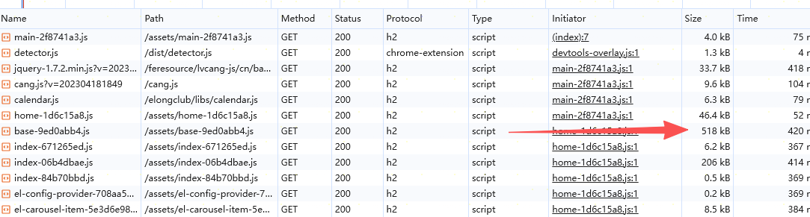

# 加载性能优化

## 列表页接口请求优化策略

每个线路都需要发送一个请求，一页15条数据，高并发请求对服务器压力较大，且用户体验不佳。

1. **合并请求**：将多个线路的请求合并为一个请求，服务器返回所有线路的数据，前端根据线路进行分类展示。
2. **按需加载**：初始只加载用户关注的线路数据，其他线路数据在用户切换时再进行请求加载。
3. **同步逻辑异步化**：将同步请求改为异步请求以及被错误阻塞的接口，避免阻塞页面渲染，提高用户体验。

## 瞬时请求数量过多优化策略

类似上述页面， 由于浏览器限制并发请求数量，每个线路都需要发送一个请求，初始加载时请求数量过多，影响页面加载速度。

前端维护请求队列，限制同时进行的请求数量，其他请求排队等待，减少对服务器的瞬时压力，提高页面加载速度。

## 应用包体积优化策略

1. **按需加载**：使用动态导入（dynamic import）技术，按需加载页面组件和依赖库，减少初始包体积。
2. **代码拆分**：将应用代码拆分为多个小包，按需加载，避免一次性加载过多代码。
3. **使用CDN**：将静态资源托管在CDN上，提高资源加载速度，减轻服务器压力。
4. **压缩和混淆**：使用工具对代码进行压缩和混淆，减少包体积，提高加载速度。
5. **老代码移除**：清理和移除不再使用的代码和依赖库，保持代码库的整洁和高效。
