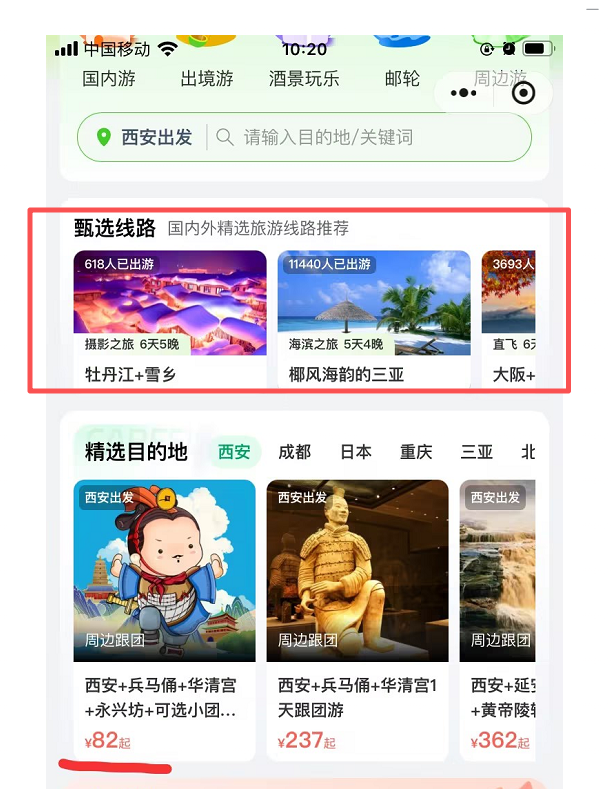
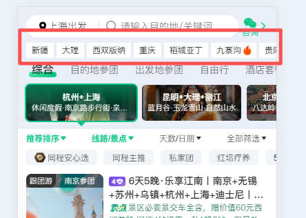
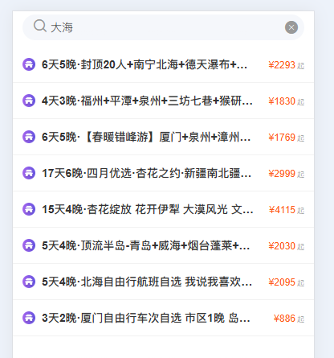
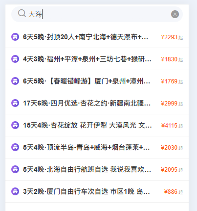

# 旅游线路智能推荐系统

## 背景

之前旅仓 H5 列表页中上线过一段时间的线路推荐模块，但本质上还是业务在后台手动维护数据。这样做有两个明显问题：

- 每次都需要人工更新
- 很难真正体现用户的个性化偏好

所以我在想，能不能换一个角度，不把它只看成传统的推荐模块，而是把它理解成一个基于用户行为持续感知和响应的旅游线路智能推荐系统，应用在多个场景。

## 思路

核心想法是：可以尝试用 agent 的视角重新理解旅游推荐这件事。 agent 的行为通常取决于两部分：

- 当前输入，也就是 prompt
- 历史信息和环境状态，也就是 context

放到旅游场景里，可以做一个比较自然的映射。

### 1. 上下文 context

用户的过往数据可以看成是一个持续更新的 context，例如：

- 浏览过哪些线路
- 搜索过哪些关键词
- 点击过哪些城市、主题或筛选条件
- 是否下单、加购或停留较久

这些信息并不是一次性的，而是在用户每一次访问、每一次点击之后都在变化。因此，用户画像不是静态的，而是一个不断更新的上下文。

### 2. 提示词 prompt

用户当前这一刻的输入和交互，可以类比为 prompt，或者说是当前意图的直接信号。例如：

- 用户输入了一个搜索关键词
- 用户点击了某个目的地
- 用户在页面上切换了出发地、日期、价格区间
- 用户点进了一条具体线路

这些动作不一定是严格意义上的 prompt，但都可以理解为“用户此刻想要什么”的即时表达。

### 3. 持续的 agent 行为

在这个框架下，推荐系统的行为就不只是“给用户推几个商品”，而是一个持续感知用户意图并动态响应的 agent。

## 应用场景

### 1. 页面推荐模块

用户一打开页面，就可以看到更贴近个人兴趣的推荐内容。这里适合用 agent 思路的原因在于：页面首屏并没有显式输入，但用户的历史 context 已经足够提供一轮个性化判断。

#### 1.1 甄选线路模块

可以根据用户的历史浏览、购买偏好、常看的目的地和价格区间，动态推荐更可能感兴趣的线路，而不是展示一组固定的运营配置数据。

#### 1.2 城市景点，城市推荐模块

除了具体线路，也可以先推荐“用户可能感兴趣的城市以及景点”。

### 2. 搜索结果的推荐

### 3. 搜索文案的补全

搜索补全是一个非常适合 agent 化的场景，因为它天然是在理解“用户还没说完的话”。

比如用户刚输入一个城市名、一个景点词，或者一个模糊需求，系统就可以结合上下文推测，他更可能想去哪里，这样补全出来的不只是关键词，而是更接近用户真实意图的下一步表达。

### 4. 行程设计

这是最像 agent 的一个场景。

相比“推荐一条现成线路”，行程设计更像是根据用户目标动态生成方案。系统可以基于用户已有 context，再结合当前输入条件，例如：

- 想去哪里
- 预算多少
- 玩几天
- 几个人出行
- 偏好轻松还是紧凑

最终输出一个更个性化的行程线路。

