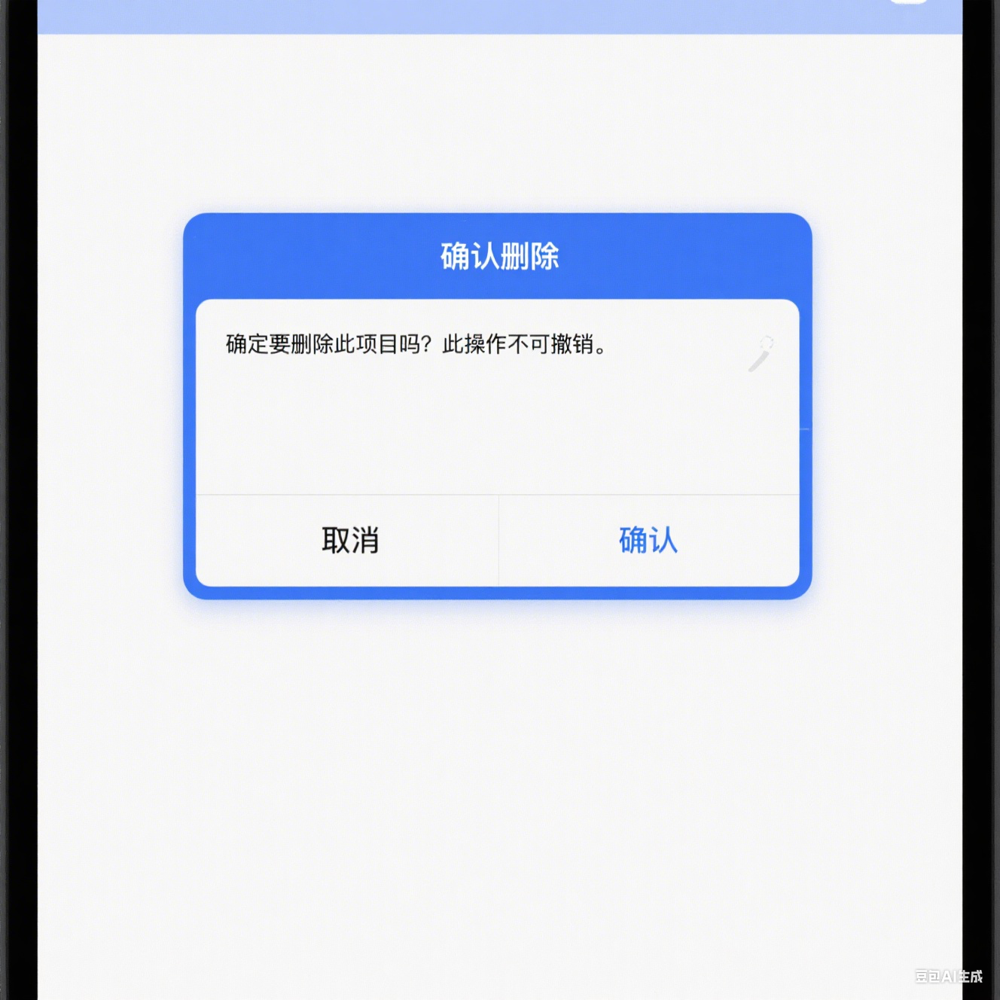
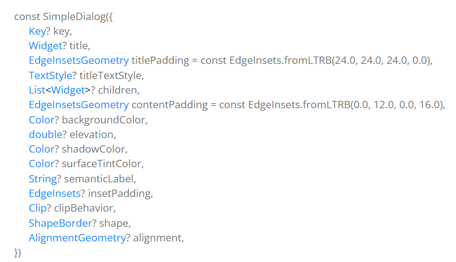
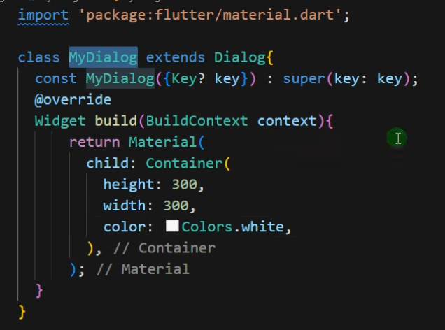
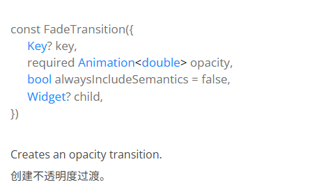

# Flutter 38~49课总结

## Flutter中的路由

- Flutter为在屏幕之间导航和处理深度链接提供了一个完整的系统。
- 在 Flutter 中，屏 (screen) 和 页面 (page) 都叫做 路由 (route)，在下文中统称为“路由 (route)”。
- 在Flutter中通过Navigator组件管理路由导航。
- 并提供了管理堆栈的方法。

  - Navigator.push
  - Navigator.pop

- Flutter中给我们提供了两种配置路由跳转的方式：
  - 基本路由
  - 命名路由

### 基本路由跳转

```dart
void main() {
  runApp(
    MaterialApp(
      title: '基本路由',
      home: FirstRoute()
    ),
  );
}


class FirstRoute extends StatelessWidget {
  const FirstRoute({super.key});

  @override
  Widget build(BuildContext context) {
    return Scaffold(
      appBar: AppBar(title: const Text('First Route')),
      body: Center(
        child: ElevatedButton(
          child: const Text('Open route'),
          onPressed: () {
            Navigator.push(
              context,
              MaterialPageRoute(builder: (context) => const SecondRoute()),
            );
          },
        ),
      ),
    );
  }
}

```

### 重要Wedgit

- Navigator： 一个小部件，它管理一组具有堆栈规则的子小部件。
- MaterialPageRoute: 一个模式路由，用一个平台自适应的过渡取代整个屏幕
- SecondRoute: 指定跳转的页面类

### 路由返回

```dart {height:'120px'}
class SecondRoute extends StatelessWidget {
  const SecondRoute({super.key});

  @override
  Widget build(BuildContext context) {
    return Scaffold(
      appBar: AppBar(title: const Text('Second Route')),
      body: Center(
        child: ElevatedButton(
          onPressed: () {
            Navigator.pop(context);
          },
          child: const Text('Go back!'),
        ),
      ),
    );
  }
}
```

### 重要Wedgit

- Navigator： 一个小部件，它管理一组具有堆栈规则的子小部件。

### 路由跳转传值

```dart
 // 方式一：
 Navigator.push(
  context,
  MaterialPageRoute(
    builder: (context) => DetailScreen(todo: todos[index]),
  ),
);

 // 方式二：
 Navigator.push(
  context,
  MaterialPageRoute(
    builder: (context) => const DetailScreen(),
    settings: RouteSettings(arguments: todos[index]),
  ),
);
```

### 重要Widget

- DetailScreen：通过给跳转页面的类的构造函数传值的方式来传递参数
- RouteSettings：在构造 Route 时可能有用的数据。

### 路由返回传值

```dart
// 传递方
onPressed: () {
  Navigator.pop(context, 'Yep!');
},

// 接收方
final result = await Navigator.push(
  context,
  MaterialPageRoute(builder: (context) => const SelectionScreen()),
);
```

### 命名路由定义

```dart
void main() {
  runApp(
    MaterialApp(
      title: 'Named Routes Demo',
      initialRoute: '/',
      routes: {
        '/': (context) => const FirstScreen(),
        '/second': (context) => const SecondScreen(),
      },
    ),
  );
}
```

### 路由跳转

```dart
class FirstScreen extends StatelessWidget {
  const FirstScreen({super.key});

  @override
  Widget build(BuildContext context) {
    return Scaffold(
      appBar: AppBar(title: const Text('First Screen')),
      body: Center(
        child: ElevatedButton(
          onPressed: () {
            Navigator.pushNamed(context, '/second');
          },
          child: const Text('Launch screen'),
        ),
      ),
    );
  }
}
```

### 命名路由传参

```dart
// 传递单个参数
Navigator.pushNamed(context, '/user', arguments: 123);

// 传递多个参数（使用 Map）
Navigator.pushNamed(
  context,
  '/product',
  arguments: {
    'id': 456,
    'name': 'iPhone',
    'price': 999.99,
  }
);
```

### 路由替换

- 即将跳转的路由来替换当前的路由

- pushReplacementNamed

```dart
Navigator.of(context).pushReplacementNamed('/registerSecond');
```

### 返回到根路由

- 从多层的嵌套路由返回到根路由
- pushAndRemoveUntil

```dart
Navigator.of(context).pushAndRemoveUntil(
  MaterialPageRoute(builder: (BuildContext context) {
  return const Tabs();
}), (route) => false);
```

## Dialog

- <span v-mark.box.red="1">Dialog 是一种用于在当前页面上显示临时 UI 的组件</span>，通常用于向用户呈现重要信息、获取确认或收集少量输入。它会创建一个浮动在当前内容之上的模态窗口，吸引用户的注意力并阻止背景交互，直到被关闭。
- 具象弹框：
  - AlertDialog
  - SimpleDialog
- 抽象弹框：
  - Dialog
- showModalBottomSheet

### AlertDialog



- 一个`Material Design`设计系统下的警告对话框，警告对话框（也称为基本对话框）通知用户需要确认的情况。

### showDialog


### 用法

```dart
import 'package:flutter/material.dart';

void main() => runApp(const AlertDialogExampleApp());

class AlertDialogExampleApp extends StatelessWidget {
  const AlertDialogExampleApp({super.key});

  @override
  Widget build(BuildContext context) {
    return MaterialApp(
      home: Scaffold(
        appBar: AppBar(title: const Text('AlertDialog Sample')),
        body: const Center(child: DialogExample()),
      ),
    );
  }
}

class DialogExample extends StatelessWidget {
  const DialogExample({super.key});

  @override
  Widget build(BuildContext context) {
    return TextButton(
      onPressed:
          () => showDialog<String>(
            context: context,
            builder:
                (BuildContext context) => AlertDialog(
                  title: const Text('AlertDialog Title'),
                  content: const Text('AlertDialog description'),
                  actions: <Widget>[
                    TextButton(
                      onPressed: () => Navigator.pop(context, 'Cancel'),
                      child: const Text('Cancel'),
                    ),
                    TextButton(
                      onPressed: () => Navigator.pop(context, 'OK'),
                      child: const Text('OK'),
                    ),
                  ],
                ),
          ),
      child: const Text('Show Dialog'),
    );
  }
}
```

### SimpleDialog


- `SimpleDialog`一个`Material Design`设计系统下的一个简单的对话框,它为用户提供几个选项之间的选择。一个简单的对话框有一个可选的标题，显示在选项的上方。



```dart
import 'package:flutter/material.dart';

class SimpleExample extends StatelessWidget {
  const SimpleExample({super.key});

  @override
  Widget build(BuildContext context) {
    return ElevatedButton(
      onPressed: () async {
        final String? result = await showDialog<String>(
            context: context,
            builder: (BuildContext context) {
              return SimpleDialog(
                title: const Text('Select assignment'),
                children: <Widget>[
                  SimpleDialogOption(
                    onPressed: () {
                      Navigator.pop(context, 'Treasury');
                    },
                    child: const Text('Treasury department'),
                  ),
                  SimpleDialogOption(
                    onPressed: () {
                      Navigator.pop(context, 'State');
                    },
                    child: const Text('State department'),
                  ),
                ],
              );
            });
        if (result != null) {
          print('Selected department: $result');
        }
      },
      child: const Text('弹出SimpleDialog'),
    );
  }
}

```

### SimpleDialogOption

SimpleDialog 中使用的一个选项


### 关闭对话框


### showModalBottomSheet

底部弹出对话框


### 自定义Dialog

内置的`Dialog`有自己的固定布局模板，无法做更多的自定义。

1. 直接使用`Dialog Widget`开发自定义对话框


2. 所以我们需要通过继承`Dialog`类来实现自定义`Dialog`。



### 用法

```dart
import 'package:flutter/material.dart';

void main() => runApp(const BottomSheetApp());

class BottomSheetApp extends StatelessWidget {
  const BottomSheetApp({super.key});

  @override
  Widget build(BuildContext context) {
    return MaterialApp(
      home: Scaffold(
        appBar: AppBar(title: const Text('Bottom Sheet Sample')),
        body: const BottomSheetExample(),
      ),
    );
  }
}

class BottomSheetExample extends StatelessWidget {
  const BottomSheetExample({super.key});

  @override
  Widget build(BuildContext context) {
    return Center(
      child: ElevatedButton(
        child: const Text('showModalBottomSheet'),
        onPressed: () {
          showModalBottomSheet<void>(
            context: context,
            builder: (BuildContext context) {
              return Container(
                height: 200,
                color: Colors.amber,
                child: Center(
                  child: Column(
                    mainAxisAlignment: MainAxisAlignment.center,
                    mainAxisSize: MainAxisSize.min,
                    children: <Widget>[
                      const Text('Modal BottomSheet'),
                      ElevatedButton(
                        child: const Text('Close BottomSheet'),
                        onPressed: () => Navigator.pop(context),
                      ),
                    ],
                  ),
                ),
              );
            },
          );
        },
      ),
    );
  }
}
```

### 弹出自定义Dialog


## PageView

PageView 是 Flutter 中用于创建水平或垂直滚动分页效果的组件，常用于轮播图、引导页、图片浏览等场景，本质是一个分页滚动的列表容器。

### 基本用法

1. 通过实例化`PageView`类，传递构造函数的配置参数来使用；

```dart
import 'package:flutter/foundation.dart';
import 'package:flutter/material.dart';

void main() => runApp(const PageViewExampleApp());

class PageViewExampleApp extends StatelessWidget {
  const PageViewExampleApp({super.key});

  @override
  Widget build(BuildContext context) {
    return MaterialApp(
      home: Scaffold(
        appBar: AppBar(title: const Text('PageView Sample')),
        body: const PageViewExample(),
      ),
    );
  }
}

class PageViewExample extends StatefulWidget {
  const PageViewExample({super.key});

  @override
  State<PageViewExample> createState() => _PageViewExampleState();
}

class _PageViewExampleState extends State<PageViewExample> with TickerProviderStateMixin {
  late PageController _pageViewController;
  late TabController _tabController;
  int _currentPageIndex = 0;

  @override
  void initState() {
    super.initState();
    _pageViewController = PageController();
    _tabController = TabController(length: 3, vsync: this);
  }

  @override
  void dispose() {
    super.dispose();
    _pageViewController.dispose();
    _tabController.dispose();
  }

  @override
  Widget build(BuildContext context) {
    final TextTheme textTheme = Theme.of(context).textTheme;

    return Stack(
      alignment: Alignment.bottomCenter,
      children: <Widget>[
        PageView(
          controller: _pageViewController,
          onPageChanged: _handlePageViewChanged,
          children: <Widget>[
            Center(child: Text('First Page', style: textTheme.titleLarge)),
            Center(child: Text('Second Page', style: textTheme.titleLarge)),
            Center(child: Text('Third Page', style: textTheme.titleLarge)),
          ],
        ),
        PageIndicator(
          tabController: _tabController,
          currentPageIndex: _currentPageIndex,
          onUpdateCurrentPageIndex: _updateCurrentPageIndex,
          isOnDesktopAndWeb: _isOnDesktopAndWeb,
        ),
      ],
    );
  }

  void _handlePageViewChanged(int currentPageIndex) {
    if (!_isOnDesktopAndWeb) {
      return;
    }
    _tabController.index = currentPageIndex;
    setState(() {
      _currentPageIndex = currentPageIndex;
    });
  }

  void _updateCurrentPageIndex(int index) {
    _tabController.index = index;
    _pageViewController.animateToPage(
      index,
      duration: const Duration(milliseconds: 400),
      curve: Curves.easeInOut,
    );
  }

  bool get _isOnDesktopAndWeb =>
      kIsWeb ||
      switch (defaultTargetPlatform) {
        TargetPlatform.macOS || TargetPlatform.linux || TargetPlatform.windows => true,
        TargetPlatform.android || TargetPlatform.iOS || TargetPlatform.fuchsia => false,
      };
}
```

2. 通过调用`PageView`类的`builder`静态方法创建`PageView`实例，且页面的创建是按需的


### 上拉无线加载功能

| 参数名        | 描述         | 类型                |
| ------------- | ------------ | ------------------- |
| onPageChanged | 换页监听事件 | ValueChanged`<int>` |

---

### 无缝轮播图

通过`SizedBox`组件作为`PageView`组件的容器，控制宽高。


### 轮播图的指示灯

通过`Container`创建元素，配合`Positioned`布局组件来定位元素。注意定位元素要再`Stack`组件中使用，因为定位涉及到层的堆栈。


### PageView实现动态轮播图

1. 定时器


2. PageController：`PageView` 的控制器。控制哪一个页面展示再`PageView`中。通过`animateToPage`方法控制页面索引。


```dart
class _PageViewExampleState extends State<PageViewExample> with TickerProviderStateMixin {
  late PageController _pageViewController;
  late TabController _tabController;
  int _currentPageIndex = 0;

  @override
  void initState() {
    super.initState();
    _pageViewController = PageController();
    _tabController = TabController(length: 3, vsync: this);
  }

  @override
  void dispose() {
    super.dispose();
    _pageViewController.dispose();
    _tabController.dispose();
  }

Widget build(BuildContext context) {
    final TextTheme textTheme = Theme.of(context).textTheme;

    return Stack(
      alignment: Alignment.bottomCenter,
      children: <Widget>[
        PageView(
          controller: _pageViewController,
          onPageChanged: _handlePageViewChanged,
          children: <Widget>[
            Center(child: Text('First Page', style: textTheme.titleLarge)),
            Center(child: Text('Second Page', style: textTheme.titleLarge)),
            Center(child: Text('Third Page', style: textTheme.titleLarge)),
          ],
        ),
        PageIndicator(
          tabController: _tabController,
          currentPageIndex: _currentPageIndex,
          onUpdateCurrentPageIndex: _updateCurrentPageIndex,
          isOnDesktopAndWeb: _isOnDesktopAndWeb,
        ),
      ],
    );
  }
}
```

### AutomaticKeepAliveClientMixin

`PageView`页面每次切换都会销毁每页的子元素，如果想缓存下来，需要使用


### Flutter Key

键是 Widgets, Elements and SemanticsNodes的标识符,不可重复。(DOMid选择器)
Key 的子类应该是 LocalKey 或 GlobalKey 的子类。


作用是：

1. 保存状态
2. 排序

### LocalKey

当前组件初始化创建的`List`组件有用。

### GlobalKey

销毁后再次创建的组件状态有用。

### GlobalKey获取子元素,修改子元素


## AnimatedList

带有动效的列表。在增删的时候给元素添加动效。


### itemBuilder


### FadeTransition



```dart
class AnimatedListSample extends StatefulWidget {
  const AnimatedListSample({super.key});

  @override
  State<AnimatedListSample> createState() => _AnimatedListSampleState();
}

class _AnimatedListSampleState extends State<AnimatedListSample> {
  final GlobalKey<AnimatedListState> _listKey = GlobalKey<AnimatedListState>();
  late ListModel<int> _list;
  int? _selectedItem;
  late int _nextItem; // The next item inserted when the user presses the '+' button.

  @override
  void initState() {
    super.initState();
    _list = ListModel<int>(
      listKey: _listKey,
      initialItems: <int>[0, 1, 2],
      removedItemBuilder: _buildRemovedItem,
    );
    _nextItem = 3;
  }

  // Used to build list items that haven't been removed.
  Widget _buildItem(BuildContext context, int index, Animation<double> animation) {
    return CardItem(
      animation: animation,
      item: _list[index],
      selected: _selectedItem == _list[index],
      onTap: () {
        setState(() {
          _selectedItem = _selectedItem == _list[index] ? null : _list[index];
        });
      },
    );
  }

  /// The builder function used to build items that have been removed.
  ///
  /// Used to build an item after it has been removed from the list. This method
  /// is needed because a removed item remains visible until its animation has
  /// completed (even though it's gone as far as this ListModel is concerned).
  /// The widget will be used by the [AnimatedListState.removeItem] method's
  /// [AnimatedRemovedItemBuilder] parameter.
  Widget _buildRemovedItem(int item, BuildContext context, Animation<double> animation) {
    return CardItem(
      animation: animation,
      item: item,
      // No gesture detector here: we don't want removed items to be interactive.
    );
  }

  // Insert the "next item" into the list model.
  void _insert() {
    final int index = _selectedItem == null ? _list.length : _list.indexOf(_selectedItem!);
    _list.insert(index, _nextItem);
    _nextItem++;
  }

  // Remove the selected item from the list model.
  void _remove() {
    if (_selectedItem != null) {
      _list.removeAt(_list.indexOf(_selectedItem!));
      setState(() {
        _selectedItem = null;
      });
    }
  }

  @override
  Widget build(BuildContext context) {
    return MaterialApp(
      home: Scaffold(
        appBar: AppBar(
          title: const Text('AnimatedList'),
          actions: <Widget>[
            IconButton(
              icon: const Icon(Icons.add_circle),
              onPressed: _insert,
              tooltip: 'insert a new item',
            ),
            IconButton(
              icon: const Icon(Icons.remove_circle),
              onPressed: _remove,
              tooltip: 'remove the selected item',
            ),
          ],
        ),
        body: Padding(
          padding: const EdgeInsets.all(16.0),
          child: AnimatedList(
            key: _listKey,
            initialItemCount: _list.length,
            itemBuilder: _buildItem,
          ),
        ),
      ),
    );
  }
}

```

### insertItem


## Flutter中的动画

1. 隐式动画
2. 显示动画

### Flutter隐式动画

动画背后的实现原理和繁琐的操作细节都被隐藏了，所以叫隐式动画。

1. AnimatedContainer
2. AnimatedPadding
3. AnimatedAlign: 动画版本的 Align，自动转换位置在给定的时间内，只要给定的对齐方式发生变化

```dart
import 'package:flutter/material.dart';

class AnimatedContainerExampleApp extends StatelessWidget {
  const AnimatedContainerExampleApp({super.key});

  @override
  Widget build(BuildContext context) {
    return Scaffold(
      appBar: AppBar(title: const Text('AnimatedContainer Sample')),
      body: const AnimatedContainerExample(),
    );
  }
}

class AnimatedContainerExample extends StatefulWidget {
  const AnimatedContainerExample({super.key});

  @override
  State<AnimatedContainerExample> createState() =>
      _AnimatedContainerExampleState();
}

class _AnimatedContainerExampleState extends State<AnimatedContainerExample> {
  bool selected = false;

  @override
  Widget build(BuildContext context) {
    return GestureDetector(
      onTap: () {
        setState(() {
          selected = !selected;
        });
      },
      child: Center(
        child: AnimatedContainer(
          width: selected ? 200.0 : 100.0,
          height: selected ? 100.0 : 200.0,
          color: selected ? Colors.red : Colors.blue,
          alignment:
              selected ? Alignment.center : AlignmentDirectional.topCenter,
          duration: const Duration(seconds: 2),
          curve: Curves.fastOutSlowIn,
          child: const FlutterLogo(size: 75),
        ),
      ),
    );
  }
}

```

### Flutter显式动画

能够参与的动画过程叫做显示动画。通过`AnimationController`控制动画的暂停，播放，倒放等

1. ScaleTransition
2. PositionedTransition
3. SizeTransition

```dart
import 'package:flutter/material.dart';

void main() => runApp(const ScaleTransitionExampleApp());

class ScaleTransitionExampleApp extends StatelessWidget {
  const ScaleTransitionExampleApp({super.key});

  @override
  Widget build(BuildContext context) {
    return const MaterialApp(home: ScaleTransitionExample());
  }
}

class ScaleTransitionExample extends StatefulWidget {
  const ScaleTransitionExample({super.key});

  @override
  State<ScaleTransitionExample> createState() => _ScaleTransitionExampleState();
}

class _ScaleTransitionExampleState extends State<ScaleTransitionExample>
    with TickerProviderStateMixin {
  late final AnimationController _controller = AnimationController(
    duration: const Duration(seconds: 2),
    vsync: this,
  )..repeat(reverse: true);
  late final Animation<double> _animation = CurvedAnimation(
    parent: _controller,
    curve: Curves.fastOutSlowIn,
  );

  @override
  void dispose() {
    _controller.dispose();
    super.dispose();
  }

  @override
  Widget build(BuildContext context) {
    return Scaffold(
      body: Center(
        child: ScaleTransition(
          scale: _animation,
          child: const Padding(padding: EdgeInsets.all(8.0), child: FlutterLogo(size: 150.0)),
        ),
      ),
    );
  }
}
```


### 执行动画

1. forward: 正序执行一次
2. stop：停止动画
3. reset：重置动画
4. reverse：倒序执行一次


