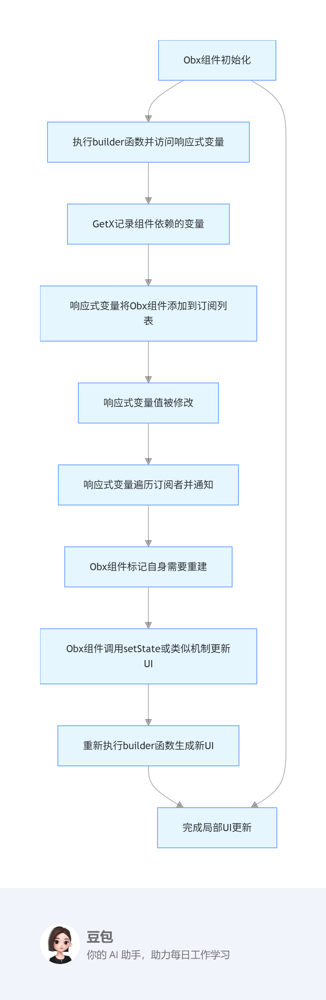

# Flutter 51~57课总结

## 核心思想


## 什么是状态管理

状态管理是指在应用程序中管理和维护状态的方式。状态可以是用户输入、网络请求的结果、UI 组件的状态等。有效的状态管理可以提高应用程序的可维护性和可扩展性。

## 状态管理的类型

状态管理可以分为以下几种类型：

1. **本地状态管理**：仅在单个组件内部管理状态，通常使用 `setState`。
2. **全局状态管理**：跨多个组件共享状态，常用的库有 Provider 等。
3. **响应式状态管理**：基于数据变化自动更新 UI，GetX 等库支持这种方式。

## GetX

GetX 是一个强大的 Flutter 状态管理库，它提供了简单易用的 API 和高性能的状态管理解决方案。GetX 的核心思想是将状态与 UI 解耦，通过响应式编程实现状态的自动更新。使用 GetX，开发者可以轻松地管理应用程序的状态，提高开发效率。

### GetX 的主要特点

1. **简单易用**：GetX 提供了简洁的 API，开发者可以快速上手，减少学习成本。
2. **高性能**：GetX 采用了高效的状态管理机制，能够在数据变化时快速更新 UI，提升应用性能。
3. **解耦**：GetX 将状态与 UI 解耦，开发者可以更专注于业务逻辑，提高代码的可维护性。
4. **响应式编程**：GetX 支持响应式编程，开发者可以轻松实现数据变化自动更新 UI 的功能。
5. **多功能**：除了状态管理，GetX 还提供了路由管理、依赖注入等功能，减少了对其他库的依赖。

## 基本用法

### 1. 安装依赖

在 `pubspec.yaml` 中添加：

```yaml
get: ^4.6.5
```

### 2. 创建 Controller

```dart
import 'package:get/get.dart';

class CounterController extends GetxController {
  var count = 0.obs;

  void increment() => count++;
}
```

### 3. 注入与使用

```dart
// 注入
final CounterController c = Get.put(CounterController());

// 使用 Obx 监听状态变化
Obx(() => Text('点击了 ${c.count} 次'))

// 调用方法
ElevatedButton(
  onPressed: c.increment,
  child: Text('增加'),
)
```

### 4. 路由与依赖注入

```dart
Get.to(DetailPage(), arguments: {'id': 1});

// 获取参数
final id = Get.arguments['id'];
```

### 5. GetX状态更新流程


