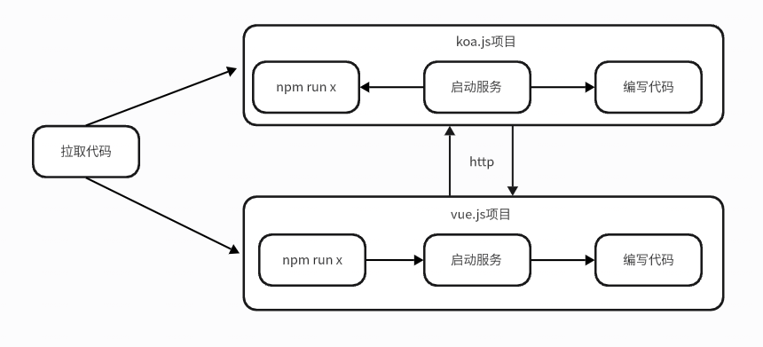

# 基于monorepo架构的全栈开发方案

## 背景

为了让前端开发人员能够做到全栈开发，我们基于koa做了一套后端业务开发框架，同时我们还有一套基于vue的前端业务开发框架。

## 当前的开发工作流

## 问题

1. 代码在一个代码库中，但是是两个项目。
2. 每个项目独立安装依赖，运行项目，构建项目，做两份体力活。
3. 无法做到端到端的类型检查，导致类型不一致的问题。
4. 无法做到统一的代码规范，导致代码风格不一致。
5. 无法做到代码共享，导致重复造轮子。
6. 开发效率低下。

## 目标

1. 统一的开发环境。
2. 统一的代码规范。
3. 统一的依赖管理。
4. 代码共享。
5. 统一的构建和运行命令。
6. 简化的开发工作流。
7. 更高的开发效率。
8. 端到端的类型检查。

## 方案

基于monorepo架构，使用npm作为包管理工具，统一前后端的开发环境和工作流。**Monorepo** 是单代码仓库管理多项目 / 包的架构，简单说就是把多个关联的 npm 包（如工具库、业务模块、前端应用）放在同一个 Git 仓库中管理，而非每个包单独建仓。对 npm 生态而言，它能高效解决多包依赖管理、版本同步、代码复用等痛点。

## 架构

## 未来的开发工作流

## 工期

1. 架构设计：1周
2. 技术实现：1周