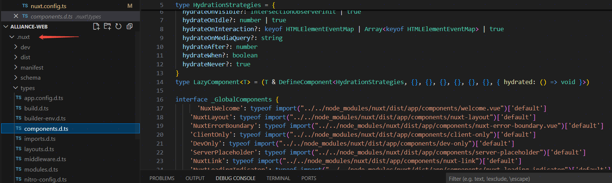
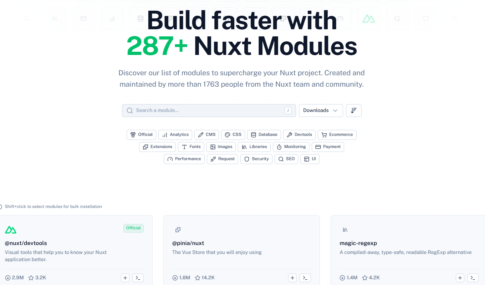
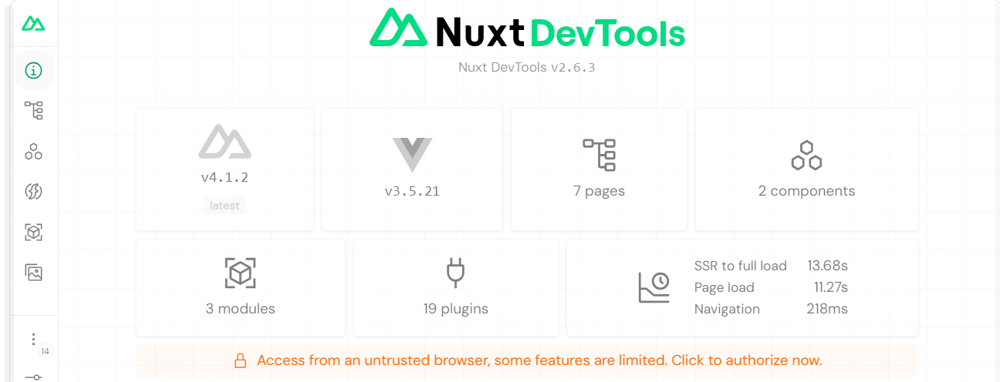
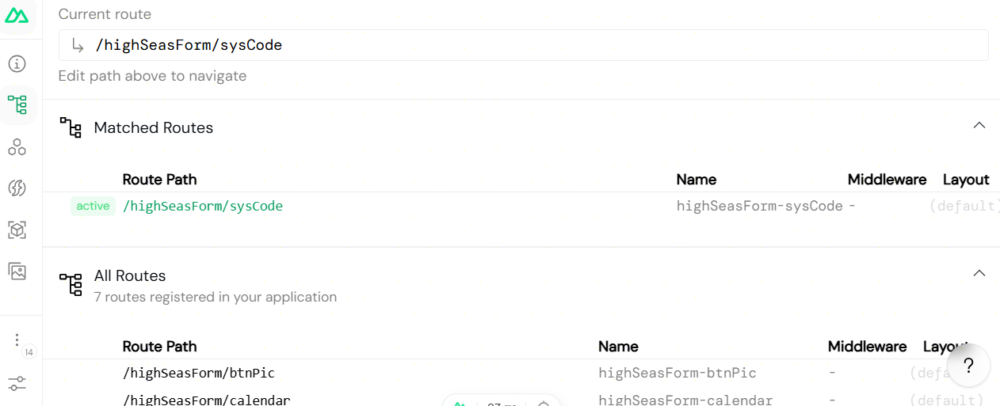

<div class="text-center">

# Nuxt 全栈框架新技术调研

</div>

## 什么是 Nuxt

Nuxt 是一个基于 <span>Vue.js 组件化</span> 的、<span>多渲染模式</span>的、<span>约定优于配置原则</span>的全栈开发框架。就像一个功能强大的 `HTML字符串` 渲染引擎。

## Vue.js 组件化

<div>组件允许我们将 UI 拆分为独立且可重用的部分，并单独考虑每个部分。应用程序通常被组织成嵌套组件树：</div>


## 多渲染模式

- 服务端渲染（SSR）

- 静态站点生成（SSG）

- 混合渲染（Nuxt 3 新增）

- 客户端渲染（CSR）

- <del>流式渲染（Streaming SSR） </del>

## 约定优于配置原则

<div>

_“约定优于配置” 是一种软件设计原则，强调通过预定义的约定来简化配置过程。Nuxt.js 采用这种理念，通过约定的目录结构和文件命名，减少了开发者需要手动配置的内容。_

</div>

例如，页面组件放在 `pages` 目录下，路由会自动生成，无需手动配置路由文件。这种方式不仅提高了开发效率，还降低了出错的可能性 。

<div class="flex flex-col justify-center items-center h-full">


</div>

## Nuxt 目录结构

<div class="h-[100%] overflow-scroll">

```text {all|4-7|8-11|12-15|16-18|19-22|23-25|27-38|39-42|43-50|57-59}
your-nuxt-project/          # 项目根目录
├── .nuxt/                  # Nuxt 开发时自动生成的临时文件（构建缓存、编译产物，无需手动修改）
├── .output/                # 生产构建输出目录（SSR/混合渲染模式，包含服务端代码和客户端静态资源）
├── assets/                 # 客户端静态资源（需编译/处理）
│   ├── css/                # 全局 CSS/SCSS 样式（如 main.scss、variables.scss）
│   ├── images/             # 图片资源（如 logo.png，构建时会被优化）
│   └── fonts/              # 字体文件（如 custom-font.ttf）
├── components/             # 公共 Vue 组件（自动导入，无需手动 import）
│   ├── common/             # 通用基础组件（如 Button.vue、Input.vue）
│   ├── layout/             # 布局相关组件（如 Header.vue、Footer.vue）
│   └── [业务模块]/         # 按业务划分的组件（如 product/ProductCard.vue）
├── composables/            # 可复用的组合式函数（自动导入，前后端通用）
│   ├── useUser.ts          # 用户状态相关逻辑（如登录、权限判断）
│   ├── useRequest.ts       # 封装请求逻辑（如二次封装 useFetch）
│   └── useToast.ts         # 全局提示组件逻辑
├── content/                # Nuxt Content 模块目录（用于管理 Markdown/JSON 等内容文件，需安装 @nuxt/content）
│   ├── blog/               # 博客文章（如 2024-01-01-first-post.md）
│   └── docs/               # 文档内容（如 installation.md）
├── layouts/                # 页面布局组件（控制页面整体结构，默认使用 default.vue）
│   ├── default.vue         # 默认布局（包含 <NuxtPage /> 渲染页面内容）
│   ├── auth.vue            # 登录/注册页面布局（无 Header/Footer）
│   └── admin.vue           # 后台管理页面布局（侧边栏+主体）
├── middleware/             # 路由中间件（控制页面跳转权限，分全局/页面/组级别）
│   ├── auth.global.ts      # 全局中间件（所有页面跳转前执行，需加 .global 后缀）
│   └── admin.ts            # 页面级中间件（仅指定页面使用，如 admin 相关页面）
├── node_modules/           # 项目依赖包（npm/yarn/pnpm 安装，无需手动修改）
├── pages/                  # 页面组件目录（文件即路由，自动生成 vue-router 路由表）
│   ├── index.vue           # 首页（对应路由 /）
│   ├── about.vue           # 关于页（对应路由 /about）
│   ├── blog/               # 博客模块页面
│   │   ├── index.vue       # 博客列表页（对应路由 /blog）
│   │   └── [slug].vue      # 博客详情页（动态路由，对应 /blog/xxx）
│   ├── admin/              # 后台管理页面
│   │   ├── index.vue       # 后台首页（/admin）
│   │   └── products/       # 商品管理页面
│   │       ├── index.vue   # 商品列表（/admin/products）
│   │       └── [id].vue    # 商品编辑页（/admin/products/123）
│   └── api/                # 客户端 API 路由（仅 Nuxt 2，Nuxt 3 移至 server/api）
├── public/                 # 静态资源根目录（无需编译，直接复制到输出目录）
│   ├── favicon.ico         # 网站图标
│   ├── robots.txt          # 搜索引擎爬虫规则
│   └── images/             # 无需优化的图片（如二维码、图标）
├── server/                 # Nuxt 3 服务端目录（存放服务端逻辑，仅在服务端运行）
│   ├── api/                # 服务端 API 路由（文件即接口，对应 /api/xxx）
│   │   ├── user.ts         # 用户相关接口（/api/user，支持 GET/POST）
│   │   └── products/       # 商品接口（/api/products）
│   ├── middleware/         # 服务端中间件（所有服务端请求前执行，如权限校验、日志）
│   │   └── auth.ts         # 服务端权限中间件（验证 Token 等）
│   ├── routes/             # 服务端自定义路由（补充 API 路由，支持更复杂的路由规则）
│   └── utils/              # 服务端工具函数（如数据库连接、敏感数据加密）
├── stores/                 # Pinia 状态管理目录（Nuxt 3 官方推荐，替代 Vuex）
│   ├── user.ts             # 用户状态 store（useUserStore）
│   └── cart.ts             # 购物车状态 store（useCartStore）
├── types/                  # TypeScript 类型定义目录（全局类型、接口声明）
│   ├── user.ts             # 用户相关类型（如 User、LoginParams）
│   └── product.ts          # 商品相关类型（如 Product、ProductListRes）
├── utils/                  # 通用工具函数（前后端通用，如格式化时间、数据验证）
│   ├── format.ts           # 格式化工具（如 formatDate、formatPrice）
│   └── validate.ts         # 验证工具（如 validateEmail、validatePhone）
├── .env                    # 环境变量文件（本地开发用，不提交到 Git）
├── .env.production         # 生产环境变量文件（构建时生效）
├── .eslintrc.js            # ESLint 配置文件（代码规范检查）
├── .gitignore              # Git 忽略文件配置（如 node_modules、.nuxt、.env）
├── nuxt.config.ts          # Nuxt 项目核心配置文件（渲染模式、模块、路由等）
├── package.json            # 项目依赖配置（脚本、依赖包版本）
├── pnpm-lock.yaml          # 依赖锁文件（pnpm 专用，确保依赖版本一致）
├── README.md               # 项目说明文档（安装、运行、部署步骤）
└── tsconfig.json           # TypeScript 配置文件（类型检查、编译选项）
```

</div>

## Nuxt 核心价值

1. Nuxt 提供多种渲染模式提高页面渲染性能
2. 工程化能力增强提高开发体验
3. 复用 Vue 生态系统

## Nuxt 提供多种渲染模式提高页面渲染性能

- 服务端渲染（SSR）：
  - 每次请求时，服务端动态生成 HTML 并返回，SEO 友好、首屏加载快。

- 静态站点生成（SSG）：
  - 构建时预先生成所有页面的静态 HTML，部署后直接返回，极致加载速度。

- 客户端渲染（CSR）：
  - 兼容传统 SPA 模式，适合纯交互型应用，像后台管理系统。

- 混合渲染（Nuxt 3 新增）：
  - 同一项目中，部分页面用 SSR（如用户中心），部分用 SSG（如首页），按需选择最优模式。

- <del>流式渲染（Streaming SSR）： </del>

## 服务端渲染（SSR）


## 客户端渲染（CSR）


## 混合渲染（Nuxt 3 新增）

```ts
// nuxt.config.ts

export default defineNuxtConfig({
  routeRules: {
    // Homepage pre-rendered at build time
    '/': { prerender: true },
    // Products page generated on demand, revalidates in background, cached until API response changes
    '/products': { swr: true },
    // Product pages generated on demand, revalidates in background, cached for 1 hour (3600 seconds)
    '/products/**': { swr: 3600 },
    // Blog posts page generated on demand, revalidates in background, cached on CDN for 1 hour (3600 seconds)
    '/blog': { isr: 3600 },
    // Blog post page generated on demand once until next deployment, cached on CDN
    '/blog/**': { isr: true },
    // Admin dashboard renders only on client-side
    '/admin/**': { ssr: false },
    // Add cors headers on API routes
    '/api/**': { cors: true },
    // Redirects legacy urls
    '/old-page': { redirect: '/new-page' }
  }
})
```

## 工程化增强

- 基于文件的路由

- 自动导入：组件（components 目录）、工具函数（composables 目录）无需 import 即可直接使用。

- TypeScript 友好：默认支持 TS，类型提示完善。

- 代码分割：自动按页面分割 JS 包，减少首次加载体积。

- CSS 支持：内置 SCSS、PostCSS，支持全局样式（assets/css）和组件样式隔离（scoped）。

- 热重载：开发时修改文件，浏览器，服务器自动刷新，提升开发效率。

## 基于文件的路由

```text
├── middleware/             # 路由中间件（控制页面跳转权限，分全局/页面/组级别）
│   ├── auth.global.ts      # 全局中间件（所有页面跳转前执行，需加 .global 后缀）
│   └── admin.ts            # 页面级中间件（仅指定页面使用，如 admin 相关页面）
├── node_modules/           # 项目依赖包（npm/yarn/pnpm 安装，无需手动修改）
├── pages/                  # 页面组件目录（文件即路由，自动生成 vue-router 路由表）
│   ├── index.vue           # 首页（对应路由 /）
│   ├── about.vue           # 关于页（对应路由 /about）
│   ├── blog/               # 博客模块页面
│   │   ├── index.vue       # 博客列表页（对应路由 /blog）
│   │   └── [slug].vue      # 博客详情页（动态路由，对应 /blog/xxx）
│   ├── admin/              # 后台管理页面
│   │   ├── index.vue       # 后台首页（/admin）
│   │   └── products/       # 商品管理页面
│   │       ├── index.vue   # 商品列表（/admin/products）
│   │       └── [id].vue    # 商品编辑页（/admin/products/123）
│   └── api/                # 客户端 API 路由（仅 Nuxt 2，Nuxt 3 移至 server/api）
├── public/                 # 静态资源根目录（无需编译，直接复制到输出目录）

```

## 编译产物

```json
{
  "routes": [
    {
      "path": "/about",
      "component": "pages/about.vue"
    },
    {
      "path": "/",
      "component": "pages/index.vue"
    },
    {
      "path": "/posts/:id",
      "component": "pages/posts/[id].vue"
    }
  ]
}
```

## 自动导入-框架内部

### vue:

```vue
<script setup lang="ts">
const count = ref(1)
</script>
```

### nuxt:

```vue
<script setup lang="ts">
const { data, refresh, status } = await useFetch('/api/hello')
</script>
```

## 自动导入-项目内部

### 内置自动导入文件夹

1. app/components/
2. app/composables/
3. app/utils/

### 自定义自动导入文件夹

```ts
imports: {
  // Auto-import pinia stores defined in `~/stores`
  dirs: ['stores']
}
```

## TypeScript 友好

### 端到端的类型提示



## 复用 Vue 生态系统

- Vue 3 支持：Nuxt 3 基于 Vue 3，享受最新特性（组合式 API、Teleport、Suspense）。
- Vue Router 集成：自动生成路由表，支持动态路由、嵌套路由。
- 丰富插件生态：支持 Vue 插件（如 Vuex、Vue I18n）。
- 兼容 Vue 生态库：大部分 Vue 组件库（如 Vuetify、Element Plus）均可直接使用。



## 强大的devtools-展示项目信息



## 强大的devtools-可视化的路由切换



<!-- ---

# 关于 Celljs

- 社区太冷了
- 只存在中文社区
- 资料少且滞后
- 没有单元测试
- 基于Webpack构建
- Java技术背景
- 没有知名大佬坐镇 -->
