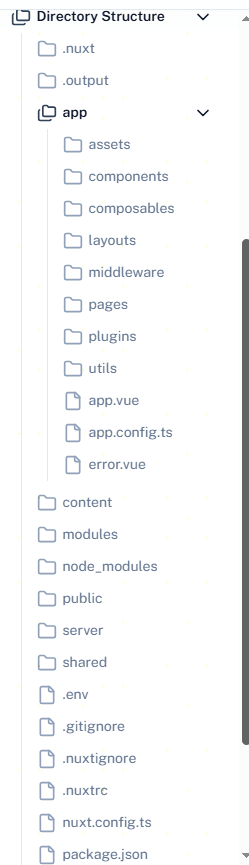

# Nuxt 全栈框架新技术调研

## 纯Vue.js项目的问题

- SEO 问题：SPA 页面内容由 JS 动态生成，搜索引擎引擎难以抓取，导致搜索引擎排名低。
- 首加载体验：首次次加载需下载完整 JS 包，首屏白屏时间长。
- 路由配置繁琐：需手动维护 vue-router 的路由表，文件增减时容易漏配。
- 服务端能力缺失：纯前端 Vue 难以直接操作数据库、处理敏感逻辑（如用户认证）。

## 什么是Nuxt

Nuxt.js 是一个基于 Vue.js 的全栈框架，用于构建服务端渲染（SSR）和静态网站生成（SSG）的应用程序。它提供了一套完整的开发工具和最佳实践，使得开发者能够更高效地构建高性能的 Web 应用。Nuxt.js 的核心理念是 **“约定优于配置”**，通过约定的目录结构和配置，简化了开发流程。

## Nuxt.js项目架构图

```text
┌─────────────────────────────────────────────────────────────────────┐
│                         客户端（浏览器）                              │
│  ┌─────────────────┐  ┌─────────────────┐  ┌─────────────────────┐  │
│  │  页面组件        │  │  公共组件        │  │  客户端交互逻辑      │  │
│  │  (pages/*.vue)   │  │  (components/*)  │  │  (composables/*.ts) │  │
│  └────────┬────────┘  └────────┬────────┘  └──────────┬────────────┘  │
│           │                    │                      │               │
│           ▼                    ▼                      ▼               │
│  ┌─────────────────────────────────────────────────────────────┐     │
│  │                  客户端框架核心（Vue 3 + Nuxt 运行时）        │     │
│  │  - 路由管理（自动路由 + 动态路由）                           │     │
│  │  - 水合过程（Hydration）：激活服务端渲染的 DOM 交互           │     │
│  │  - 状态管理（Pinia / useState）                             │     │
│  │  - 数据请求（useFetch / useAsyncData）                       │     │
│  └────────────────────────────────────────────────────────────┘     │
└──────────────────────────────────────────────────────────────────────┘

┌─────────────────────────────────────────────────────────────────────┐
│                         服务端（Node.js）              │
│                                                                     │
│  ┌─────────────────────────────────────────────────────────────┐   │
│  │                  服务端入口（Nitro 引擎）                    │   │
│  │  - 处理请求路由分发（客户端页面 / 服务端 API）                │   │
│  │  - 渲染模式控制（SSR / SSG / CSR / 混合渲染）                │   │
│  │  - 中间件执行（服务端中间件 + 路由中间件）                   │   │
│  └────────┬──────────────────────────────┬────────────────────┘   │
│           │                              │                         │
│           ▼                              ▼                         │
│  ┌─────────────────────┐        ┌─────────────────────────────┐   │
│  │  服务端页面渲染      │        │  服务端 API / 逻辑          │   │
│  │  （SSR / SSG 核心）  │        │  （server/ 目录）           │   │
│  │  - 服务端解析 Vue 组件 │        │  ┌─────────────────────┐   │   │
│  │  - 生成完整 HTML 输出  │        │  │  API 路由           │   │   │
│  │  - 预获取页面数据      │        │  │  (server/api/*.js)   │   │   │
│  └─────────────────────┘        │  ├─────────────────────┤   │   │
│                                 │  │  服务端中间件       │   │   │
│                                 │  │  (server/middleware)│   │   │
│                                 │  ├─────────────────────┤   │   │
│                                 │  │  数据库交互         │   │   │
│                                 │  │  （Prisma / 其他ORM）│   │   │
│                                 │  └─────────────────────┘   │   │
│                                 └─────────────────────────────┘   │
│                                                                     │
│  ┌─────────────────────┐  ┌─────────────────────┐  ┌─────────────┐ │
│  │  静态资源处理        │  │  配置文件           │  │  工具函数    │ │
│  │  (public/ / assets/) │  │  (nuxt.config.ts)   │  │  (utils/*)  │ │
│  └─────────────────────┘  └─────────────────────┘  └─────────────┘ │
└─────────────────────────────────────────────────────────────────────┘

```

## Nuxt 的核心特性

1. **服务端渲染（SSR）**：Nuxt.js 支持服务端渲染，可以提高页面加载速度和 SEO 性能。
2. **静态网站生成（SSG）**：Nuxt.js 可以将应用程序预渲染为静态 HTML 文件，适合部署到 CDN 上。
3. **模块化**：Nuxt.js 提供了丰富的模块系统，可以方便地集成各种功能，如认证、数据获取等。
4. **插件系统**：Nuxt.js 支持插件，可以扩展框架的功能，满足特定需求。
5. **自动路由生成**：基于文件系统的路由生成，简化了路由配置。

## 约定优于配置

“约定优于配置” 是一种软件设计原则，强调通过预定义的约定来简化配置过程。Nuxt.js 采用这种理念，通过约定的目录结构和文件命名，减少了开发者需要手动配置的内容。例如，页面组件放在 `pages` 目录下，路由会自动生成，无需手动配置路由文件。这种方式不仅提高了开发效率，还降低了出错的可能性。

### 目录结构



### 具体表现

#### app

- pages/ 目录下的 Vue 文件自动生成路由（如 pages/user.vue → 路由 /user）；
- components/ 目录下的组件自动注册，无需手动 import 即可在页面中使用；
- layouts/ 目录下的布局文件可以定义应用的整体结构，页面可以选择使用不同的布局；
- middleware/ 目录下的中间件可以在页面渲染前执行逻辑；

#### server

- api/ 目录下的文件自动成为 API 接口（如 api/user.js → 接口 /api/user）。
- routes/ 目录下的文件自动成为路由（如 routes/user.js → 路由 /user）。
- middleware/ 目录下的文件自动成为中间件（如 middleware/auth.js → 中间件 /auth）。

## Nuxt 核心价值

### Nuxt 提供多种渲染模式，不同场景需求：

- 服务端渲染（SSR）：
  - 每次请求时，服务端动态生成 HTML 并返回，SEO 友好、首屏加载快。

- 静态站点生成（SSG）：
  - 构建时预先生成所有页面的静态 HTML，部署后直接返回，极致加载速度、可部署到 CDN，运维成本低。

- 混合渲染（Nuxt 3 新增）：
  - 同一项目中，部分页面用 SSR（如用户中心），部分用 SSG（如首页），按需选择最优模式。

- 客户端渲染（CSR）：
  - 兼容传统 SPA 模式，适合纯交互型应用，像后台管理系统。

### 文件即路由

- pages/ 目录下的 Vue 文件自动生成路由（如 pages/user.vue → 路由 /user）；

### 服务端能力

- api/ 目录下的文件自动成为 API 接口（如 api/user.js → 接口 /api/user）。

### 工程化增强

- 自动导入：组件（components 目录）、工具函数（composables 目录）无需 import 即可直接使用。

- 代码分割：自动按页面分割 JS 包，减少首次加载体积。

- CSS 支持：内置 SCSS、PostCSS，支持全局样式（assets/css）和组件样式隔离（scoped）。

- TypeScript 友好：默认支持 TS，类型提示完善。
