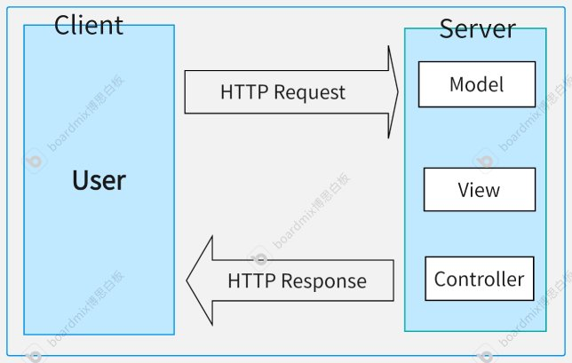
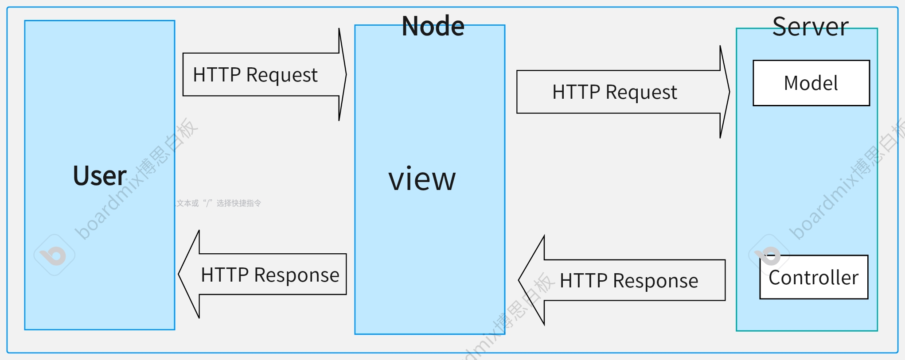

# 旅仓 PC 前端架构设计与实现

## 自我介绍

| 姓名     | 季明壮                                                                                                                       |
| -------- | ---------------------------------------------------------------------------------------------------------------------------- |
| 基准岗位 | 前端开发                                                                                                                     |
| 职级     | T5                                                                                                                           |
| 核心工作 | 旅仓分销平台前端相关系统的架构设计与实现，以及日常开发与维护。其中包括旅仓 PC 站，旅仓 M 站，旅仓小程序，旅仓 CRM 管理系统等 |

## 旅仓 PC 前端架构设计与实现复盘

### 背景

**旅仓**是同程旅游授权的全品类的分销网站，包括：旅游线路，酒店，机票，等等产品和服务。

但是旅仓技术方案目前面临几个问题对我们的开发与迭代造成了巨大的负担：

1. 采用的是`aps.net mvc`的技术架构，前端只是`mvc`中的`v`，前后端耦合严重。
2. 当前的前端技术栈老旧，技术栈采用的是基于`jQuery+plugins`的方案，写复杂逻辑很痛苦。
3. 逻辑复杂且混乱，代码组织结构不清晰，导致维护成本较高，再发展下去肯定会慢慢变的不可维护了。

所以进行技术架构，技术栈升级。而且为了不影响业务日常工作开展，我们进行了渐进式的项目演进。

### 目标

1. 架构升级，提高开发人员的开发效率与开发体验。
2. 老项目重构，提高项目的可维护性和可拓展性等。
3. 不影响业务日常工作开展的前提下给业务交付开发结果。

### 技术方案

#### 第一阶段

1. 开发时进行前后端分离

   - 前后端分离

     - 首先进行前后端分离，让前端拥有前端项目的主动权，独立设计，独立开发，独立部署（面向`业务`与`HTTP API`）。

       
       
(前后端分离之前)

       
       
(前后端分离之后)

   - 前端项目架构设计

     - 需要考虑的事情

       - 应用形态定位：PC 旅仓系统是传统的 Web 网站应用，非工具类型的重型应用，非静态的静态网站。

       - 应用交互方式：这类应用一般交互方式为页面之间通过超链接的方式进行互相连接，且为了用户查看方便，跳转之间不会覆盖上一个页面，而是在新的页面打开。

       - 网站营销需求：需要搜索引擎优化(seo)

     > **总结：基于以上种种，我们决定采用多页开发架构(MPA)**

     - 技术选型：

       - Vite：项目构建工具

       - Vue3：UI开发

       - Vue Router`(可选)`：主要是为了复杂页面准备，可能有主页中存在子页面的情况

       - Pinia：复杂数据流管理

       - 其他：三方工具库，组件库等

     - 架构图

       
        
(前端架构图)

2. 构建时产物进老项目

   - 从三个方面考虑：

     - 兼容老项目：这样可以让我们把代码部署在一个站点上，新老项目只需要根据`url`跳转即可。

     - 避免技术债务和较大的工作量：原本是想基于微前端方案，重新独立部署前端，通过微前端将老项目兼容进来，但是时间紧，任务重，因为之前技术栈老旧，且是多页架构的，每个页面都要当作一个子应用数量庞大。

     - 开发效率，尽快满足业务需求：人少，活多，想尽快上线。

   - 我们是怎么做的：

     - 通过编写`vite`插件，在构建的生命周期钩子中，将对应产物`.html`写入到对应的`C#`模板中，同样静态资源`css,js,图片`都放到`asp.net`存放的静态文件的文件夹下。

     
     

3. 运行时跑在老服务器上

   - 到这里就结束了

#### 第二阶段 _（未来计划）_

项目完全不再依赖后端服务器`特指的是传统后端服务器，asp.net,java`，可独立部署，这个阶段会结合`微前端`、`ssr`、`monorepore`做进一步架构探索。

### 总结

#### 优点

1. 架构升级，提高开发人员的开发效率与开发体验，更好的做到业务开发的交付。
2. 从技术角度来看，我们在尽量对齐业界最新技术实践，保持开发人员的核心竞争力。
3. 从项目角度来看，我们在尽量保持的项目可持续发展（可维护性，可拓展性，可复用性，健壮性等等），与时俱进。

#### 缺点/展望

1. 项目的监控（埋点，异常，性能）缺失，促使我们对问题后知后觉，后续进一步补齐这一块的短板，接入公司的监控平台中去。
2. 旅仓`web`网站的应用形态，最终技术方案应该时`ssr`，这样可以给我们后续的优化，新的技术方案的采用等等带来便利。
3. 要做精细化拆包，因为多页架构，希望能够将每个页面的依赖控制到最低，以及公共包的缓存。
