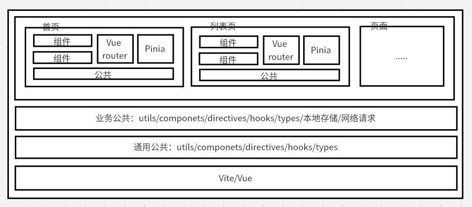
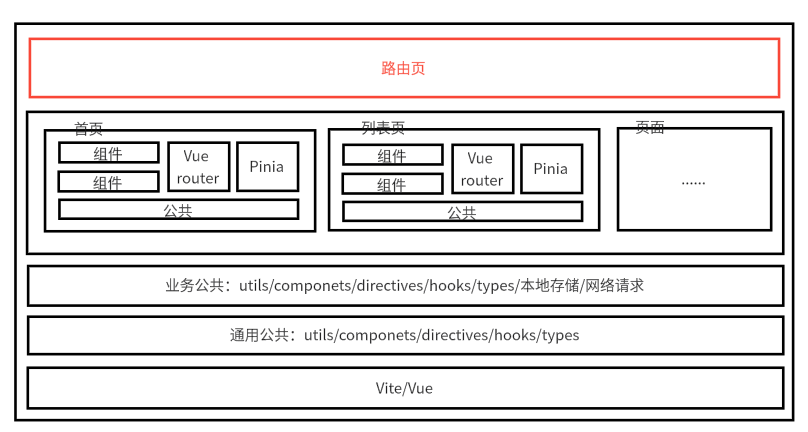
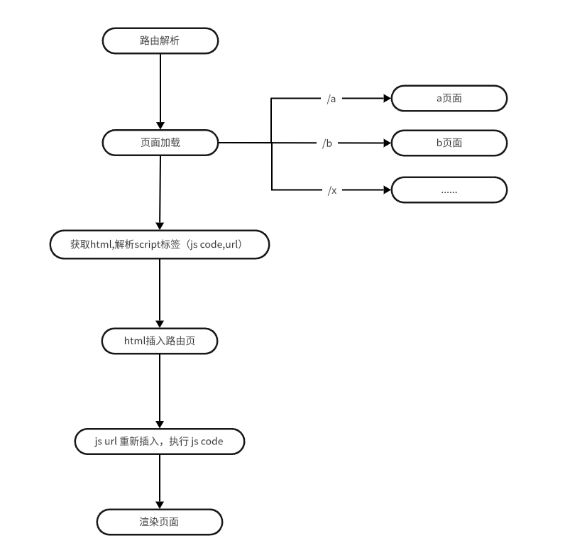

# 旅仓 PC 路由改造方案

## 背景

旅仓PC前端是多页的架构，后部署方式选择了 Ngnix 托管静态资源的方式部署，所以前端是没有路由的，只能通过 Ngnix 的配置来做路由的跳转。但是每次新增一个页面都需要在 Ngnix 上配置路由，导致操作繁琐，不利于维护，且容易忘记配置，导致页面无法访问，甚至可能会因为配置错误，导致服务器部署失败。所以需要对路由进行改造，改造成前端路由的方式。避免每次都要改服务器。

## 目标

- 前端路由化，避免每次新增页面都要改服务器，减少失误。
- 保持现有的多页架构不变，继续支持多页架构，减少工作量。
- 保持现有的 Ngnix 部署方式不变，继续支持 Ngnix 部署方式，不引入新技术债务。
- 保持当前的开发体验不变，且新的方案与当前工作流一致。开发环境一致，部署方式一致，没有侵入性。

## 方案

通过微前端的思路来实现路由化，主应用负责路由的管理和页面的加载，子应用负责具体页面的实现。主应用通过路由来加载不同的子应用，实现路由化的效果。

### 之前的架构

### 现在的架构

## 实现

### 逻辑流程图

1. 通过服务器路由到打到路由页面中，获取当前路由的地址。

2. 根据路由来加载对应页面的 HTML 字符串,解析提取其中的 html, css, js，动态插入到当前页面中，执行 js，激活页面，实现路由的效果。

3. 测试每个页面，确保没有不兼容的地方。

## 计划

- 9.1-9.5 方案评审，确定方案可行性。
- 9.8-9.12 方案开发，完成路由化的功能开发。
- 9.15-9.19 方案测试与上线。
