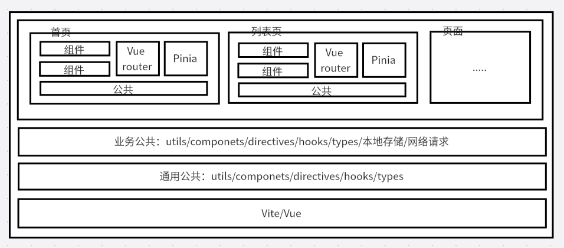
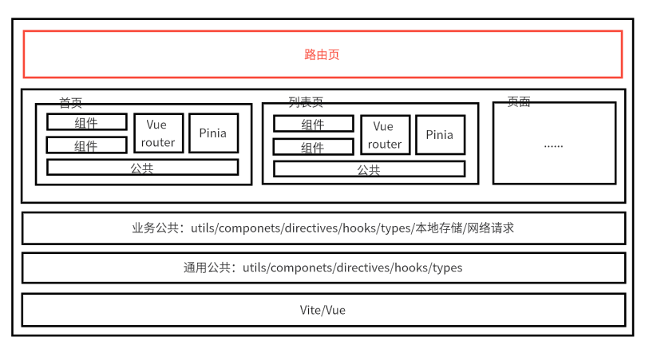

# 旅仓 PC 路由改造方案

## 背景

旅仓PC前端是多页的架构，部署方式选择了 Ngnix 托管静态资源的方式部署，所以前端是没有路由的，只能通过 Ngnix 的配置来做路由的跳转。但是每次新增一个页面都需要在 Ngnix 上配置路由。有以下问题：

1. 导致操作繁琐，不利于维护。
2. 且容易忘记配置，导致页面无法访问。
3. 甚至可能会因为配置错误，导致服务器部署失败。

所以需要对路由进行改造，改造成前端路由的方式，在前端配置路由即可，避免每次都要改服务器。

## 收益

- 前端路由，避免每次新增页面都要改服务器，减少失误。
- 保持现有的多页架构不变，继续支持多页架构，减少工作量。
- 保持现有的 Ngnix 部署方式不变，继续支持 Ngnix 部署方式，不引入新技术债务。
- 保持当前的开发体验不变，且新的方案与当前工作流一致。开发环境一致，部署方式一致，没有侵入性。

## 方案

通过微前端的思路来实现前端路由，

主应用负责:

1. 路由的监听与解析
2. 对应路由页面的入口**html**加载
3. 解析html中的js
4. 执行js，激活页面

子应用负责:

1. 具体页面的实现

## 微前端应用架构图

### 旅仓之前的架构

### 旅仓现在的架构

## 实现

### 逻辑流程图

## 注意

1. 确保js顺序执行，避免依赖混乱。
2. 开发注意事项，因为通过主页面加载子页面，所以子页面不存在window相关事件，比如onload，DOMContentLoaded，onpageshow, onpagehide等,统统可以通过组件钩子函数来实现。
3. nginx服务器配置需要支持根路由都指向主页面，且保证html文件不缓存。
4. 测试每个页面，确保没有不兼容的地方

## 计划

- 9.1-9.5 方案评审，确定方案可行性。
- 9.8-9.12 方案开发，完成路由化的功能开发。
- 9.15-9.19 方案测试与上线。
