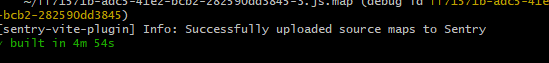
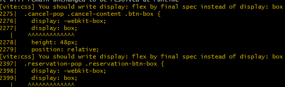
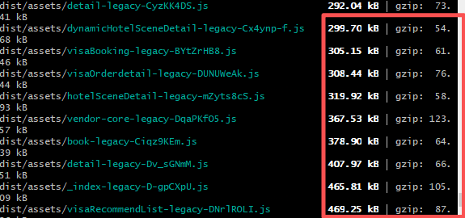
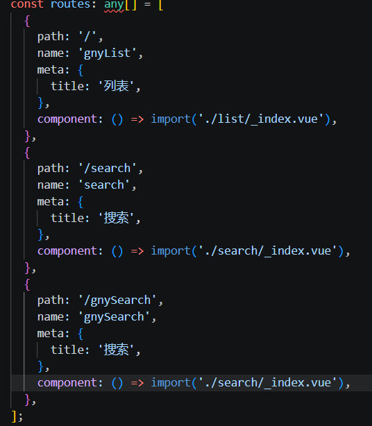
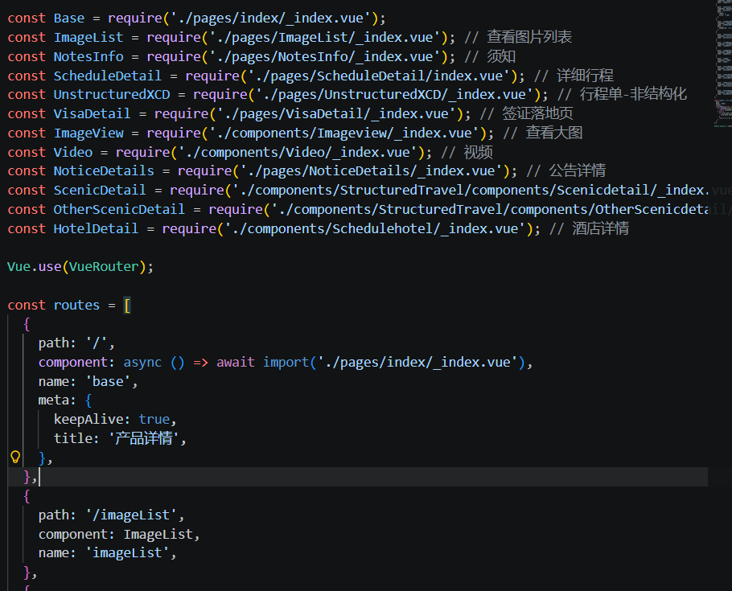
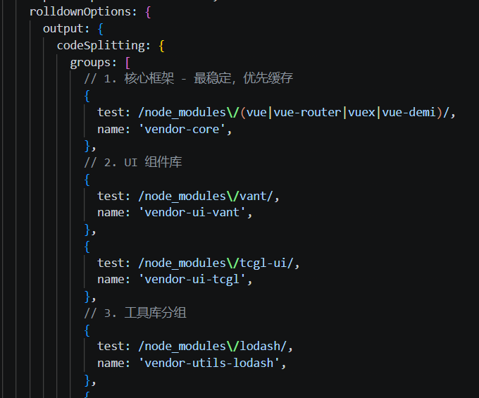
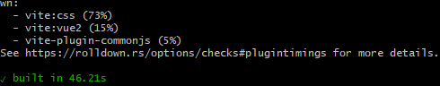
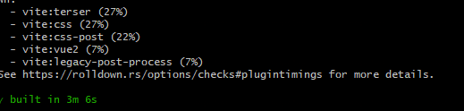
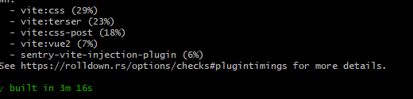

# 旅仓 H5 Vite 构建性能优化

## 问题

### 1. 构建时长较长



### 2. 部署平台构建流程中 @sentry/vite-plugin 插件的执行导致浏览器卡死

### 3. 预发构建破坏生产source map, 导致生产环境异常无法定位

修改后的文件hash不一致，导致生产环境的source map无法正确映射到源代码，无法定位异常位置。

### 4. 构建工具脱节

<br />

## 优化

### vite 相关优化

#### 1. vite的大版本升级vite5.0.1到vite8.0.12

- 从当前使用的vite版本是5.0.1，升级到vite8.0.12版本。

  - vite5.x版本生产构建用的是rollup，js版本的打包器，vite8.x版本生产构建用的是rolldown。
  - vite8.x的rolldown打包器的插件api与rollup的插件api兼容，插件无需修改。

- 一同升级vite插件，同时确保插件与vite的兼容性，兼顾每个插件的对等依赖的vite版本。

  - @vitejs/plugin-vue2
  - @sentry/vite-plugin
  - vite-plugin-commonjs

- css压缩兼容问题

  - vite8默认css压缩工具为lightcss,与Vue框架的/deep/穿透选择器不兼容，将压缩器回退到esbuild

- css非标准样式引起的构建警告

  - display:box， 2009 年最早期的草案语法
  - 已被现代标准取代：display: flex 已经成为 W3C 的正式推荐标准

  

- 跟进技术迭代.

  - 更加精细化的分包控制。

#### 2. 关闭 reportCompressedSize 功能


1. 构建时会计算每个输出文件的gzip压缩后的大小，并在构建完成后生成一个报告，显示每个文件的原始大小、gzip压缩后的大小以及压缩率。

2. 关闭`reportCompressedSize`功能，避免构建时计算gzip压缩后的文件大小。




#### 3. 图片、字体、视频等大文件静态资源处理

1. 放在项目的assets目录下的静态资源，构建工具会对其进行处理优化，例如文件生成hash码，压缩等等。

2. 其中可能会存在尺寸较大的文件，字体，视频等，构建工具处理这些文件会增加构建时间。

3. 类似静态，大文件通常作为外部模块，只是提供引用，将其外置利用cdn进行加载。


### 构建流程编排优化

为避免所有环境共用同一套复杂配置，我们将构建流程按环境拆分为五类：common、dev、qa、stage、prod。

- common：基础通用配置和插件，所有环境共享。
- dev：本地开发专用配置，主要用于加速热重载与本地调试。
- qa：测试验证环境，主要用于功能与业务流程验收。
- stage：准生产环境，尽量保持与 prod 一致，用于上线前验收。
- prod：生产环境配置，开启完整优化和上报流程。

这种分层编排的好处是：

- 不同环境只加载必要插件，避免 dev/qa/stage 承担 prod 一样的成本。
- 可以把体积、兼容和监控三类开销做精细化控制。
- 保证 prod 环境的构建输出稳定，同时让测试和开发构建更轻量。

项目中我们重点优化了两个与环境编排相关的插件：

1. @vitejs/plugin-legacy

- 该插件用于生成兼容旧浏览器的 legacy bundle。它会同时输出 modern 和 legacy 两套 chunk，导致构建时间和产物体积显著增加。
- Vite 本身默认产物目标为 `baseline-widely-available`，对应现代浏览器：
  ```
  Chrome >=111
  Edge >=111
  Firefox >=114
  Safari >=16.4
  ```
- 只有要兼容低于 ES2015 的旧浏览器时，才需要 legacy 插件。否则默认即可产出现代 bundle。
- 优化策略：
  - dev/qa 环境关闭 `@vitejs/plugin-legacy`，避免重复生成 legacy chunk。
  - prod 环境根据业务兼容要求决定是否开启，否则优先禁用。
  - 若必须支持老旧浏览器，可只在 stage/prod 环境开启，并且尽量精简 legacy 兼容目标。

2. @sentry/vite-plugin

- 该插件负责上传 Sentry 所需的 sourcemap，便于线上异常定位。
- 问题在于：
  - 打开 sourcemap 会增加构建时间；
  - 每次构建都上传 sourcemap，会产生额外网络开销；
  - 非生产构建上传 sourcemap，可能干扰线上映射文件管理。
- 优化策略：
  - 仅在 prod 环境开启 `@sentry/vite-plugin` 和 `build.sourcemap`。
  - dev/qa/stage 环境关闭 sourcemap 上传，减少构建负担。
  - 内部排查阶段可以使用 vconsole / 本地调试方案，而不依赖线上 sourcemap 上传。

通过这套环境分层的编排方案，我们让构建流程更符合“各环境只做必要工作的原则”，从而显著降低 dev/qa/stage 的构建成本，同时保留 prod 的稳定性和监控能力。

### vite 插件相关优化

#### 1. @vitejs/plugin-legacy 插件优化

1. 该插件会生成两份chunck,一份modern版本，一份legacy版本，构建耗时增加。

2. 关闭`@vitejs/plugin-legacy`插件`renderModernChunks`，避免构建时生成现代浏览器的代码。


### 重构

#### 1. 部分项目cjs模块进行esm模块重构


1. 项目中存在一些cjs模块，构建工具通过`vite-plugin-commonjs`插件对其进行转换为esm模块，再交给打包工具完成cjs与esm模块的交互。

2. 动态酒景项目所有cjs模块进行esm模块重构，减少构建时的转换成本。

3. 后续可以将cjs模块转esm模块插件移除，减少构建时的插件数量。


### 杂项

#### 1. 分包优化

1. 静态导入路由转换为动态导入路由（路由懒加载改造），减少首屏加载的js体积，同时进行有效的缓存。




2. 将一些第三方库进行分包，减少首屏加载的js体积，同时进行有效的缓存


。


#### 2. 删除无效页面

1. 测试页，空页面等


#### 3. 删除无用依赖

1. @vitest/coverage-c8
2. @vue/test-utils
3. @tsconfig/node-lts
4. jsdom
5. @types/jsdom
6. npm-run-all
7. rimraf
8. @rushstack/eslint-patch
9. postcss-html
10. postcss-scss
11. @typescript-eslint/eslint-plugin
12. eslint-plugin-tsdoc
13. eslint-plugin-prettier
14. html2canvas
15. @vue/tsconfig

#### 4. 升级eslint及其插件

1. eslint升级到9.0.0版本，配置文件扁平化，告别复杂的遍历目录树去查找和合并。
2. 并行支持多线程并行检查，代码检查的耗时能大幅缩短。
3. 提升编辑器的使用体验，减少编辑器卡顿的情况。

## 优化成果

#### 1. 性能数据对比表
| 环境   | 优化前构建时长 | 优化后构建时长 | 提升幅度 |
|--------|----------------|----------------|----------|
| QA     | 4m56s          | 46.21s左右        | ≈84%   |
| Stage  | 4m56s         | 3m6s左右        | ≈37%   |
| Prod   | 4m56s          | 3m16s左右       | ≈33%   |

> 注：以上数据为多次构建的平均值，具体时长可能因代码规模和机器性能略有差异

#### 2. QA 环境构建时长优化


#### 3. Stage 环境构建时长优化


#### 4. 生产环境构建时长优化


#### 5. 技术升级

- 升级vite版本，跟进技术迭代。
- 升级eslint版本，提升编辑器的使用体验。

#### 6. qa与stage环境构建时浏览器不在被卡住

6.1 通过进一步拆分vite的sentry插件到本地运行，可以解决这个问题，但是构建流程割裂且易于遗忘，不推荐。

#### 7. 只会在生产环境下构建生产source map,避免代码映射异常