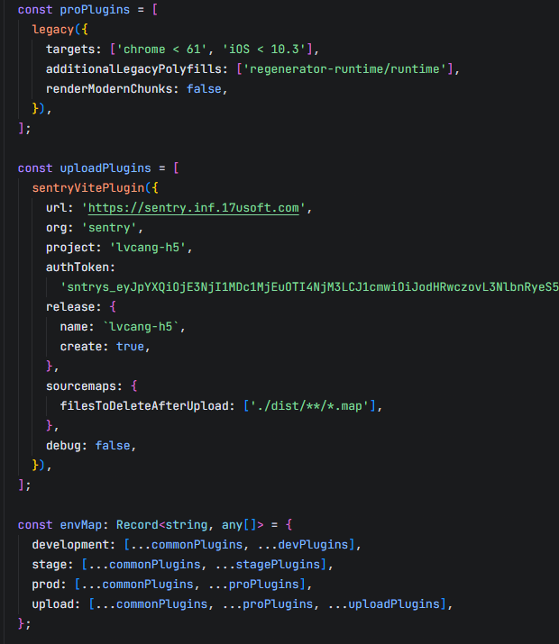

# 旅仓 H5 Vite 构建性能优化

 

## 背景

### 1. 构建时长

![](data:image/png;base64,iVBORw0KGgoAAAANSUhEUgAAAjAAAAApCAIAAACk1YRCAAAQAElEQVR4AexdTWhjS3aumUV2d+XLLAwDFjR0E4g3uVo1eSAnEMKABI92Ah4li9dpsFYRvWhmo15Ys5hFMHoDGTUMvQnGi7h5IC/CZGPBg85Gd5Hxyg8ariDQEJBXgiwGhpnv1Klbt+6vftoeS6+PKZVOnXOq6tR3RZ17qsr3/vAv5U8QEAQEAUFAENgABH6o5E8QEAQEAUFAENgABMQhbcBFEBPuCQFpVhAQBLYKAXFIW3W5xFhBQBAQBL6/CIhD2p5r++d//+pn7fr22CuWCgKCwP0h8L1s+VMdUvvNOHzXc6DpXYTmb/ym7fBdMtG5eJ3wqSlT9cJtMdGIKdIs6TRtTFyBvtvD8Xh4RFTvXWj7BW36pC+jQErZD6ontUh4NBxTFfrY1ohvPhhjaWtOpwtGahrD14/bw1+++usfzSegnURQjIdlQDuKTMKqUFtrCUUtpMDMaHJxYU4NEhYht79Qv0IhB7VKGi//UVU0KCJBQBDYDgQ+ySFhLusGnjNQTByt2nQU6L8rv1s0fZCOHw5I5XTiN82srZtSk1NiB6ezg7B0ptaabqeYv2yng8lOq6hT2FjzvdnHcxDt3Z357AMIpN7+XmTMpZ4bHVIAP5PQRbfu9glv9LKueBTBYNbIzMI0xlqmjbgI+1txp4PQby3nTto/e17//6uTl6O4mfW++4dBcHiyTN3lNdEajTd/TSFYPeWgVuC0TOPBaBZ0tUNdvWGpIQgIAhuPwLoOCTNyGHaDWTR1hvh6v6ai0bM+s/rfTFTQ0rEOJqx4ytY6V8dnpHP+/mbuPfkC9/ftp4+9efjW+IPzztW0dqADLEzfoZ2yCztVNd9T0TV3evb+u7nnF/kC9DtlJeizZ1LqaNefzyIypfRDBoTd+m3kqrW/eOLNJ295FOqsM45qDROm6Oin5U+jeUmT6F4ZS9TZtwCg0Nx05ebX/xjMr/711fs0Oy7Bq3FwEoOsFJlh4x7CjR2/cyF0ZYyObin2WqEFWfPRACJdPfWjynj4BiXuouhGAdiqKHdNTexFluiqaA3daTIsDGS1NAu1et2qe3Hjqj8K57V9/ZuCie9MY4jKDMsYL1+CgCCwlQis65CUurlETHF4nRl1dn73d2mVzLndPqF7dPYe6ugp5vWbb7VzUmr20RDcJPuVs+NG0OhYQVGn0Wyu4klKO7a0i9HTXBg2a2qvpSewVk3VWvByMOyRr9STruaGzOG+U/kNhVDPsgNVt0XmouJsguiv8c0MZGEic/fMnKodW9rcgjr13j/V/yz8j1ffFsiI5dX879BnEFDEmfgkEi36AN5BOFcIah2Qc5W8+uOZ7mAwmdda1s9ZvfJrCsz3r/E7CdBLrRl2/SsqnE7mewe8fGrb0EQB1O1dXzk/qrOPM6XRw2Vt7RDUaHCwdKCpe5FMEBAENhSBdR3SeaeTX/k5uY68+nMd2WC4vS9Tq1zgOAn33WFIq14cFVFkU2vGd99Hw4M9R9eShZ0iQGkEI8XOpuuPg4YJXEw1zLmYs0ZTFZEHpZlxHmJ2pdU5THaeNyN/A43LWf0lhxGmIn+dHXf6TDk5RTZ7Ldzya1572Ehisv5x4j61NJuRPZfW3KugyhPouv/c+bsf3Vz8wjplzXQzG6tRZGl9s6vxqXQ05kHRZVI7uwhpi1rMXFOtMp+M9O+EEFPzyTcaSx0Z+4+0gpMVQk1y1/d/wO0H8dwPQboQRreC0J8ZAjLcbUFgXYdUPL7+4elEBSbk2L8euctc6RoUM8ELYJ+JV28wp4ymCFx0tPJCXeG2PV2hvETz4AHfwQe0ncMNpvVpr+haz4xYMbOhGDrFloqeI5U6ORxNvfqXy639nHcalxFu+bW5z9V4UrZAlzaDSrSE1bDmHhQsN/24fvA39V3Sxaf+85/sz/777a/+F3RJcuZrCr9KHUZJ9TtjZ69pruGZ3sPLsddinB1f4e5H/9QKbiPWalIqCQKCwAMjcLcOSSnM1PAzOh1+wGrLgjmofx3xCgxg6D/T1ZA1Osr3nHUaCMuTu4GBaOnX2eUgrO2EIS/Tkfto7SntSApmMZrNy/vJSmidCrYirWQuXKOKAw51dvx2Mje7ZUn7f/VV7xdff/36KXGa7frO9W/+rWTziDQ27uNe07sxznWxj7BjyK2y/8Mqold/iSsbh9cslFwQEAS2EIG7dkgOBIUbJOQesvvnTh1D0qxt4xjDW/eLwqDLiLZJ4DuwezGfYMEuwErZeXs4Dt0jeQielvKCOUt6+7XsllJOZwXGeeenv/yt/5OfY5flq2Zd/c+oKjxCu858jSHcpSVofIm03DVdoqEiFdo04u1ELcUqqz0SohlnnQauK2Lx2r7zLwRaJJkgIAhsGQJ365Bo9czsrBwNnweeDQUsKrzS0jJzR++iWZuHIyyauZNa712rFu892IqlBDaulA0y2sMXdW96ZU7rxXUwixlPg/vrW3sYgXZEPHMOUKnXF609e5orrln2nZxb44rx7kiZfsLvX0+VPZLXfvPcOUKWKH38987g/e/qX/3XP/zF/OY3o0RQSHl1gycNwVhC0d7ePq8/Vm7mFba4GrPsmq7WSpn2ycgJInst/Kj0YUn3B6N0lHytl2TLmhG+ICAIbD4Cd+uQaA/Jb2L9hA8sDA7NHOE4KuXohPT/JXwGAXHM6LautwRCOIZRvEedmneK4cTSzWgWcNVuXU0G8bnzWL399LHis3yJZ9IydEoHtLS9YdOfnB7CNWrJogwrk3QIQtds1qJLOiJRVef1hd0rwsqkHWk3UGWdjl7+6v3vd3b+77dn/1nVMMmmk1kjawkvBvJJj8rNPEXHDej84QV7L2pw5U/xNV25meIKiIHs9aUfDP+oaIDK/GBWu3bFvQjXICBfgsADIvCpDgnTa+A6AMzUWEHRiT2NHht8hvP/mMU6iprSFZODBgq7LA2srmVOmJGm26mi9k3V2JPpfjnDjGYcBjyQYxVJwTEV0U3xf8WSmtJd8FTIZZXsITlDMzKl99JMp8Qj5cTbkf2mV0eH9NzP6F/+NgiarzKPZnA1QJP9zzp62YpadCzEqImDz+EJ8OGOQLC1lmBTSSvtjK2CJdBb8eUgQdE1Jdvs5SAFiwDZ5phKDTifVI+aTxyYiORcPmoEHJ14dFpXMkFAENhaBD7VIW3twMVwQUAQEAQEgc1C4J4d0mYNVqwRBAQBQUAQ2FwExCFt7rURywQBQUAQ+KwQWOCQflAORoUIlTJSFJHA3+rkDsGleVB5DvPdvFAnw8wU3eoPS1cYViGCzRkpikjgb3X6gVLW/vxw8hyrbIlCnQwzU7R1H5yoMKxCBLMzUhSRwN/q5A7BpXlQeQ7z3bxQJ8PMFN3qD0tXGFYhgs0ZKYoLHNIfUKkkVYhQIyNFEQn8rU7uEFyaB5XnMN/NC3UyzEzRrf6wdIVhFSLYnJGiiAT+Vid3CC7Ng8pzmO/mhToZZqboVn9YusKwChFszkhRRAJ/q5M7BJfmQeU5zHfzQp0MM1N0qz8sXWFYhQg2Z6QoLnBIcFmohsQE5ygiMc05ikiWtgSY+cRSzlnKNOfM2bScbeMctlUQVmp1wMknK60g8rUelpMx1RZhFdOco4hkaUuAmU8s5ZylTHPOnE3L2TbOYVsFYaVWB5x8stIKIl/rYTkZU20RVjHNOYpIlrYEmPnEUs5ZyjTnzNm0nG3jHLZVEFZqdcDJJyutIPK17oGzQpMZU20RTTDNOYpIlrYEmDYtcEhwWazKBOfVHEhdNRQziaWcs4hpzpmzaTnbxjlsqyCs1OqAk09WWkHkaz0sJ2OqLcIqpjlHEcnSlgAzn1jKOUuZ5pw5m5azbZzDtgrCSq0OOPlkpRVEvtbDcjKm2iKsYppzFJEsbQkw84mlnLOUac6Zs2k528Y5bKsgrNTqgJNPVlpB5Gs9LCdjqi3CKqY5RxHJ0pYA06YFDsnqCSEICAKCgCAgCNwrAqs5pMIga0lmoRqPrULECpufYwhIZXZWiMqqbD6/cFBlzMxwCtVYp0LECpufYwhIZXZWiMqqbD6/cFBLMgvVeMgVIlbY/BxDQCqzs0JUVmXz+YWDWpK5mkPKB1ntN+NJ6o1t9JSgMAwnYeq5pQDRqWt0oMYPvmMRmgJHpwWPsSHNok5R131YKjp1Uns4Nk/47r1L3mIHGrXiZBTStWJh/M02Ozr0alSMF0mruMajUwAx/Kmr7TxGiAai66Sy1NDcmvTcvDD9aNrE/hQ/QbjoZRzcpqOTqsvSxTlftYzeksxCNW6qQsQKm59jCEhldlaIyqpsPr9wUEsyC9V4yBUiVtj8HENAKrOzQlRWZfP5hYNakrmaQ8pggfm0G3gOE3NcqzY1b7y78rtF7oF0fHpFHr/h1PgA3ZSanOoHwZzODkJ3Wnd6UDT7r94pWqj53ky/j6e9uzOffQAHqbe/FxlzqefiJ9Dwm/1Ijk/2razkcrpB/JY/KOiX76Wclpe8tBBdZlMMF6qalHoqkqMOT9ZM3gQIAbwRPfePq40B91C/Os9BOBhMdlpFVwFmJ1dqdFvvVnhB9CRJEBAEShEQwZ0hsK5Dosddh5iIo6ljin7o8iieT/vfTFTQ0o/sxBQZByVa5+pYP53u/P3N3HvyBWbR9tPH3jx8a57Sfd65mpoHeMNRJTHBap06hoFEv1P9mGhViz2TUke7vnkMODSWS+f8ar4LPS54x+f0ONfAPqVN0TPu6N19RgGNRtPIC54Pj0CunQjAsOlHU/dFgPCmKrqMuz4ZTVSdHvuNkSr72PKzzjjyHj8FxKm+X7fqXpRcqWdB/EBC3RHHa+KiUpBJQRAQBO4dgXUdklI3l7gzP7zOWJid3/1dmojp4ZiH/ORv9zGjR0+fePObb7VzUirzAiR+CU7qAZ2rdWosI5eGGRaxBT3TGhS/rE9HZo98pZ7wc8JpZY1MNbWqvuiFFzwu7Ue/e28GYOvAN8xryet5rvW7aF9w+GKVViNm4SAIGqNZppYN9Qzf322TR3QcZHvXNzLnq7dfS79ViGUUNpngNSgLrVhTckFAEBAE7h6BdR3SeafDDsY1CTO1szxV+RoefSf+sq5MVESvJqo146jiaHiw57Yb02t1Si4tCEZTBBPwoMEgnM/15I5oDJO158WrbfQ6Ce2l4t7Kv6PZ3PMfQY5gK+tHwVXq7OOtIt+gC8j6z0aRgww4STJuEp7SpNRyn9HrdzimNEX+6l9Pvbr1cxT0MN/N9QuExp2sy1QKdw5Y8TNdFgRD9Cxt59HabptCCwKCgCBwLwis65CKjaH34qjAhByVr+GhmAn+AftMvOsOtzGa1vj9PeELdRW6a1PFncXcZTrt7e9F/AI3+BAbiqHTwAYTJzqO+ZKX4uK27+y7f3gZFS/c5faQTCi5RNf9ZwMs0yVwu8unVB1enzaKChv0gu7+Na4AEgVD+iro9T2+fGsdc6A+5SMICAKCwLoI3K1DUvo9QJjjKB1+wGoRnyMo8JIUZQAAA1VJREFUta5/Hak982LT5C1BjY7yPdzCl1bLCLCvQx3SJ9+pXrLjZTqKB1p7qkavECwIhhD4ZBouKcKp8VoZ1XAjoVi/vbuTi5xOtMOzAU2s+mnfFMfQsPF5FqU7Nd4o3hzK9oMwMXZU5IfMVaAF1SA4ncy9Ovm5gsgp246UBYFVEBBdQaAKgbt2SE5f7S+wQzSLHA5Icg+L774R0OQmdFReIuU7pTDoMlIciGCqnU+wGxPQ6/iwZZI6m679TMbeoi7p1AA7WlppLDsywAGZW98s3DUKNnVctTVpvSFnTg/S6Y8W7QbFB0wybcKR8hZdhm+K7OABWnyvYPjyJQgIAoLAfSJwtw4Jd+Xxabqj4fPAi3K7F2fHV5GnD4PRqHoXzdo8HPX1YW57mq73rlWbT0b5PSqqkv8s7hR7RSbeeuR7tx/jDRXtTgI+B0j/4tPas4fT8r3EHMz1zZo923Z2/HaiEEzEu1/Q0oezrQIYTurTwp3nHpR3hKuTtAlkgpj28EXdm15hY0yp3gVtzg0qdoDoKuy14s2q9rBR02ccUh66V3zwYXUrpYYgIAgIAsshcLcOibZzfFoQC0M9J8aLQo7PUI5OSHfxPG8ijhndYmbnVbVoFL/6ujqi0mN0Gkx1qoWUtZ8+VnyWL/FMxFfodBD6ZuOq6U9O4yPUWmozvcRHhtHn5ZOb0yAeF1Ro0SxpBBpNNcLGVJk3PcHCHWo5KXeoISz/HyynGpG0h7TD5nfp9LmOh9pvDmpKYYsItsTpQu+Mpa9CMFJ8pcJu/XakV/bOOr+e2C3A1s5koBuknuQjCAgCgsD9I/CpDok2ftxpi1d7sKWBRbHkYBgdYUgm8WIdRU3pipjPETPx2OEzsLoWxzTM05qLOzXKSsFnmP94RWvs/xLZccP0iW7OLdsSqBvLzbdpymqAQLNGSF+uV6PqycChqrTxgdFJV6TK+mOkWj2VkX7sqrWA2tdVALc5Skc6hmW/uMH0VVBUNBoWTOfSAI8M7LpHyQQBQUAQuC8EPtUh3Zdd0q4g8LkjIOMXBD47BMQhfXaXXAYsCAgCgsBmIiAOaTOvi1glCAgCgsD3F4GSkYlDKgFG2IKAICAICAJ/WgTEIf1p8ZbeBAFBQBAQBEoQ+CMAAAD//+6FB6sAAAAGSURBVAMAMAL9mW0M87EAAAAASUVORK5CYII=)

### 2. 浏览器卡死

 

## 优化

### 升级vite5.0.1到vite8.0.12

优化前：

1. 当前使用的vite版本是5.0.1。
2. vite5.x版本生产构建用的是rollup。

优化后：

1. 升级到vite8.0.12版本。
2. vite8.x版本生产构建用的是rolldown。
3. 一同升级vite插件。

- @vitejs/plugin-vue2
- @sentry/vite-plugin
- @vitejs/plugin-vue2
- vite-plugin-commonjs

4. vite8默认的css转换插件lightcss不支持老旧预发，切换到postcss

### 构建流程编排

优化前：

1. 当前构建流程中会生成sourcemap文件，并上传到托管的sentry服务器，后删除sourcemap文件。
2. 潜在问题，暴漏sourcemap文件，等于暴漏项目源代码。
3. 需要开启vite的sourcemap功能，是一个耗时操作。
4. 执行时造成浏览器卡死。

优化后：

1. 重新划分不同构建环境vite插件配置，新增upload命令，单独用于处理sentry插件的任务。
2. 避免sourcemap文件泄露。
3. 生产构建关闭sourcemap功能，优化构建时长。

缺点：

1. 手动执行，容易遗忘。不算紧急。

### 删除测试页面

### 文件（图片、字体）资源处理

1. 将字体文件，图片文件，等资源文件，移动到public目录下,避免构建工具处理。

### vite 插件优化

关闭`@vitejs/plugin-legacy`插件`renderModernChunks`，避免构建时生成现代浏览器的代码。

## 杂项

### 分包优化

### 删除无用依赖

1. @vitest/coverage-c8
2. @vue/test-utils
3. @tsconfig/node-lts
4. jsdom
5. @types/jsdom
6. npm-run-all
7. rimraf
8. @rushstack/eslint-patch
9. postcss-html
10. postcss-scss
11. @rushstack/eslint-patch
12. @typescript-eslint/eslint-plugin
13. eslint-plugin-tsdoc
14. eslint-plugin-prettier
15. html2canvas
16. @vue/tsconfig

### 升级eslint及其生态

