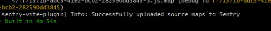
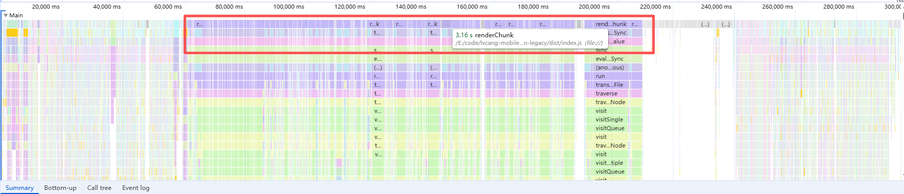
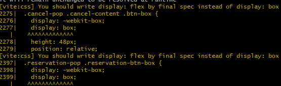
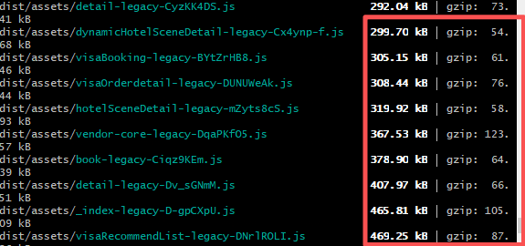
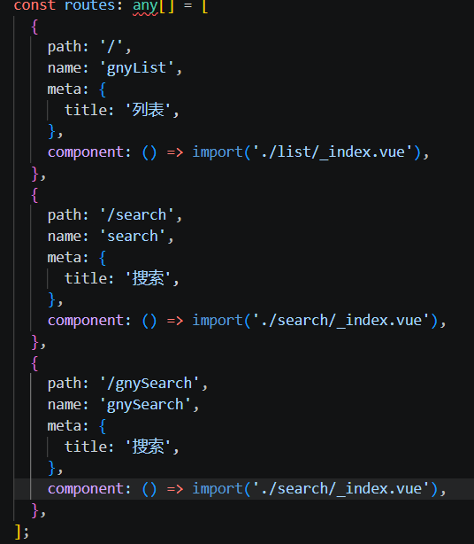
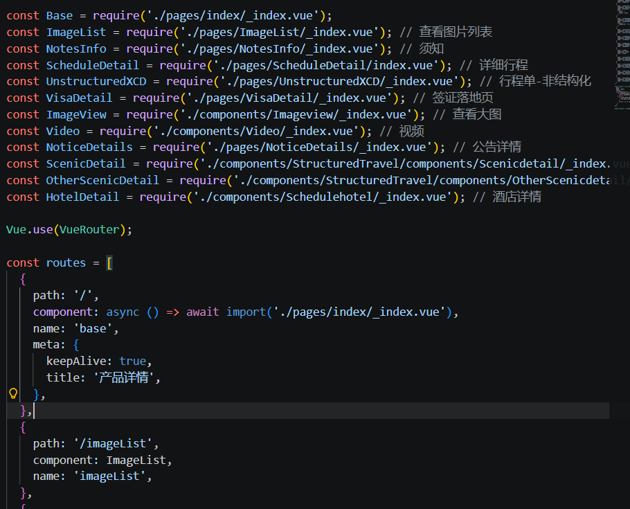
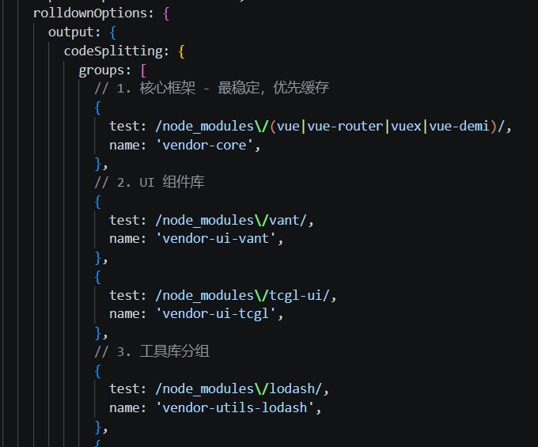
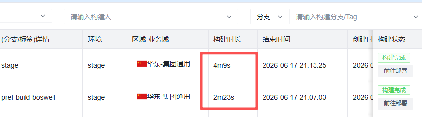

# 旅仓 H5 Vite 构建性能优化

## 问题

### 1.本地构建时长较长

### 2.CI构建时长较长

### 2. 预发构建破坏生产source map, 导致生产环境异常无法定位

修改后的文件hash不一致，导致生产环境的source map无法正确映射到源代码，无法定位异常位置。

### 3. 构建工具脱节

当前使用的vite版本是5.0.1，vite最新版本是8.0.16。最主要的是vite底层打包器已经到了原生时代。

## 分析

1. 性能火焰图

## 优化

### vite 相关优化

#### 1. vite的大版本升级vite5.0.1到vite8.0.16

- 从当前使用的vite版本是5.0.1，升级到vite8.0.12版本。
  - vite5.x版本生产构建用的是rollup，js版本的打包器，vite8.x版本生产构建用的是rolldown。
  - vite8.x的rolldown打包器的插件api与rollup的插件api兼容，插件无需修改。

- 一同升级vite插件，同时确保插件与vite的兼容性，兼顾每个插件的对等依赖的vite版本。
  - @vitejs/plugin-vue2
  - @sentry/vite-plugin
  - vite-plugin-commonjs

- css压缩兼容问题
  - vite8默认css压缩工具为lightcss,与Vue框架的/deep/穿透选择器不兼容，将压缩器回退到esbuild

- css非标准样式引起的构建警告
  - display:box， 2009 年最早期的草案语法
  - 已被现代标准取代：display: flex 已经成为 W3C 的正式推荐标准

  

- 模块外部化的兼容问题
  - 项目依赖包qs模块，是一个跨端的查询字符串解析库，导致在vite8.x版本构建的产物中不兼容。

- 跟进技术迭代.
  - 更加精细化的分包控制。优化资源加载以及资源缓存利用率。

#### 2. 关闭 reportCompressedSize 功能

1. 构建时会计算每个输出文件的gzip压缩后的大小，并在构建完成后生成一个报告，显示每个文件的原始大小、gzip压缩后的大小以及压缩率。

2. 关闭`reportCompressedSize`功能，避免构建时计算gzip压缩后的文件大小。

#### 3. 图片、字体、视频等大文件静态资源处理

1. 放在项目的assets目录下的静态资源，构建工具会对其进行处理优化，例如文件生成hash码，压缩等等。

2. 其中可能会存在尺寸较大的文件，字体，视频等，构建工具处理这些文件会增加构建时间。

3. 类似静态，大文件通常作为外部模块，只是提供引用，将其外置利用cdn进行加载。

### 构建流程编排优化

为避免所有环境共用同一套复杂配置，我们将构建流程按环境拆分为五类：common、dev、qa、stage、prod。

- common：基础通用配置和插件，所有环境共享。
- dev：本地开发专用配置，主要用于加速热重载与本地调试。
- qa：测试验证环境，主要用于功能与业务流程验收。
- stage：准生产环境，尽量保持与 prod 一致，用于上线前验收。
- prod：生产环境配置，开启完整优化和上报流程。

这种分层编排的好处是，不同环境只加载必要插件，避免 dev/qa/stage 承担 prod 一样的成本。

项目中我们重点优化了两个与环境编排相关的插件：

1. @vitejs/plugin-legacy

- 该插件用于生成兼容旧浏览器的 legacy bundle。
- 问题在于：
  - 要兼容低于 ES2015 的旧浏览器，会导致构建时间显著增加。
- 优化策略：
  - dev/qa 环境关闭 `@vitejs/plugin-legacy`，减少构建开销。
  - stage/prod 环境开启 `@vitejs/plugin-legacy`，兼容旧浏览器，保证线上稳定性。

2. @sentry/vite-plugin

- 该插件负责上传 Sentry 所需的 sourcemap，便于线上异常定位。
- 问题在于：
  - 打开 sourcemap 会增加构建时间；
  - 每次构建都上传 sourcemap，会产生额外网络开销；
  - 非生产构建上传 sourcemap，可能干扰线上映射文件管理。
- 优化策略：
  - 仅在 prod 环境开启 `@sentry/vite-plugin` 和 `build.sourcemap`。
  - dev/qa/stage 环境关闭 `@sentry/vite-plugin`。

通过这套环境分层的编排方案，我们让构建流程更符合“各环境只做必要工作的原则”，从而显著降低 dev/qa/stage 的构建成本，同时保留 prod 的稳定性和监控能力。

### 删除无效页面

1. 测试页，空页面等

### cjs模块进行esm模块重构，减少构建时的转换成本。

1. 项目中存在一些cjs模块，构建工具通过`vite-plugin-commonjs`插件对其进行转换为esm模块，再交给打包工具完成cjs与esm模块的交互。
2. 动态酒景项目所有cjs模块进行esm模块重构，减少构建时的转换成本。
3. 后续可以将cjs模块转esm模块插件移除，减少构建时的插件数量。

### npm 包下载源

1. 项目中使用了npm的镜像源，减少npm包下载时的网络开销。

2. http://nexus.17usoft.com/repository/npm-all/

### jean部署

#### 1. 使用容器内置的node.js做构建环境

1. 之前都是在docker中拉取node.js镜像，构建环境在docker中，构建完成后，将构建产物复制另一个镜像中。

2. 现在直接使用容器内置的node.js做构建环境，构建完成后，将构建产物复制另一个镜像中，减少一个构建镜像的下载。

### 杂项

#### 1. 分包优化

1. 静态导入路由转换为动态导入路由（路由懒加载改造），减少首屏加载的js体积，同时进行有效的缓存。

2. 将一些第三方库进行分包，减少首屏加载的js体积，同时进行有效的缓存

。

#### 2. 删除无用依赖

1. @vitest/coverage-c8
2. @vue/test-utils
3. @tsconfig/node-lts
4. jsdom
5. @types/jsdom
6. npm-run-all
7. rimraf
8. @rushstack/eslint-patch
9. postcss-html
10. postcss-scss
11. @typescript-eslint/eslint-plugin
12. eslint-plugin-tsdoc
13. eslint-plugin-prettier
14. html2canvas
15. @vue/tsconfig

#### 3. 升级eslint及其插件

1. eslint升级到9.0.0版本，配置文件扁平化，告别复杂的遍历目录树去查找和合并。
2. 并行支持多线程并行检查，代码检查的耗时能大幅缩短。
3. 提升编辑器的使用体验，减少编辑器卡顿的情况。

## 优化成果

### 1. 本地性能数据对比表

| 环境  | 优化前构建时长 | 优化后构建时长 | 提升幅度 |
| ----- | -------------- | -------------- | -------- |
| QA    | 4m56s          | 46.21s左右     | ≈84%     |
| Stage | 4m56s          | 3m6s左右       | ≈37%     |
| Prod  | 4m56s          | 3m16s左右      | ≈33%     |

> 注：以上数据为多次构建的平均值，具体时长可能因代码规模和机器性能略有差异

### 2. 线上新能数据对比

> 线上性能提升约 42%

### 3. 技术升级

- 升级vite版本。
- 升级eslint版本。

### 4. 只会在生产环境下构建生产source map,避免代码映射异常
