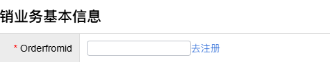
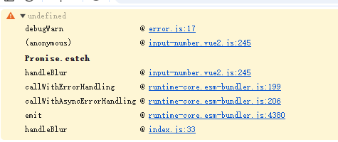
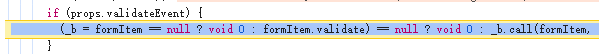
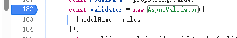
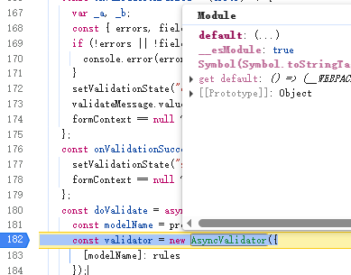
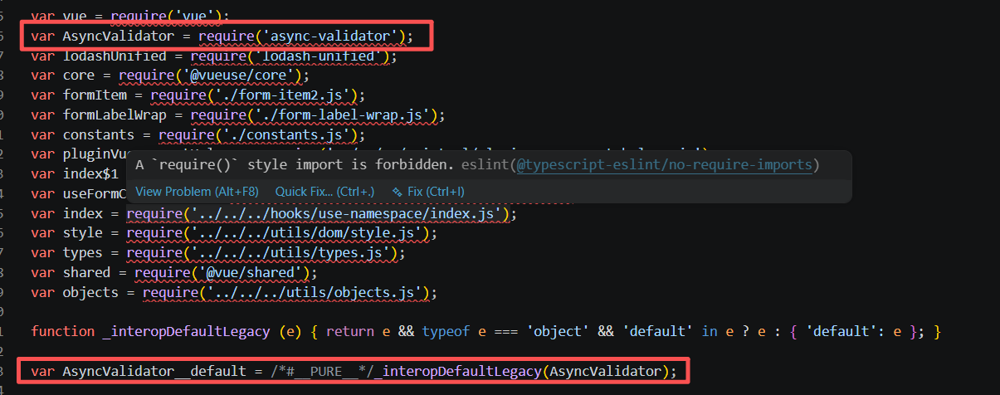

# element-plus 2.13.2 版本下的表单验证失效

## 问题描述

element-plus 的 form 组件可以给每个 form-item 设置 rules 来进行表单验证，从客户端就能及时给用户反馈表单填写的正确性，提升用户体验。

具体示例如下：

```html
<el-form ref="ruleFormRef" style="max-width: 600px" :model="ruleForm" :rules="rules" label-width="auto">
  <el-form-item label="Activity name" prop="name">
    <el-input v-model="ruleForm.name" />
  </el-form-item>
</el-form>
```

```ts
const rules = reactive<FormRules<RuleForm>>({
  name: [
    { required: true, message: "Please input Activity name", trigger: "blur" },
    { min: 3, max: 5, message: "Length should be 3 to 5", trigger: "blur" }
  ]
});
```


但是，这次在crm系统中开发需求时突然发现，所的表单验证都失效了，用户输入不符合规则的内容时，表单验证没有任何提示。



只在控制台留下了一个错误提示



从错误的堆栈信息中可以看出来，这是 element-plus input-number 组件发出的错误。所以首先通过调用堆栈定位到错误位置。



从这段代码中可以看出，这里调用了表单的 validate 方法，但是程序中断了。继续定位下去到 validate 方法里面，断点走到下面这里中断。



通过下面的变量查看面板可以看到，上面代码实例化的 AsyncValidator 对象类型是 Object, 而 js 语言当中能够实例化的对象类型是 Function, 所以这里报错了。



从上面的图片我们可以看到，AsyncValidator 包含了一个 default 属性的 js 对象, 因为 AsyncValidator 是一个单独的 js 模块，而一般 esm 模块被当做 cjs(node 模块)使用时，模块的导出对象会被包裹在一个 default 属性中。但是 element-plus 的构建流程没有处理好这个问题，导致 AsyncValidator 被当做 cjs 模块使用时，返回的对象类型是 Object, 而不是 Function, 所以在调用 AsyncValidator 的时候就报错了。

## 问题解决

现在已经能够确定 element-plus@2.13.2 是个有问题的版本了，之后通过 `npm pack element-plus@2.13.1` 下载了 element-plus 的源码包，`npm pack element-plus@2.13.1`命令可以用来下载`npm i element-plus@2.13.1`的 node_modules 下的包，也就是打包后的依赖包，然后解压后查看了 element-plus@2.13.1 的源码包，发现这个版本的 cjs 引入 esm 模块是处理过的，所以不会有问题。



又向后了两个版本到 element-plus@2.13.4, 同样存在问题，直到 element-plus@2.13.5 才修复了这个问题，所以 element-plus@2.13.2 到 element-plus@2.13.4 这三个版本都是有问题的。

其实我们项目中使用的版本更老，是 element-plus@^2.8.4,因为 npm 下载依赖的机制，在语义化版本的基础上每次都会升级次要版本到最新，使得重新安装依赖时，element-plus 的版本会升级到 element-plus@2.13.2, 所以就出现了表单验证失效的问题。

所以，解决这个问题的办法就是把 element-plus 的版本锁定在 element-plus@2.13.2以下即可。
