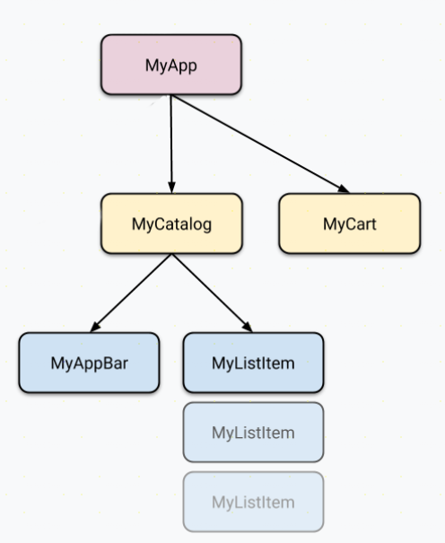

---
# You can also start simply with 'default'
theme: seriph
# random image from a curated Unsplash collection by Anthony
# like them? see https://unsplash.com/collections/94734566/slidev
# background: https://cover.sli.dev
# some information about your slides (markdown enabled)
title: Flutter 状态管理
class: text-center
# https://sli.dev/features/drawing
drawings:
  persist: false
# slide transition: https://sli.dev/guide/animations.html#slide-transitions
transition: slide-left
# enable MDC Syntax: https://sli.dev/features/mdc
mdc: true
background: ''
---

# Flutter 状态管理

---

# 现代UI开发的核心思想


---

# 现代UI开发范式

<div class=" flex items-center justify-center h-[80%]">

- 声明式
- 组件化
- 响应式

</div>

---

# 命令式


---

# 声明式


---

# 组件化

<div class=" flex items-center justify-center h-[100%]">


</div>

---

# 响应式


---
layout: two-cols
---

# 什么是状态

状态是指应用程序中某个特定时刻的所有信息，包括用户输入、网络请求的结果、UI 组件的状态等。状态可以是简单的变量，也可以是复杂的数据结构。状态的变化会影响 UI 的渲染，因此管理好状态是构建现代应用程序的关键。

::right::


---
layout: two-cols
---

# 什么是管理

状态管理是指在应用程序中管理和维护状态的方式。

::right::


---

#  状态的类型

<div class=" flex flex-col  justify-center h-[40%]">

状态管理可以分为以下几种类型：

1. **本地状态**：仅在单个组件内部管理状态，通常使用 `setState`。
2. **全局状态**：跨多个组件共享状态，常用的库有 GetX 等。

</div>

---
layout: two-cols
---

# 本地状态管理

本地状态管理是指在单个组件内部管理状态，通常使用 `setState` 方法。它适用于状态较简单的场景，例如表单输入、按钮点击等。

::right::


---
layout: two-cols
---

# 全局状态管理

全局状态管理是指跨多个组件共享状态，常用的库有 Provider、GetX 等。它适用于状态较复杂的场景，例如用户认证、购物车等。

::right::


---

# GetX

<div class=" flex flex-col  justify-center h-[40%]">

GetX 是一个强大的 Flutter 状态管理库，它提供了简单易用的 API 和高性能的状态管理解决方案。GetX 的核心思想是将状态与 UI 解耦，通过响应式编程实现状态的自动更新。使用 GetX，开发者可以轻松地管理应用程序的状态，提高开发效率。

</div>

---

# GetX 的主要特点

<div class=" flex flex-col  justify-center h-[60%]">

1. **简单易用**：GetX 提供了简洁的 API，开发者可以快速上手，减少学习成本。
2. **高性能**：GetX 采用了高效的状态管理机制，能够在数据变化时快速更新 UI，提升应用性能。
3. **解耦**：GetX 将状态与 UI 解耦，开发者可以更专注于业务逻辑，提高代码的可维护性。
4. **响应式编程**：GetX 支持响应式编程，开发者可以轻松实现数据变化自动更新 UI 的功能。
5. **多功能**：除了状态管理，GetX 还提供了路由管理、依赖注入等功能，减少了对其他库的依赖。

</div>

---

<div class=" flex   items-center justify-center h-[100%]">

# 基本用法

</div>

---


<div class=" flex flex-col  justify-center h-[60%]">

### 1. 安装依赖

在 `pubspec.yaml` 中添加：

```yaml
get: ^4.6.5
```

</div>

---


<div class=" flex flex-col  justify-center h-[60%]">

### 2. 创建 Controller


```dart
import 'package:get/get.dart';

class CounterController extends GetxController {
  var count = 0.obs;

  void increment() => count++;
}
```

</div>

---


<div class=" flex flex-col  justify-center h-[60%]">

### 3. 注入与使用


```dart
// 注入
final CounterController c = Get.put(CounterController());

// 使用 Obx 监听状态变化
Obx(() => Text('点击了 ${c.count} 次'))

// 调用方法
ElevatedButton(
  onPressed: c.increment,
  child: Text('增加'),
)
```

</div>

---


<div class=" flex flex-col  justify-center h-[60%]">

### 4. 路由与依赖注入


```dart
Get.to(DetailPage(), arguments: {'id': 1});

// 获取参数
final id = Get.arguments['id'];
```

</div>

<!-- --- -->

<!-- #  GetX状态更新流程

<div class=" flex flex-col  justify-center h-[10%]">



</div> -->

---
layout: center
---

[Presentation Slides for Developers](https://sli.dev)