# Flutter UI 布局

---
layout: two-cols
---

# 前言

<div>

1. JS简单，但是害怕UI开发，毫无逻辑可循。

</div>

::right::

<div class="flex flex-col justify-center items-center h-full">
  怎么布局乱了<br />
  怎么按钮移不过去<br />
  ......
  
</div>

---
layout: two-cols
---

# 前言
 
<div>

2. 前端天然的就是后端的可视化调试工具。

</div>


::right::

<div class="flex flex-col justify-center items-center h-full">

  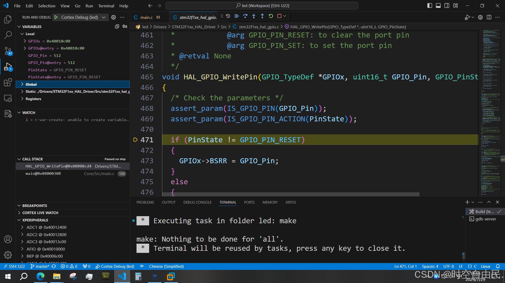

</div>

---
layout: two-cols
---

# 前言
 
<div>

3. 误会了，你们只是再改模板而已。

</div>

::right::

<div class="flex flex-col justify-center items-center h-full">

  

</div>

---
layout: two-cols
---

# 前言

<div>

4. UI是门艺术。

</div>


::right::

<div class="grid grid-cols-3 grid-rows-2 items-center  h-full">

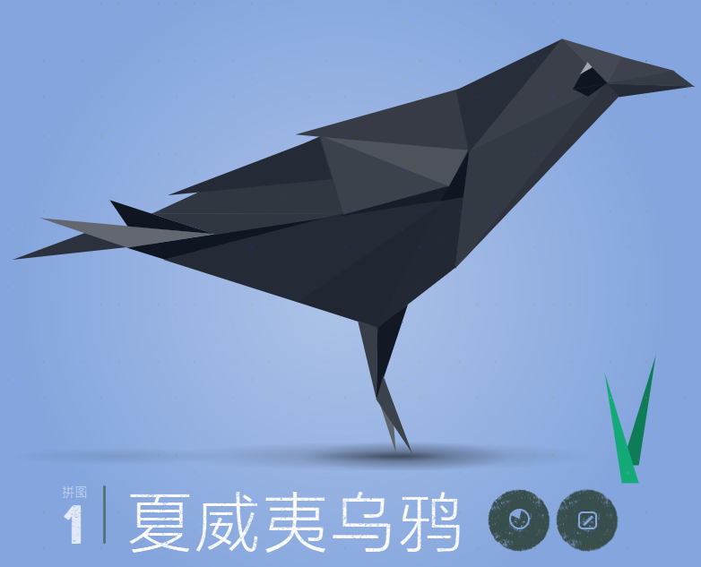
   
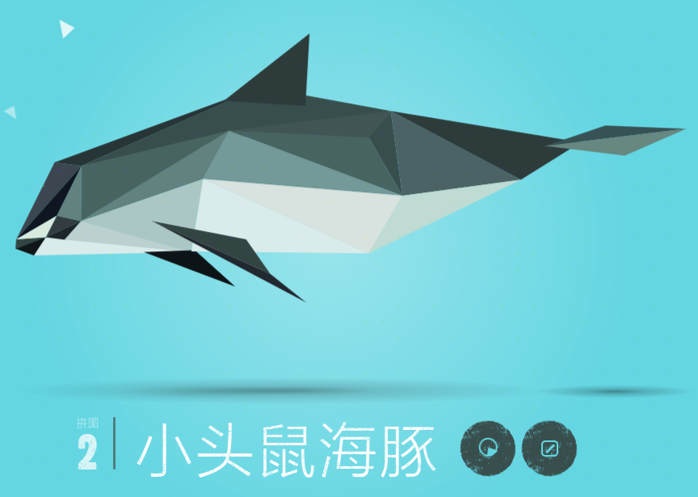

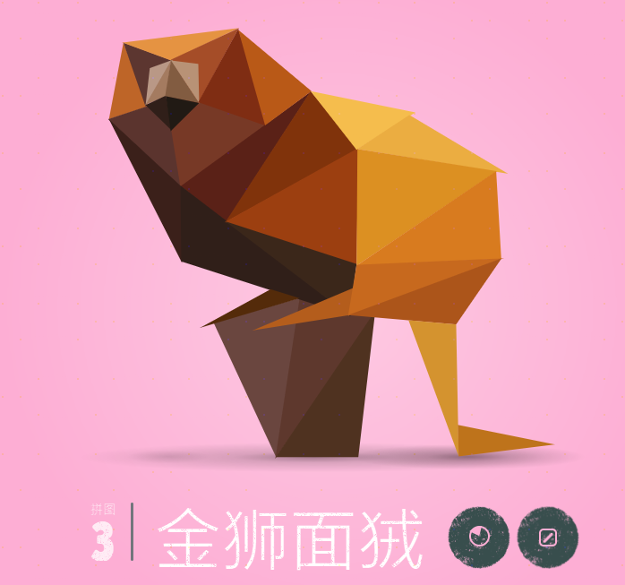


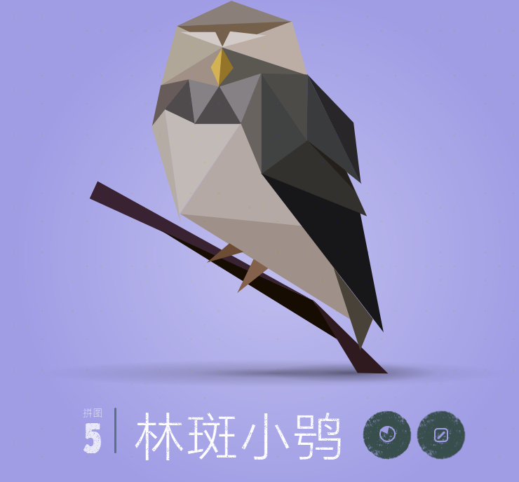

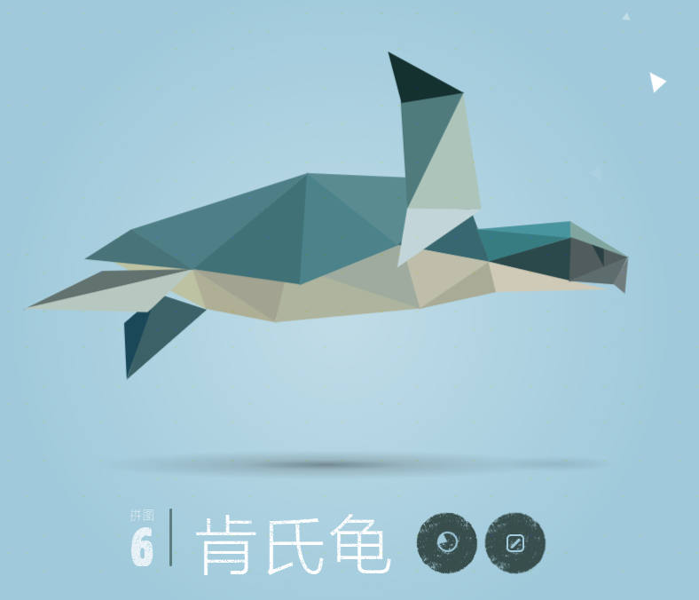

</div>

---
layout: two-cols
---

# 前言

<div>

5. 全栈。

</div>

::right::

<div class="flex flex-col justify-center items-center h-full">

  

</div>

---
layout: two-cols
---

# Flutter 布局是什么

<div>

UI 元素如何在屏幕上<span v-mark.highlight.red="0">排列</span>和<span v-mark.highlight.red="0">显示</span>的<span v-mark.highlight.red="0">规则</span>。

</div>

<div v-click="1">
  
</div>

::right::

<div class="flex flex-col justify-center items-center h-full">

  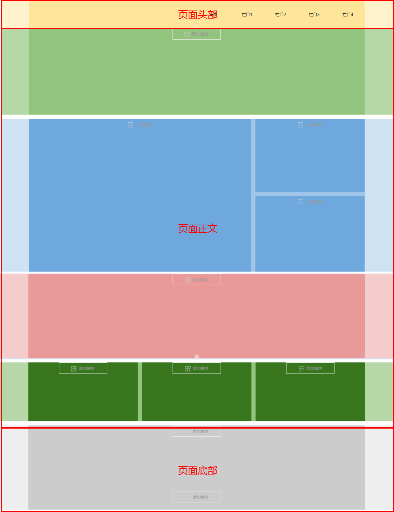

</div>

---

# Flutter 布局有哪些

<div class="flex flex-col justify-center items-center h-full">

- 流式布局
- 层叠布局
- 弹性布局
- 网格布局

</div>

---
layout: two-cols
---

# 流式布局-概述

元素会沿着<span v-mark.highlight.red="0">一个方向</span>依次排列，当前行方向的空间不足以容纳下一个元素时，<span v-mark.highlight.red="0">自动换行</span>到下一行，继续排列，类似文本在文档中 “流式排列、自动换行” 的行为。


::right::

<div class="flex flex-col justify-center items-center h-full">

  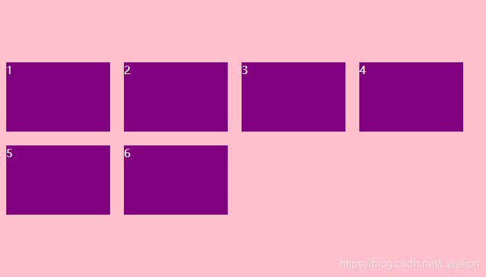

</div>


---

# 流式布局-场景

- 商品列表排列
 
<div class="flex justify-center items-center h-[100%]">

  

</div>


---

# 流式布局-场景

- 筛选排列
 
<div class="flex justify-center items-center h-[100%]">

  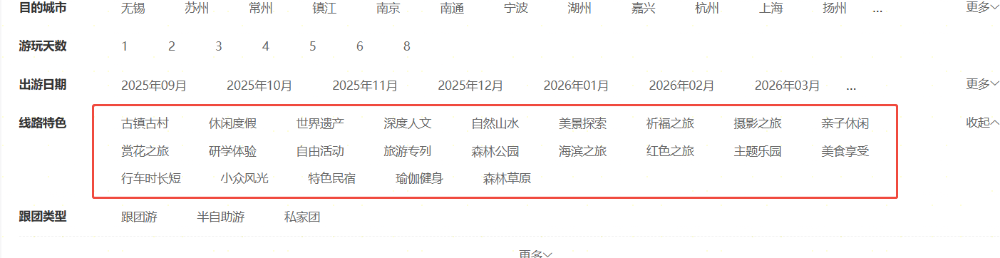

</div>

---

# Flutter 实现-Wrap

定义： 在水平或垂直方向上显示其子项的小部件。

```dart
const Wrap({
  Key? key,
  Axis direction = Axis.horizontal,
  WrapAlignment alignment = WrapAlignment.start,
  double spacing = 0.0,
  WrapAlignment runAlignment = WrapAlignment.start,
  double runSpacing = 0.0,
  WrapCrossAlignment crossAxisAlignment = WrapCrossAlignment.start,
  TextDirection? textDirection,
  VerticalDirection verticalDirection = VerticalDirection.down,
  Clip clipBehavior = Clip.none,
  List<Widget> children = const <Widget>[],
})
```


---

# Flutter 实现-用法


```dart
Wrap(
  spacing: 8.0,
  runSpacing: 4.0,
  children: <Widget>[
    Chip(
      avatar: CircleAvatar(backgroundColor: Colors.blue.shade900, child: const Text('AH')),
      label: const Text('Hamilton'),
    ),
    Chip(
      avatar: CircleAvatar(backgroundColor: Colors.blue.shade900, child: const Text('ML')),
      label: const Text('Lafayette'),
    ),
    Chip(
      avatar: CircleAvatar(backgroundColor: Colors.blue.shade900, child: const Text('HM')),
      label: const Text('Mulligan'),
    ),
    Chip(
      avatar: CircleAvatar(backgroundColor: Colors.blue.shade900, child: const Text('JL')),
      label: const Text('Laurens'),
    ),
  ],
)
```

---

# Flutter 实现-效果

<div class="flex justify-center items-center h-[100%]">

  

</div>

---
layout: two-cols
---

# 层叠布局-概述

元素会在一个<span v-mark.highlight.red="0">特定的区域内</span>进行重叠排列，后面的元素会覆盖前面的元素，类似于图层的概念。通过堆叠 Widget 实现 “元素覆盖” 效果的布局方式


::right::

<div class="flex flex-col justify-center items-center h-full">

  

</div>

---

# 层叠布局-场景

- 城市选择
 
<div class="flex justify-center items-center h-[100%]">


</div>


---

# 层叠布局-场景

- 工具条
 
<div class="flex justify-center items-center h-[100%]">

  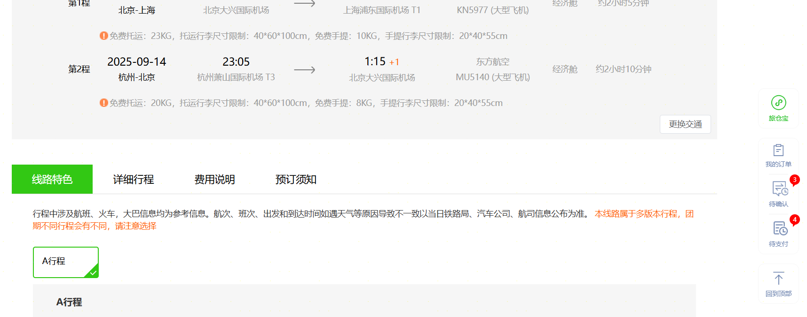

</div>

---
layout: two-cols
---

# Flutter 实现

- Stack

定义： Stack 是层叠布局的 “容器”，负责管理所有子 Widget 的堆叠规则，自身不具备定位能力。

- Positioned

定义： Positioned 必须作为 Stack 的直接子 Widget，用于精确控制子 Widget 在 Stack 中的位置，通过距离 Stack 边缘的偏移量定位。

::right::

<div class="flex flex-col justify-center items-center h-[100%]">

```dart
const Stack({
  Key? key,
  AlignmentGeometry alignment = 
  AlignmentDirectional.topStart,
  TextDirection? textDirection,
  StackFit fit = StackFit.loose,
  Clip clipBehavior = Clip.hardEdge,
  List<Widget> children = const <Widget>[],
})
```

```dart
const Positioned({
  Key? key,
  double? left,
  double? top,
  double? right,
  double? bottom,
  double? width,
  double? height,
  required Widget child,
})
```
</div>
---

# Flutter 实现-用法

<div class="h-[100%] overflow-scroll">

```dart
 Stack(
  alignment: Alignment.center,
  children: [
    Container(
      width: 300,
      height: 200,
      decoration: BoxDecoration(
        color: Colors.grey[200],
        borderRadius: BorderRadius.circular(8),
      ),
    ),
    Image.network(
      'https://picsum.photos/200/150',
      width: 200,
      height: 150,
    ),
    Positioned(
      bottom: 10,
      child: Text(
        '层叠布局示例',
        style: TextStyle(
          color: Colors.white,
          fontSize: 16,
          fontWeight: FontWeight.bold,
        ),
      ),
    ),
  ],
)
```
</div>
---

# Flutter 实现-效果

<div class="flex justify-center items-center h-[100%]">

  

</div>

---
layout: two-cols
---

# 弹性布局-概述


让子 Widget 能根据<span v-mark.highlight.red="0">父容器</span>的<span v-mark.highlight.red="0">剩余空间</span>灵活收缩或扩展，从而适配不同尺寸的屏幕或容器，实现响应式布局

::right::

<div class="flex flex-col justify-center items-center h-full">

  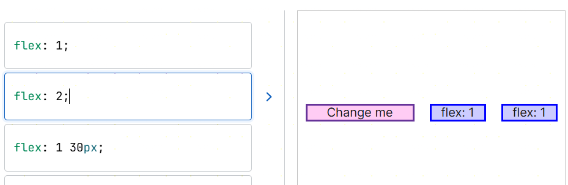

</div>

---

# 弹性布局-场景

- 自适应导航条
 
<div class="flex justify-center items-center">

  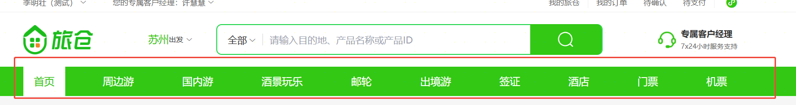

</div>


---

# 弹性布局-场景

- 商品布局
 
<div class="flex justify-center items-center ">

  

</div>

---

# Flutter 实现

- Row

定义： 弹性布局的容器，以水平方向显示其子项的小部件。


```dart
const Row({
  Key? key,
  MainAxisAlignment mainAxisAlignment = MainAxisAlignment.start,
  MainAxisSize mainAxisSize = MainAxisSize.max,
  CrossAxisAlignment crossAxisAlignment = CrossAxisAlignment.center,
  TextDirection? textDirection,
  VerticalDirection verticalDirection = VerticalDirection.down,
  TextBaseline? textBaseline,
  double spacing = 0.0,
  List<Widget> children = const <Widget>[],
})

```

---

# Flutter 实现

- Column

定义： 弹性布局的容器，以垂直方向显示其子项的小部件。


```dart
const Column({
  Key? key,
  MainAxisAlignment mainAxisAlignment = MainAxisAlignment.start,
  MainAxisSize mainAxisSize = MainAxisSize.max,
  CrossAxisAlignment crossAxisAlignment = CrossAxisAlignment.center,
  TextDirection? textDirection,
  VerticalDirection verticalDirection = VerticalDirection.down,
  TextBaseline? textBaseline,
  double spacing = 0.0,
  List<Widget> children = const <Widget>[],
})
```

---

# Flutter 实现

- Expanded

定义： Expanded 必须作为 Row、Column 的直接子 Widget，用于占据父容器的剩余空间。


```dart
const Expanded({
  Key? key,
  int flex = 1,
  required Widget child,
})
```
---

# Flutter 实现-用法

<div class="h-[100%] overflow-scroll">

```dart
 import 'package:flutter/material.dart';

class Flexlayout extends StatelessWidget {
  const Flexlayout({super.key, this.todo});

  final String? todo;

  @override
  Widget build(BuildContext context) {
    return Scaffold(
        appBar: AppBar(title: const Text('弹性布局')),
        body: const Column(
          children: [
            Row(
              children: <Widget>[
                Expanded(
                  flex: 2,
                  child: Text('flex: 2', textAlign: TextAlign.center),
                ),
                Expanded(
                  child:
                      Text('Craft beautiful UIs', textAlign: TextAlign.center),
                ),
                Expanded(
                  child: FittedBox(
                    child: FlutterLogo(),
                  ),
                ),
              ],
            ),
            Row(
              children: <Widget>[
                Expanded(
                  child: Text('Deliver features faster',
                      textAlign: TextAlign.center),
                ),
                Expanded(
                  flex: 2,
                  child: Text(' flex: 2,', textAlign: TextAlign.center),
                ),
                Expanded(
                  child: FittedBox(
                    child: FlutterLogo(),
                  ),
                ),
              ],
            )
          ],
        ));
  }
}

```

</div>

---

# Flutter 实现-效果

<div class="flex justify-center items-center h-[100%]">

  

</div>

---

# 网格布局

用于实现多行多列的二维网格结构，适合像图片墙、商品列表、图标矩阵等场景。它能自动管理子 Widget 的排列、换行和尺寸，支持灵活配置列数、间距和滚动行为。

<div class="flex justify-center items-center h-[70%]">

  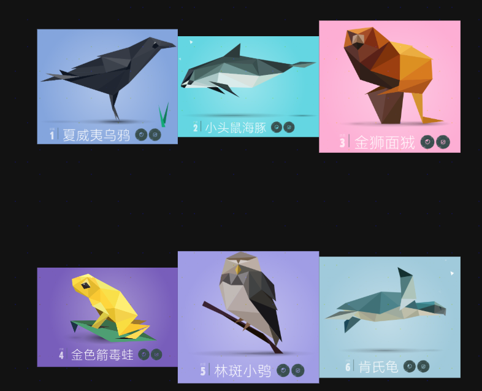

</div>

---
layout: center
---

[Presentation Slides for Developers](https://sli.dev)