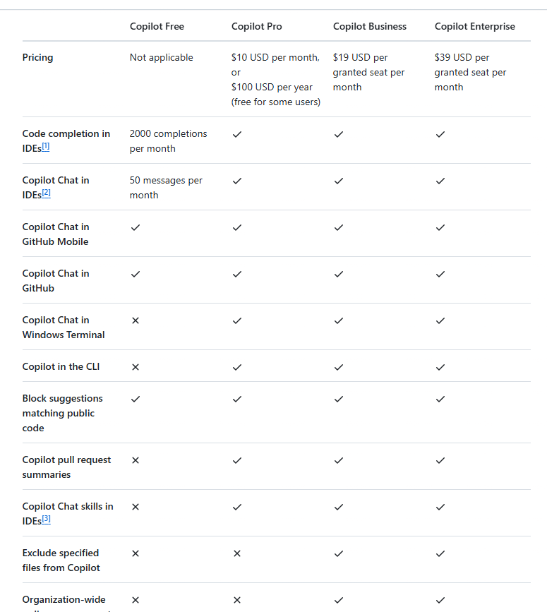

---
# You can also start simply with 'default'
theme: seriph
# random image from a curated Unsplash collection by Anthony
# like them? see https://unsplash.com/collections/94734566/slidev
# background: https://cover.sli.dev
# some information about your slides (markdown enabled)
title: GitHub Copilot
class: text-center
# https://sli.dev/features/drawing
drawings:
  persist: false
# slide transition: https://sli.dev/guide/animations.html#slide-transitions
transition: slide-left
# enable MDC Syntax: https://sli.dev/features/mdc
mdc: true
---

# GitHub Copilot

---
layout: center
---

<h1 class="text-center"> GitHub Copilot是什么 </h1>

### GitHub Copilot是Visual Studio Code(vscode)中的AI结对编程工具。

`结对编程（Pair Programming）：是一种敏捷软件开发实践，其中两名程序员在同一台计算机上协作完成编码任务。通常情况下，一名程序员负责编写代码（称为“驾驶员”），另一名程序员负责审查代码（称为“导航员”）。两人不断交换角色，以确保代码的质量和减少错误。结对编程有助于知识共享、提高代码质量和增强团队协作。`

---
layout: center
---

<h1 class="text-center"> 获取安装 </h1>

[https://code.visualstudio.com/docs/copilot/setup-simplified](https://code.visualstudio.com/docs/copilot/setup-simplified)

---
layout: center
---

<h1 class="text-center"> 免费/付费 </h1>

---
layout: center
---

# GitHub Copilot可以在各种场景中提供帮助

---

# 编辑器中的代码补全

1. 在你输入代码时提示你：`Copilot会分析你正在编辑的文件和相关文件中的上下文，并从编辑器中提供建议。例如，开始键入方法的名称，Copilot就会按照您的编码风格建议实现方法`

---

# 编辑器中的代码补全

2. 预测你的下一个代码编辑与Copilot下一个编辑建议（Copilot NES）：`根据你正在做的编辑，Copilot NES都预测下一个编辑的位置，你要做的编辑应该是什么。使用Tab键快速导航和接受建议。了解如何开始与副驾驶NES。`

---

# 跨多个文件迭代大的更改

1. 启动ai驱动的代码编辑会话：`通过使用自然语言快速迭代多个文件的代码更改。选择要编辑的文件，提供相关的上下文和提示，Copilot会建议代码编辑。`

---

# 回答编码问题

1. 为常见的编码任务和挑战提供指导和支持：`向Copilot询问语法或一般编程概念，而不需要浏览文档或搜索在线论坛。Copilot以自然语言格式或代码片段格式给出响应。例如，您可以问诸如“什么是递归？”或“如何在Java中创建单例？”之类的问题。`

2. 通过解释选定的代码来提高对代码的理解：`Copilot生成代码功能和目的的自然语言描述。如果您想要了解代码的行为，或者对于需要了解代码如何工作的非技术涉众来说，这是非常有用的。`

3. 提供特定于您的代码库的指导：`Copilot具有您的工作空间的上下文，并且可以根据您的项目提供逐步指导和代码示例。例如，“如何添加联系人页面？”或“如何从数据库读取客户数据？”`

---

# 代码重构和改进

1. 提供实现代码重构的建议：`Copilot建议使用代码库的上下文进行重构。例如，要求Copilot重构一个不使用递归的函数，或者建议一个可以提高性能的算法。`

---

# 代码重构和改进

2. 对所选代码提出潜在的改进建议：`例如改进对错误和边缘情况的处理，或者更改逻辑流以使代码更具可读性。`

---

# 解决问题

1. 使用/fix命令建议基于错误或问题上下文的代码片段和解决方案，从而对代码中的错误提出修复建议。例如，如果您的代码产生错误消息或警告，Copilot Chat可以根据错误消息、代码语法和周围代码建议可能的修复方法。这些更改可能包括对变量、控制结构或可以解决问题的函数调用的更改。

---

# 解决问题

2. 对失败的测试提出修复建议。当您为代码运行自动测试时，Copilot可以使用/fixTestFailure命令建议对失败的测试进行代码修复。

---

# 解决问题

3. 建议终端命令修复。当一个命令在终端中运行失败时，副驾驶会在槽中显示一个闪光，提供一个快速修复来解释发生了什么。

---

# 快速启动你的项目

1. 使用 /new 为您选择的技术生成一个新的VS Code工作空间，以便快速开始新项目。挑选你的技术栈，预览工作空间文件，让Copilot为你搭建整个工作空间。

---

# 快速启动你的项目

2. 使用自然语言构建一个新的Jupyter笔记本。使用 /newNotebook 根据描述生成预配置的新笔记本。例如，要构建一个加载，检查和可视化示例数据集的新笔记本，请提示Copilot“@workspace /newNotebook下载泰坦数据集并使用MatPlotLib显示关键信息”。

---

# 生成单元测试用例

1. 根据代码库配置测试框架设置：`例如，如果你有一个JavaScript和TypeScript项目，Copilot会建议合适的测试框架和步骤来为你的工作空间配置它们。`

---

# 生成单元测试用例

2. 利用测试框架编写测试代码：`Copilot识别您的测试框架和编码风格，并生成匹配的代码片段。`

---

# 生成单元测试用例

3. 识别并编写可能难以手工识别的边缘用例和边界条件的测试用例。例如，Copilot可以为错误处理、空值或意外输入类型建议测试用例。

4. 根据代码的上下文和语义，建议确保函数正常工作的断言。例如，生成断言以确保函数输入参数是有效的。

---

# 生成代码文档

1. 为在编辑器中打开的代码或在编辑器中突出显示的代码片段生成多种语言的代码文档：`使用 /doc 或Copilot智能操作来帮助您生成有意义的代码文档。`

---

# 提高生产力

1. ai生成的提交消息和PR描述：`基于提交中的代码更改或拉取请求中的更改。使用Source Control视图或GitHub PR扩展中的sparkle按钮来生成总结您的更改的标题和描述。`

---

# 提高生产力

2. 在命令面板中寻求帮助：`来帮助你在VS Code中找到相关的命令。你可以描述功能，Copilot可以帮助识别匹配的功能。例如，在命令面板中输入“滚动条中的代码预览”，Copilot就可以识别出你正在引用编辑器。小地图上设置`

---

# 提高生产力

3. 人工智能生成的重命名建议：`当您重命名代码中的符号时，Copilot会根据该符号和代码库的上下文建议一个新名称。`

---

# 提高生产力

4. 语义搜索结果：`你不仅可以看到与你的搜索词完全匹配的结果，还可以看到那些在语义上与搜索词相关的结果。这种搜索方式不仅仅依赖于字面上的匹配，还考虑了词语的含义和上下文，从而提供更智能和相关的搜索结果。`

---

# 提高生产力

5. 使用终端内嵌聊天来询问有关终端或如何使用特定shell命令的问题：`例如，你可以问这样的问题：“列出src目录中最大的5个文件”，或者“如何启用shell集成”。`

---
layout: center
---

[Presentation Slides for Developers](https://sli.dev)