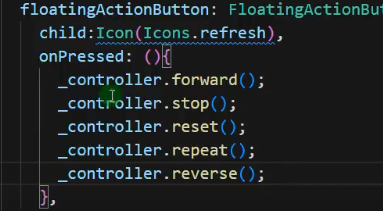

# Flutter中的动画

1. 隐式动画
2. 显示动画
3. 自定义隐式动画
4. 自定义显示动画

## Flutter隐式动画详解

动画背后的实现原理和繁琐的操作细节都被隐藏了，所以叫隐式动画。

1. AnimatedContainer 
2. AnimatedPadding
3. AnimatedAlign: 动画版本的 Align，自动转换位置在给定的时间内，只要给定的对齐方式发生变化

## Flutter显式动画详解

能够参与的动画过程叫做显示动画。通过`AnimationController`控制动画的暂停，播放，倒放等

1. ScaleTransition 
2. PositionedTransition 

定义`AnimationController`

使用`AnimationController`

执行动画

1. forward: 正序执行一次
2. stop：停止动画
3. reset：重置动画
4. reverse：倒序执行一次

## Animated动画以及交错式动画 