# Dialog

- Dialog 是一种用于在当前页面上显示临时 UI 的组件，通常用于向用户呈现重要信息、获取确认或收集少量输入。它会创建一个浮动在当前内容之上的模态窗口，吸引用户的注意力并阻止背景交互，直到被关闭。  
- 具象弹框：
  - AlertDialog
  - SimpleDialog
- 抽象弹框：
  - Dialog
- 
- showModalBottomSheet
- showToast

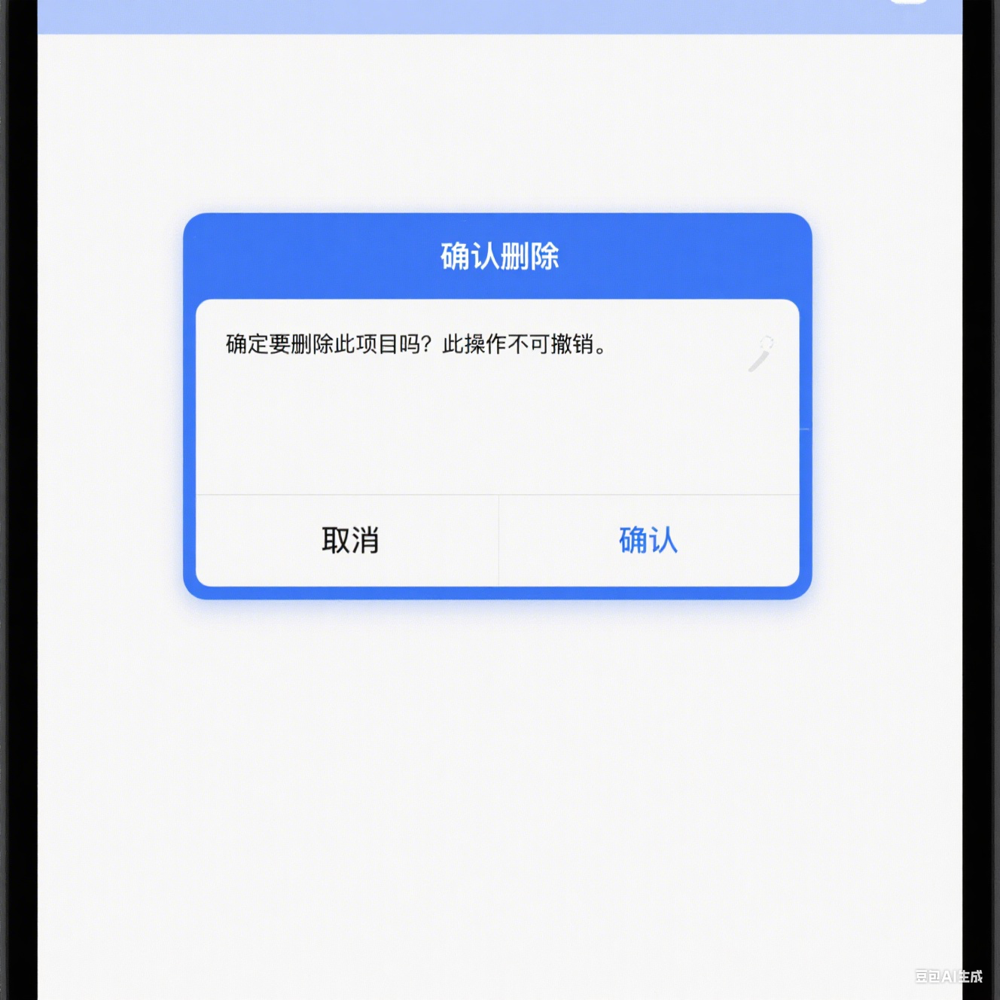

## AlertDialog

* 一个`Material Design`设计系统下的警告对话框，警告对话框（也称为基本对话框）通知用户需要确认的情况。

## 弹出一个AlertDialog

## showDialog

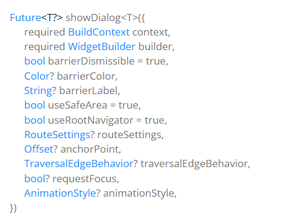

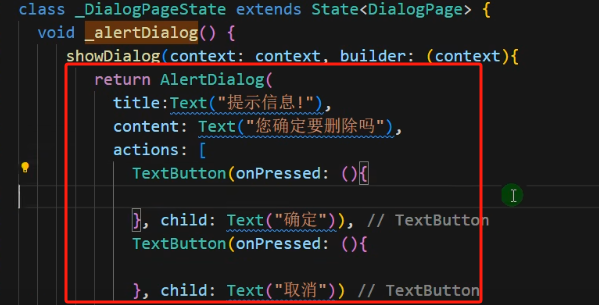

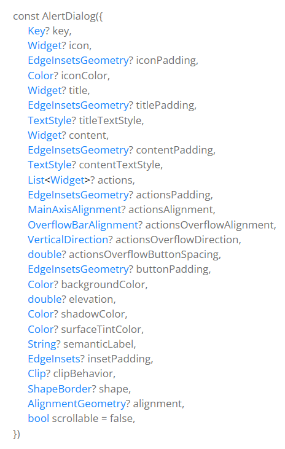

## SimpleDialog

* `SimpleDialog`一个`Material Design`设计系统下的一个简单的对话框,它为用户提供几个选项之间的选择。一个简单的对话框有一个可选的标题，显示在选项的上方。

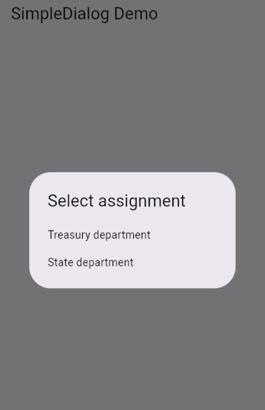

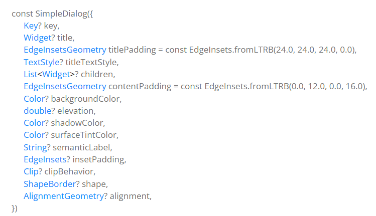
 
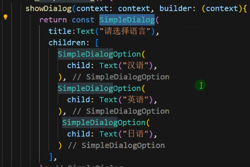

## SimpleDialogOption

SimpleDialog 中使用的一个选项

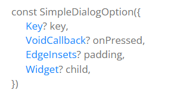

## 关闭对话框

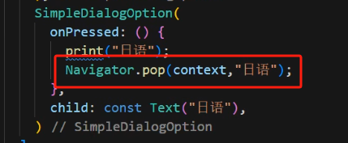

## showModalBottomSheet

底部弹出对话框

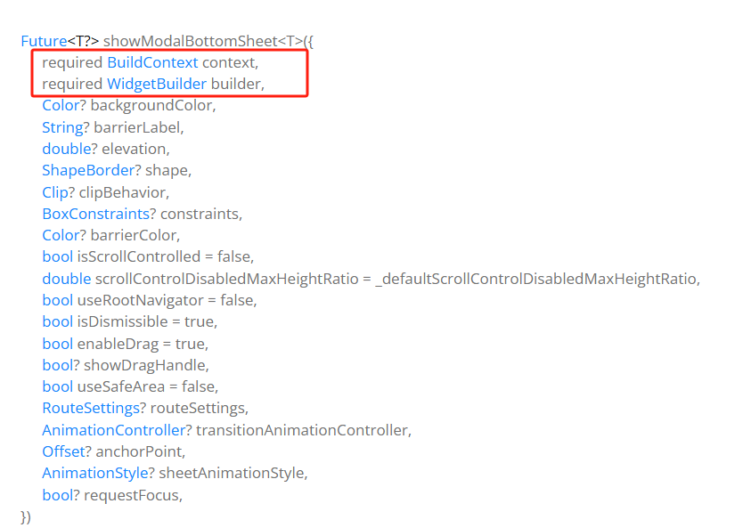

## 自定义Dialog

内置的`Dialog`有自己的固定布局模板，无法做更多的自定义。

1. 直接使用`Dialog Widget`开发自定义对话框

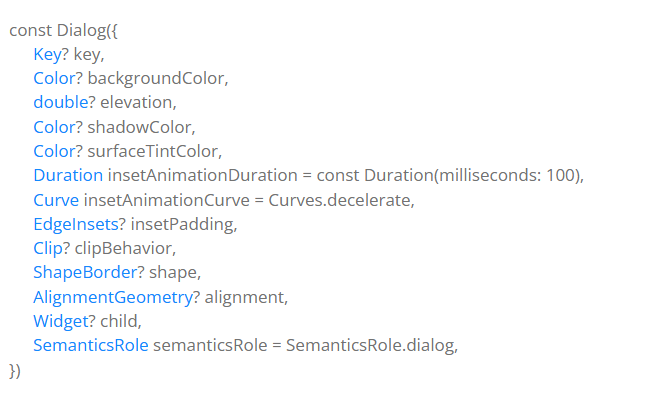

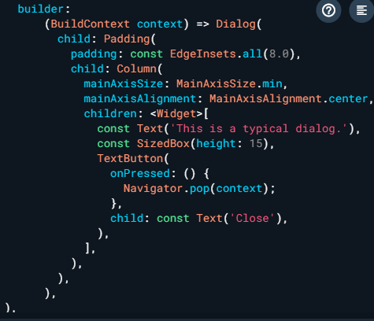

2. 所以我们需要通过继承`Dialog`类来实现自定义`Dialog`。

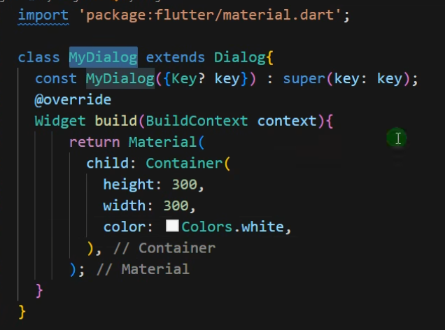

## 弹出自定义Dialog

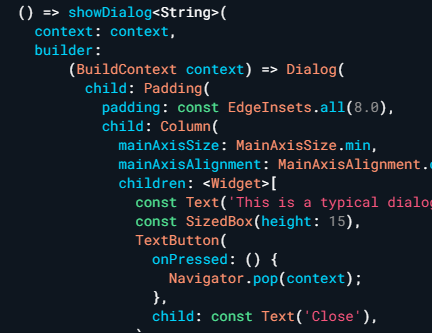