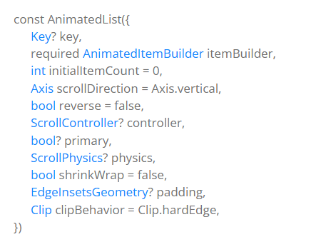
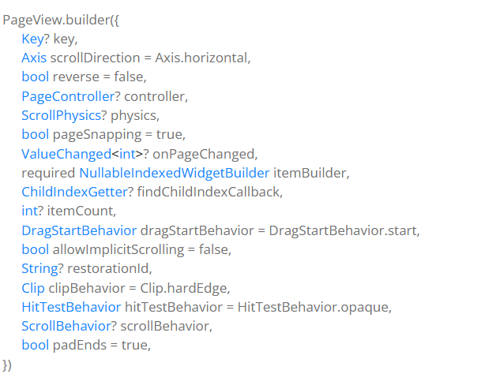

# PageView

PageView 是 Flutter 中用于创建水平或垂直滚动分页效果的组件，常用于轮播图、引导页、图片浏览等场景，本质是一个分页滚动的列表容器。

---

## PageView实现仿抖音切换页面以及PageView实现轮播图

## 基本用法

1. 通过实例化`PageView`类，传递构造函数的配置参数来使用；

2. 通过调用`PageView`类的`builder`静态方法创建`PageView`实例，且是按钮创建。

<

## 上拉无线加载功能

参数名|描述|类型
---|---|---
onPageChanged|换页监听事件|ValueChanged<int>

---

## 无缝轮播图

通过`SizedBox`组件作为`PageView`组件的容器，控制宽高。

<

## 轮播图的指示灯

通过`Container`创建元素，配合`Positioned`布局组件来定位元素。注意定位元素要再`Stack`组件中使用，因为定位涉及到层的堆栈。

---

## PageView实现动态轮播图 

1. 定时器

2. PageController：`PageView` 的控制器。控制哪一个页面展示再`PageView`中。通过`animateToPage`方法控制页面索引。

##  AutomaticKeepAliveClientMixin

`PageView`页面每次切换都会销毁每页的子元素，如果想缓存下来，需要使用

---

## Flutter Key

键是 Widgets, Elements and SemanticsNodes的标识符,不可重复。(DOMid选择器)
Key 的子类应该是 LocalKey 或 GlobalKey 的子类。

作用是：

1. 保存状态
2. 排序

## LocalKey

当前组件初始化创建的`List`组件有用。

## GlobalKey

销毁后再次创建的组件状态有用。

## GlobalKey获取子元素,修改子元素

