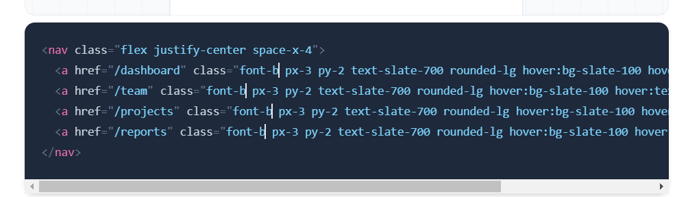
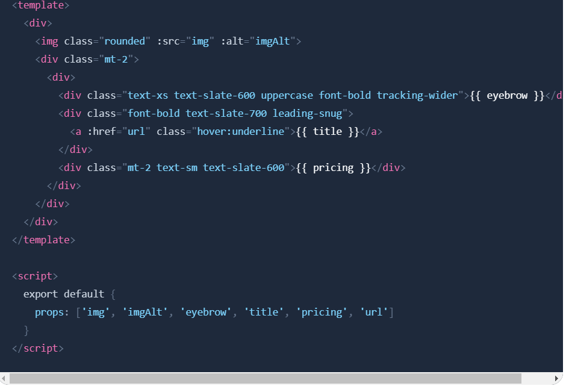
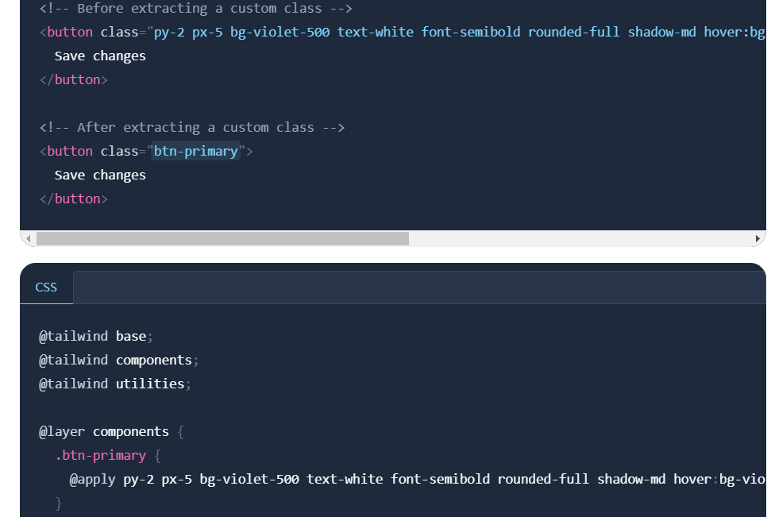

---
# You can also start simply with 'default'
theme: seriph
# random image from a curated Unsplash collection by Anthony
# like them? see https://unsplash.com/collections/94734566/slidev
# background: https://cover.sli.dev
# some information about your slides (markdown enabled)
title: TailwindCss
class: text-center
# https://sli.dev/features/drawing
drawings:
  persist: false
# slide transition: https://sli.dev/guide/animations.html#slide-transitions
transition: slide-left
# enable MDC Syntax: https://sli.dev/features/mdc
mdc: true
---

# TailwindCss

---
layout: center
class: text-center
---

# 是什么

一个通过样式Atomic CSS/Functional CSS的手段来实现utility-first(实用程序优先/工具优先)的CSS框架，包含flex，pt-4，text-center和rotate-90等类，其实就是预设`工具类库`，可以直接在标记中组合以构建任何设计。

其中包含普通类，响应式类，伪类，为元素，交互类。满足各种使用场景。

<div v-click="1" class="text-[30px] text-[#ff3333]">
  先简单看看它会长什么样子
</div>

---
layout: default
---

```html
<section>
  <ul class="bg-slate-50 p-4 sm:px-8 sm:pt-6 sm:pb-8 lg:p-4 xl:px-8 xl:pt-6 xl:pb-8 grid grid-cols-1 sm:grid-cols-2 lg:grid-cols-1 xl:grid-cols-2 gap-4 text-sm leading-6">
    <li x-for="project in projects">
      <a :href="project.url" class="hover:bg-blue-500 hover:ring-blue-500 hover:shadow-md group rounded-md p-3 bg-white ring-1 ring-slate-200 shadow-sm">
        <dl class="grid sm:block lg:grid xl:block grid-cols-2 grid-rows-2 items-center">
          <div>
            <dt class="sr-only"></dt>
            <dd class="group-hover:text-white font-semibold text-slate-900">
            </dd>
          </div>
          <div>
            <dt class="sr-only">Category</dt>
            <dd class="group-hover:text-blue-200">{project.category}</dd>
          </div>
          <div class="col-start-2 row-start-1 row-end-3 sm:mt-4 lg:mt-0 xl:mt-4">
            <dt class="sr-only">Users</dt>
            <dd x-for="user in project.users" class="flex justify-end sm:justify-start lg:justify-end xl:justify-start -space-x-1.5">
              
            </dd>
          </div>
        </dl>
      </a>
    </li>
  </ul>
</section>

```

---
layout: center
class: text-center
---

# TailwindCss核心理念

Tailwind CSS 的核心设计理念是“工具类优先”（Utility-First），一种通过Atomic CSS的工具类而非自定义CSS来实现快速样式设计，它开箱即提供颜色、填充、边距、显示等数百种CSS属性的工具，这种方法的好处是可以快速地创建原型，并且可以更直观地理解每个元素的样式，由于所有的样式都直接写在了元素上，实现了真正的所见即所得，不用离开HTML即可快速写出各种样式。

关键词：`utility-first(工具优先：以预设的样式工具为核心进行开发)` `Atomic CSS/Functional CSS(原子化：原子化 CSS 是一种 CSS 的架构方式，它倾向于小巧且用途单一的 class，并且会以视觉效果进行命名。)` 

<div v-click="1" class="text-[30px] text-[#ff3333]">
  为什么要使用它
</div>

---
layout: default
---

# bootstrap

以前的css工具类库。是非原子化的。bootstrap。(角度不同，粒度不同，概念原子化、物理原子化)

<div v-click="1">
缺点：

1. 工具类的粒度粗/样式描述的越具体，导致样式复用程度降低
2. 不可按需使用
3. 定制能力弱，没办法通过工程化手段定制，只能手动样式覆盖
4. 无法在样式完全需要定制的场景下使用
5. 使用体验差，工具类名每次都要照着文档抄

</div>

<div v-click="2" class="text-[30px] text-[#ff3333]">
总结：使用场景不够灵活，开发体验不够好
</div>

---
layout: image
image: ./images/image.png
backgroundSize: none
---

# 通过一个例子来体验它与传统css开发的不同

---
layout: two-cols
---


```html
<div class="chat-notification">
  <div class="chat-notification-logo-wrapper">
    
  </div>
  <div class="chat-notification-content">
    <h4 class="chat-notification-title">ChitChat</h4>
    <p class="chat-notification-message">You have a new message!</p>
  </div>
</div>
```
<div class="mt-[50px]"></div>

# 传统的CSS写法

::right::


```css
.chat-notification {
  display: flex;
  align-items: center;
  max-width: 24rem;
  margin: 0 auto;
  padding: 1.5rem;
  border-radius: 0.5rem;
  background-color: #fff;
  box-shadow: 0 20px 25px -5px rgba(0, 0, 0, 0.1), 0 10px 10px -5px rgba(0, 0, 0, 0.04);
}
.chat-notification-logo-wrapper {
  flex-shrink: 0;
}
.chat-notification-logo {
  height: 3rem;
  width: 3rem;
}
.chat-notification-content {
  margin-left: 1.5rem;
}
.chat-notification-title {
  color: #1a202c;
  font-size: 1.25rem;
  line-height: 1.25;
}
.chat-notification-message {
  color: #718096;
  font-size: 1rem;
  line-height: 1.5;
}
```

---
layout: default
---

# TailwindCss写法

<v-switch>
<template #1> 

  ```html
  <div>
    <div >
      
    </div>
    <div>
      <div >ChitChat</div>
      <p >You have a new message!</p>
    </div>
  </div>
  ```

</template>
<template #2-5> 

  ```html
  <div class="p-6 max-w-sm mx-auto bg-white rounded-xl shadow-lg flex items-center space-x-4">
    <div class="shrink-0">
      
    </div>
    <div>
      <div class="text-xl font-medium text-black">ChitChat</div>
      <p class="text-slate-500">You have a new message!</p>
    </div>
  </div>
  ```

</template>
</v-switch>

<div v-click="3" class="mt-1">
其中的每一个类都是tailwindcss工具类。这种方法也允许我们实现完全自定义的组件设计，而无需编写一行自定义 CSS。
</div>

---
layout: default
---

# 有哪些好处

<div v-click="1">

1. 不用想选择器名称了

</div>
<div v-click="2">

2. css文件不在随着页面的增加而大大增加

</div>

<div v-click="3">

3. 不用再担心破坏全局样式，编写样式没有心智负担，安全开发

</div>

<div v-click="4">

4. 没有代码导航问题（所见所得

</div>

<div v-click="5">

5. 加载更快

</div>

<div v-click="6">

6. 代码风格更加统一，不再四不像（错别字，不统一的命名方式等

</div>

<div v-click="7">

7. 不再有代码冗余问题

</div>


---
layout: default
---

# 是不是和内联样式有些相似

<div v-click="3" class="text-[30px] text-red">
  有哪些好处?
</div>

<div v-click.hide="3">
  <div v-click="1" class="flex items-center mt-[50px]">
    内联样式&nbsp;&nbsp;&nbsp;&nbsp;&nbsp;&nbsp;&nbsp;&nbsp;&nbsp;&nbsp;&nbsp;&nbsp;&nbsp;&nbsp;

```html{2}
<div 
  style="color:red; font-size:12px; font-weight:blod;"
>
  tailwindcss
</div>
```

  </div>

  <div v-click="2" class="flex items-center mt-[50px]">
    tailwindcss写法&nbsp;&nbsp;

```html{2}
<div 
  class="text-red text-[12px] font-bold"
>
  tailwindcss
</div>
```

  </div>
</div>


---
layout: image-left
image: ./images/image2.png
backgroundSize: 100% 100%
---

<div v-click="1">
  有约束的设计: 内置主题以及自定义主题
</div>

<div v-click="2">
（页面主题包括色彩方案、排版、布局以及其他视觉元素，这些元素共同定义了用户界面的整体外观和用户体验
</div>

---
layout: image-left
image: ./images/image3.png
backgroundSize: 100% auto
---

<div v-click="1">
响应式设计: 构建自适应用户界面
</div>

---
layout: image-left
image: ./images/image4.png
backgroundSize: 100% auto
---

<div v-click="1">

悬停、聚焦和其他状态

</div>

---
layout: center
class: text-center
---

<div>

# 以上我们看出了什么问题

</div>

<div class="text-center text-[red] text-[40px]"  v-click="1">
  重复的工具类组合的可维护性问题。
</div>

---
layout: center
---

<div class="text-[30px]">

```html{1-2|all}
<button class="bg-blue-500 hover:bg-blue-700 text-white font-bold py-2 px-4 rounded">
</button>

<button class="bg-blue-500 hover:bg-blue-700 text-white font-bold py-2 px-4 rounded">
</button>

<button class="bg-blue-500 hover:bg-blue-700 text-white font-bold py-2 px-4 rounded">
</button>
```

</div>

<div v-click="3" class="text-center text-red text-[30px] rotate-45 translate-y-[-100px]">
如何解决？
</div>


---
layout: default
---

# 方案一

多光标编辑 




---
layout: default
---

# 方案二

模板引擎能力: for循环语句(模板的编程能力，抽象提取等)

---
layout: default
---

# 方案三


组件提取: 如果你需要在多个文件中重用某些样式，最好的策略是创建一个组件




---

# 方案四

使用 @apply 提取类：Tailwind 的 @apply 指令在模板部分感觉笨重时将重复的工具模式提取到自定义 CSS 类。（从这里可以看到我们可以通过tailwindcss创建自己的bootstrap）




---
layout: default
---

# 项目中的实践-优点

<div class="flex flex-wrap justify-between  gap-y-[20px]">
  <div class="w-[50%]">
    <h3 class="text-red">不用担心全局样式冲突</h3>
    <div class="">1.每个类名都是唯一的</div>
  </div>

   <div class="w-[50%]">
    <h3 class="text-red">项目的侵入性可控</h3>
    <div class="">1. 给所有类名添加前缀：<span class="text-red">tw-bg-[#fff]</span></div>
    <div class="">2. 样式重置开关</div>
  </div>

   <div class="w-[50%]">
    <h3 class="text-red">较好的语义化</h3>
    <div class="">1.使用 TailwindCss 你不用花精力来定义类名，你可以使用内置具有良好语义化的类名，实现样式效果。</div>
  </div>

  <div class="w-[50%]">
    <h3 class="text-red">开发阶段极度流畅</h3>
    <div class="">1.搭配补全插件，极速开发</div>
  </div>

  <div class="w-[50%]">
    <h3 class="text-red">项目越大资源越小</h3>
    <div class="">1.每个原子类只生成一个</div>
  </div>

  <div class="w-[50%]">
    <h3 class="text-red">代码片段复用能力增强</h3>
    <div class="">1.一段html，随处可复制粘贴（也是一种复用）。</div>
  </div>

  <div class="w-[50%]">
    <h3 class="text-red">可渐进式使用</h3>
    <div class="">1.和老项目一起使用，less,sass,css</div>
  </div>

  <div class="w-[50%]">
    <h3 class="text-red">统一代码规范</h3>
    <div class="">1.告别四不像代码</div>
    <div>2.输入错别字</div>
  </div>
</div>


---
layout: default
---

# 项目中的实践-缺点

<div class="flex flex-wrap justify-between  gap-y-[20px]">
  <div class="w-[45%]">
    <h3 class="text-red">冗余代码</h3>
    <div>传统的css类的编写一个类可以有多个样式规则，这里都要体现在css的类里面</div>
    <div class="italic text-red">解决方案：利用css的继承特性，html标签的层级嵌套组织（抽象）</div>
  </div>

  <div class="w-[45%]">
    <h3 class="text-red">外部项目组件共享</h3>
    <div>不支持tailwind css的项目，没法使用</div>
    <div class="italic text-red">解决方案：将组件构建出来</div>
  </div>

  <div class="w-[45%]">
    <h3 class="text-red">记忆成本</h3>
    <div>规则很多</div>
    <div class="italic text-red">解决方案：搭配补全插件</div>
  </div>

  <div class="w-[45%]">
    <h3 class="text-red">构建开销</h3>
    <div>扫描文件中的标签来生成样式</div>
    <div class="italic text-red">目前暂无察觉，遇到瓶颈再谈不迟</div>
  </div>
</div>

---
layout: center
---

[Presentation Slides for Developers](https://sli.dev)