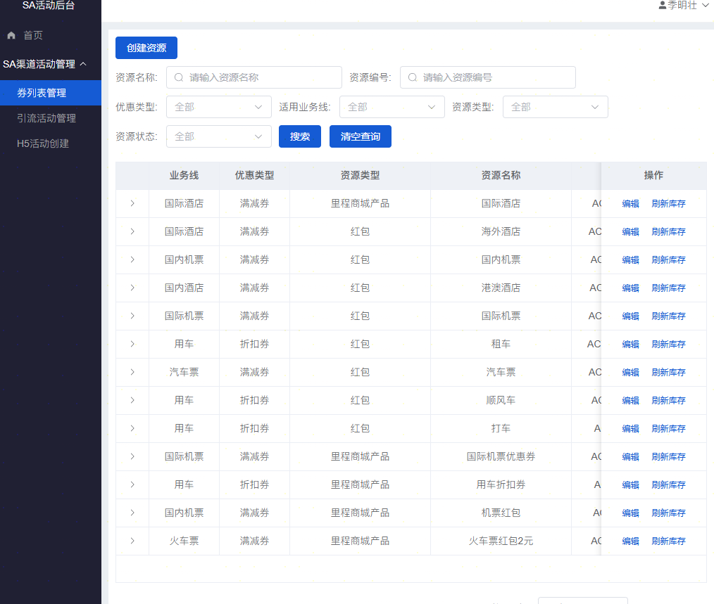
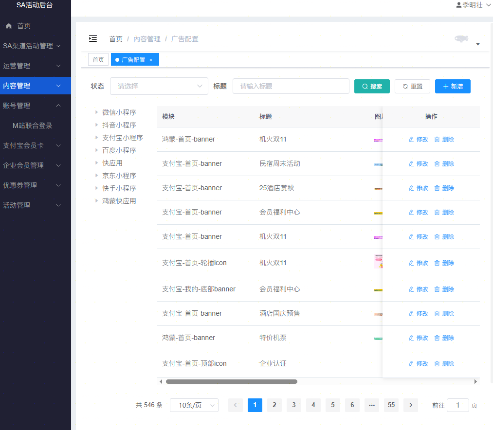
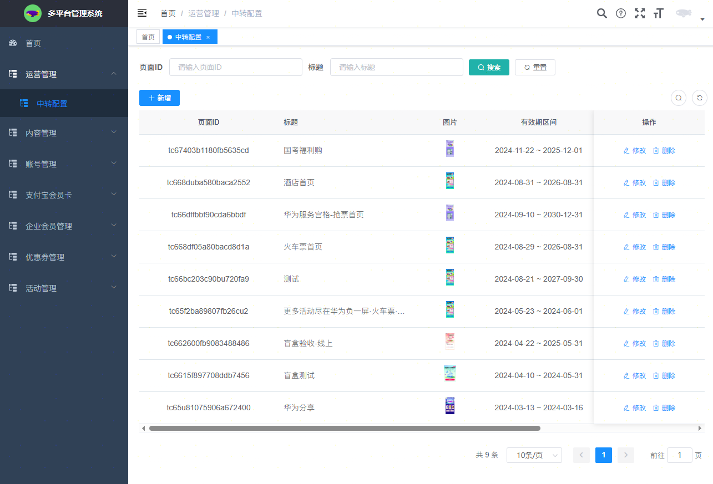
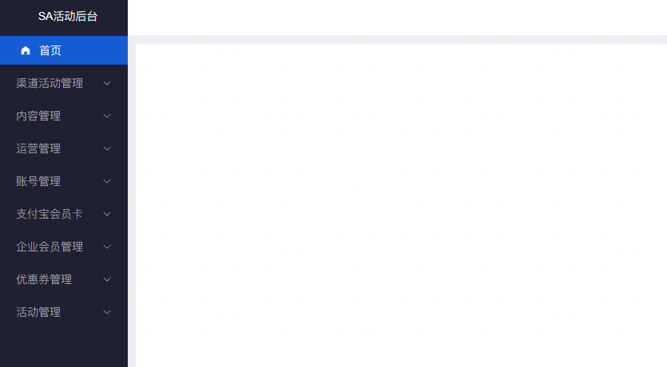
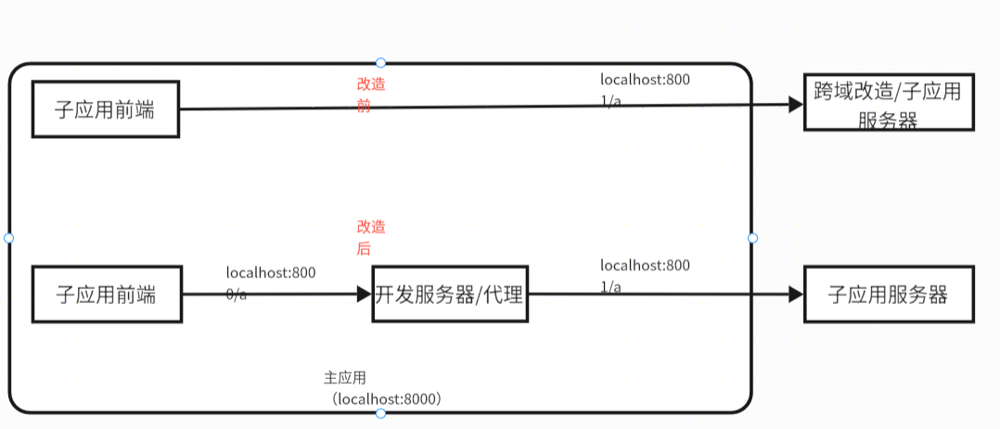
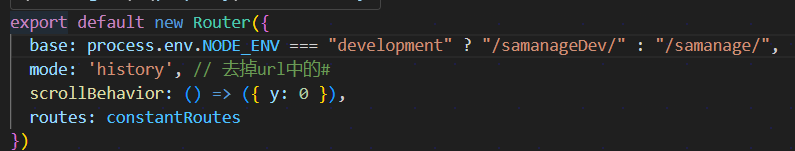

---
# You can also start simply with 'default'
# theme: seriph
# random image from a curated Unsplash collection by Anthony
# like them? see https://unsplash.com/collections/94734566/slidev
# background: https://cover.sli.dev
# some information about your slides (markdown enabled)
title: wujie-sa
class: text-center
# https://sli.dev/features/drawing
drawings:
  persist: false
# slide transition: https://sli.dev/guide/animations.html#slide-transitions
transition: slide-left
# enable MDC Syntax: https://sli.dev/features/mdc
mdc: true
# background: ./bg.png
---

# sa活动系统与多平台管理系统融合方案专项评审

---
layout: center
---

# 需求背景

1. sa活动后台和多平台管理系统都是SA管理后台的一部分，面向同一业务部门，理应存在于一个系统中。现在独立存在，导致业务流程复杂。
2. 多平台管理系统属于老项目，技术栈较为陈旧（比如VUE2版本），依赖长久未更新。 而sa活动后台使用了较新的技术栈，存在技术不兼容的问题。

---



---


---
layout: center
---

# 方案目标

1. 将多平台管理系统的功能无缝集成到中sa活动系统，确保业务流程顺畅，提升业务体验，提高工作效率。
2. 统一前端技术栈，逐步升级多平台管理系统的技术栈。
3. 统一后台菜单权限与登录信息共享，提升系统的整体一致性与安全性。

---



---
layout: center
---

# 技术方案

### 通过`WeuJie(无界)`微前端框架，以`sa活动系统`为主应用，`多平台管理系统`为子应用的技术架构，将两个系统前端页面进行融合到一个系统当中展示与交互。

---

# 技术架构

<div class=" flex items-center justify-center h-[100%] w-[80%]">


</div>

---

# 开发工作流方式

&nbsp;

<span v-mark.highlight.yellow="0">1、大前提：主子应用不跨域或者解决跨域</span>

<span v-mark.highlight.yellow="0">2、主子应用仍然是独立的代码仓库，仍然可以是独立的站点。</span>

核心思路：作为两个独立项目**进行开发和维护**，通过微前端技术架构，将子应用通过地址进行加载到主应用中进行展示，所有的开发流程保持不变。会涉及到子应用的部分改造与兼容，主要是根据子应用是否存在主应用中来展示`layout布局组件`。

优点：

* 维护简单。
* 子应用无需为了微前端架构而进行大量改造。

缺点：

* 注意跨域问题。

---

# 子应用(多平台管理系统)

* 生产环境与开发环境，都和以前保持基本一致：
* 路径跳转，文件下载等功能，需要注意兼容微前端架构主应用。


<div class=" flex items-center justify-center h-[100%] w-[80%]">



</div>

---

# 主应用(sa活动系统)

* 生产环境与开发环境，会加载对应环境的子应用（多平台管理系统）：
* 开发子应用作为项目的一个路由页面，所以不会对其他页面开发造成影响


<div class=" flex items-center justify-center h-[100%] w-[80%]">


</div>

---

# 主要开发内容

- 微前端框架调研与选型

经过对比与调研，选择了`WeuJie(无界)`微前端框架，主要考虑到其易用性与社区支持度较好，且能够满足当前的技术需求。

---

- 微前端框架集成与开发

在主应用（sa活动系统）中集成`WeuJie(无界)`微前端框架，配置子应用（多平台管理系统）的加载地址与相关参数。

<div class=" flex items-center justify-center h-[100%] w-[80%]">


</div>

---

- 多平台管理系统域名变更（后端）

从`https://tcwireless.17usoft.com/`变为`https://apprd.17usoft.com/`

---

- 系统菜单权限整合（后端+前端）

两个系统的页面整合到一个系统中，菜单权限要整合到一起。

<div class=" flex items-center justify-center h-[100%] w-[80%]">



</div>

---

- 登录信息整合（后端）

两个系统的页面整合到一个系统中，登录的cookie，认证信息需要调整。

<div class=" flex items-center justify-center w-[40%]">


</div>

---

- 融合后的整体页面兼容性检查与调整等

<div class=" flex items-center justify-center h-[100%] w-[60%]">


</div>

---

<div class=" flex items-center justify-center h-[100%] w-[80%]">


</div>

---

# 解决问题

- 子应用独立开发时的依赖安装问题

  多平台系统是一个较老的系统，依赖版本较为陈旧，尤其对于sass文件的编译工具`node-sass`版本过低，安装繁琐，容易导致安装失败的问题。为了解决这个问题，需要对子应用的依赖进行升级，尤其是`node-sass`C++版本问题，切换了`dart-sass`js版本，并且调整相关的sass文件代码，确保能够顺利安装与编译。

---

- 主应用加载子应用的跨域问题（初期）

  主子应用本地运行不在同一个端口，所以主应用加载子应用的html文件时，存在跨域问题，同时子应用代码运行发起的http请求也存在跨域情况。所以需要通过专门的vue构建工具dev server,来配置代理服务，解决跨域问题，通过给dev server的钩子函数中配置 cors 中间件，解决跨域与option方法的预请求导致的错误问题。

  ```js
   {
    before: function (app, server) {
      app.use(
        cors({
          origin: [
            "http://localhost:8000",  
          ],
          credentials: true,
          methods: ["GET", "POST", "PUT", "DELETE", "OPTIONS", "PATCH"],
          allowedHeaders: ["Content-Type", "Authorization", "X-Custom-Header"],
          maxAge: 86400,
        })
      );
      app.options("*", cors())
    }
   }

  ```

---

- 开发环境的代理服务处理

  开发环境本地`localhost`域名主应用，加载`预发或者qa环境`子应用存在跨域，所以要通过构建工具配置代理服务解决跨域问题。

 

---

- 支持多平台系统迁移后修改二级目录名称

多平台系统的原本的二级目录名称为/platformadmin,迁移后修改/samanage,这会导致部署后的前端资源加载出问题，因为内部文件打包路径没有修改，导致都指向/platformadmin目录，加载出错，同时本地开发服务器的代理接口路径也一并访问失败，所以需要修改为迁移后的服务的路由。



---

- 页面资源被代理服务器拦截


---

- 主应用中运行的子应用的页面访问有权限验证

页面访问同样有权限验证的问题，而页面加载是在主应用中的微前端框架中实现的，所以需要进行请求改造，框架本身也很灵活，有对应的fetch字段来自定义页面的请求方法，这个函数类似与装饰器函数，所以我们可以在页面加载之前，之后都能做些事情，比如性能监控，异常处理，日志等等


---

- 子应用下载有权限验证

在测试过程中发现，多平台系统的导出下载功能都是通过http协议的能力实现的，通过配置的Content-Type确定文件类型，Content-Disposition确定下载行为。前端实现方式为链接跳转，浏览器的http客户端下载，导致在微前端架构下无法将子系统的自定义头字段x-sa-admin:sam带上鉴权用户身份，下载失败。

```js
async function downloadFile(url, filename) {
  try {
    // 1. 发起 fetch 请求（可携带 headers 如认证信息）
    const response = await fetch(url, {
      method: 'GET',
      headers: {
        'x-sa-admin': 'sam', // 如有权限验证
      }
    });

    if (!response.ok) {
      throw new Error(`请求失败：${response.status}`);
    }

    // 2. 将响应转为 Blob 对象（自动识别 MIME 类型）
    const blob = await response.blob();

    // 3. 生成临时 URL
    const objectUrl = URL.createObjectURL(blob);

    // 4. 创建 <a> 标签触发下载
    const a = document.createElement('a');
    a.href = objectUrl;
    a.download = filename || 'download'; // 文件名（可从后端响应头获取）
    document.body.appendChild(a);
    a.click();

    // 5. 清理资源
    document.body.removeChild(a);
    URL.revokeObjectURL(objectUrl); // 释放 Blob URL 占用的内存

  } catch (error) {
    console.error('下载失败：', error);
  }
}
```
---

- 同域名系统下token冲突


因部门内部多个系统都是直接挂在同域名https://apprd.t.17usoft.com下的二级目录下的，比如crm(crm管理平台),samanage(多平台系统)，saadmin(sa系统)等等，都是同域名下的，同时系统都是出自一个前端开发框架，导致对于token的处理一致，都是存储到cookie当中，当多个系统互相打开时，其他系统会因为token错误重新登录，返回其他系统后会出现同样问题，包括localStroge,sessionStroge等等都存在相同问题。


1. 我们将所有的cookie，localStroge，sessionStroge等等操作原本硬编码到代码里的方式统一放到单独文件模块中进行管理，给其加上系统命名前缀做区分。
1. 为了防止失误，之后会做一个封装库，所有系统都使用这个封装库进行存储操作。这个封装库通过TS类型约束，一个运行时检查，防止误用。
2. 等等。

---

# 工期

<div class=" flex gap-[50px]  flex-wrap ">

<div>

### 前端

技术调研与验证：10.9~10.11

方案设计与开发：10.13~10.22

预发验证：10.23~10.29

</div>

<div>

### 后端

系统迁移部署：10.23~10.29

菜单权限整合：10.30~11.5

登录验证整合：10.30~11.5

</div>
<div>

### 前后端联调

多系统用户信息打通：10.30~11.10

菜单权限整合：10.30~11.10

</div>
<div>

### 测试与上线

系统测试：11.10~11.xx

问题修复与上线：11.10~11.xx

</div>
<div>

### 专项参与人员

主导：季明壮

参与：陈乐

</div>

</div>

---
layout: center
---

[Presentation Slides for Developers](https://sli.dev)