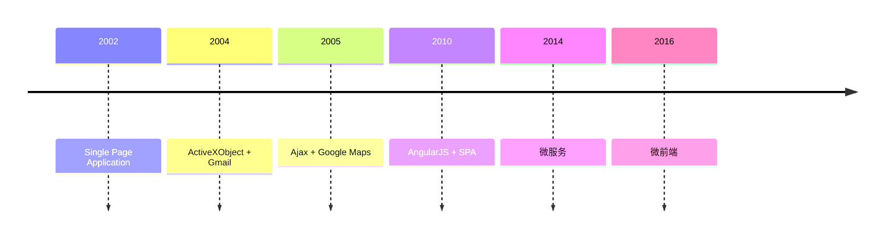

---
# You can also start simply with 'default'
theme: seriph
# random image from a curated Unsplash collection by Anthony
# like them? see https://unsplash.com/collections/94734566/slidev
# background: https://cover.sli.dev
# some information about your slides (markdown enabled)
title: wujie
class: text-center
# https://sli.dev/features/drawing
drawings:
  persist: false
# slide transition: https://sli.dev/guide/animations.html#slide-transitions
transition: slide-left
# enable MDC Syntax: https://sli.dev/features/mdc
mdc: true
background: ./bg.png
---

# wujie(无界)
## 极致的微前端框架

---

# 微前端的发展历程

---
layout: center
---

# 什么是微前端

### 将微服务的思想拓展到前端的一种新兴架构，背后主要思想是将一个单体项目，拆解为多个较小的部分，以便多个相对独立的团队进行分工写作。

---
layout: center
---

# 微前端的设计原则

1. 技术栈无关：基座不限制微应用的技术栈，微应用可使用 React、Vue 等任意框架，甚至无框架

2. 独立开发 / 部署: 每个微应用是独立的代码库，有自己的 CI/CD 流程，发布不依赖其他微应用；

3. 隔离运行: 微应用的 JS、CSS 不会污染全局环境，运行时状态互不干扰（如全局变量、事件监听、样式冲突）；

4. 用户体验一致: 尽管技术栈不同，微应用间的路由切换、样式风格、交互逻辑需保持统一，让用户感知不到「拆分」

---
layout: two-cols子应用子应用
---

# 微前端的三大核心模块

::right::

test

---
layout: center
---

# 微前端的应用场景有哪些

- 大型复杂应用的拆分
- 多团队协作开发
- 技术栈多样化
- 渐进式迁移

---
layout: center
---

# 主流的微前端方案有哪些

- iframe
- single-spa
- qiankun
- wujie
- module-federation

---
layout: center
---

# 我们为什么选用wujie

- 组件方式来使用微前端
- 一个页面可以同时激活多个子应用
- 天然 js 沙箱，不会污染主应用环境
- 天然 css 沙箱，不会污染主应用样式
- 应用切换没有清理成本
- 子应用保活

---
layout: center
---

# wujie的运行机制

- js 沙箱：iframe
- css 沙箱：web component

---
layout: center
---

# 基于wujie的系统架构

  

  

  

---
layout: center
---

[Presentation Slides for Developers](https://sli.dev)