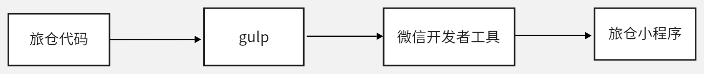
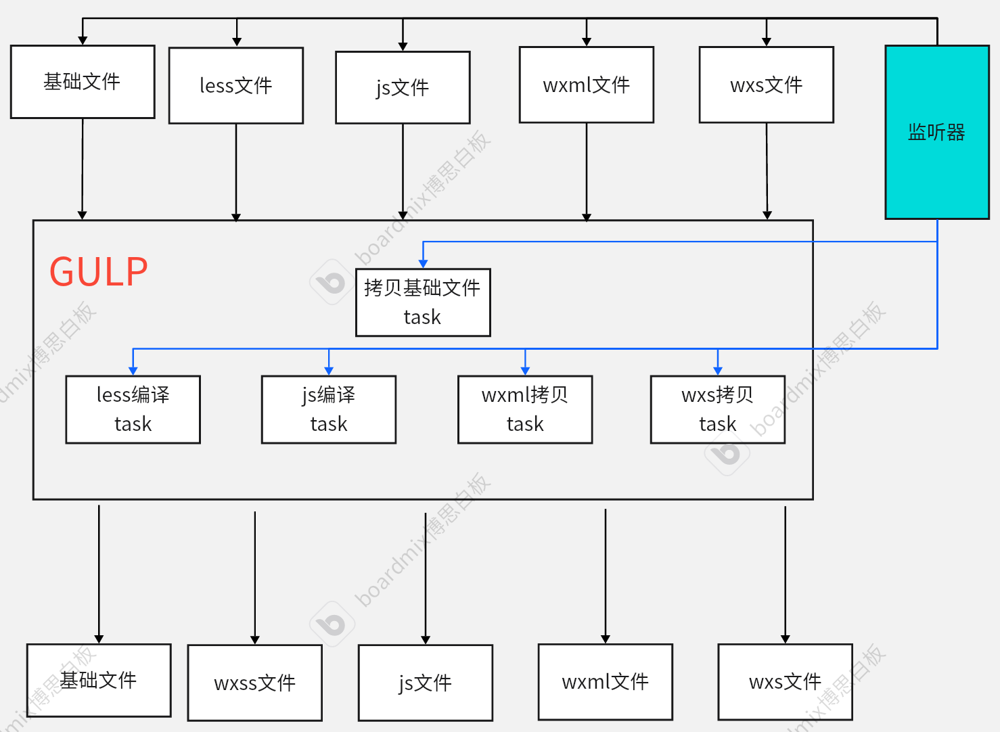

---
# You can also start simply with 'default'
theme: seriph
# random image from a curated Unsplash collection by Anthony
# like them? see https://unsplash.com/collections/94734566/slidev
# background: https://cover.sli.dev
# some information about your slides (markdown enabled)
title: 小程序构建优化工作报告
class: text-center
# https://sli.dev/features/drawing
drawings:
  persist: false
# slide transition: https://sli.dev/guide/animations.html#slide-transitions
transition: slide-left
# enable MDC Syntax: https://sli.dev/features/mdc
mdc: true
---

# 小程序构建优化工作报告

---
layout: center
---

<h1 class="text-center"> 背景 </h1>

基于`gulp`构建的旅仓小程序，每次启动项目耗时严重，且开发过程中项目变更也同样如此，使得开发过程痛苦不堪。

---
layout: center
---
 
<h1 class="text-center">什么是gulp?</h1>

Gulp 是一个基于 Node.js 的流式构建工具，主要用于前端开发中的自动化任务管理。它允许开发者定义一系列的任务来自动化常见的工作流程，如代码压缩、文件合并、CSS 预处理、浏览器自动刷新等。Gulp 通过编写简单且可读的任务代码，显著提高了开发效率。
 

---
layout: center
---

<h1 class="text-center">基本运行机制演示图</h1>

---
layout: center
---

<h1 class="text-center">构建流程</h1>

---
layout: center
---

<h1 class="text-center">gulp构建流程</h1>

---
layout: center
---

<h1 class="text-center">启动项目耗时</h1>

---
layout: center
---

<h1 class="text-center">更新项目耗时</h1>

<h4 class="m-auto  w-[70%] my-[10px]">js更新</h4>

<h4  class="m-auto  w-[70%] my-[10px]">css更新</h4>

---
layout: center
---

<h1 v-click="0" class="text-center">我们要解决的问题？</h1>

<h3 v-click="1">gulp中的每个任务执行的耗时优化</h3>

---

# 开发过程中的构建优化

1. 每个task没有进行增量构建，全部是task都是全量构建，导致每次文件改动task从头执行。

---

# 开发过程中的构建优化

1. gulp.src('./', { since: xxxx-xx-xx })
2. lastRun()

---

# 应用的启动慢的缺点

1. 启动应用等待时间长
2. 部署时间长
3. 切换不同分支无法增量更新，需要重启应用，增加等待时长

---

# 应用的启动中的构建优化

从gulp的任务中分析得出做的几件事情

1. 基本的文件拷贝
2. less处理
3. js处理

---

# 基本的文件拷贝

1. 文件平移到输出目录

---

# js处理

1. npm包构建
2. 开发环境设置
3. 生成器语法的降级与注入polyfill脚本

---

# less处理

1. less的语法降级到wxss
2. 样式文件注入
3. 样式单位px转rpx
4. 文件后缀名改写

--- 

# 微信开发者工具-JS构建

--- 

# 微信开发者工具-JS构建

--- 

# 微信开发者工具-JS构建

---

# 微信开发者工具-TS构建

---

# 微信开发者工具-Less构建

---

# 微信开发者工具-Less构建

1. 样式文件注入
2. 样式单位px转rpx
3. 文件后缀名改写

将产物作为源码基础，进行改造即可。

---
layout: center
---

<h1 class="text-center">总结</h1>

从构建版到无构建版改造完成，让原生构建工具兼容掉自定义构建工作流之后，项目变成从了纯原生项目。

---
layout: center
---

[Presentation Slides for Developers](https://sli.dev)