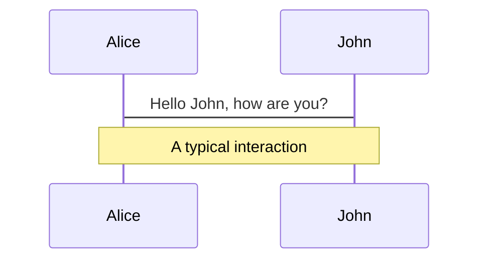
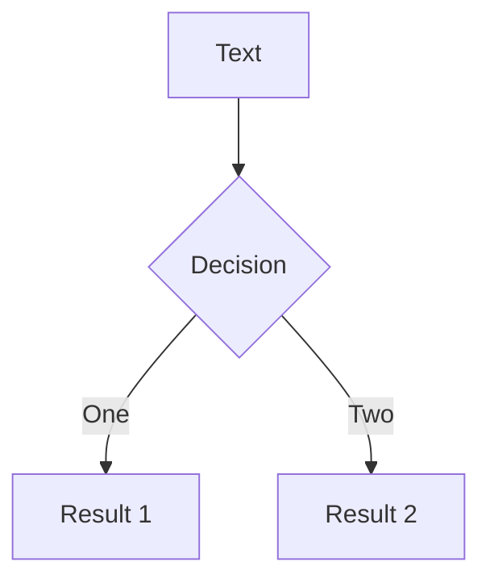
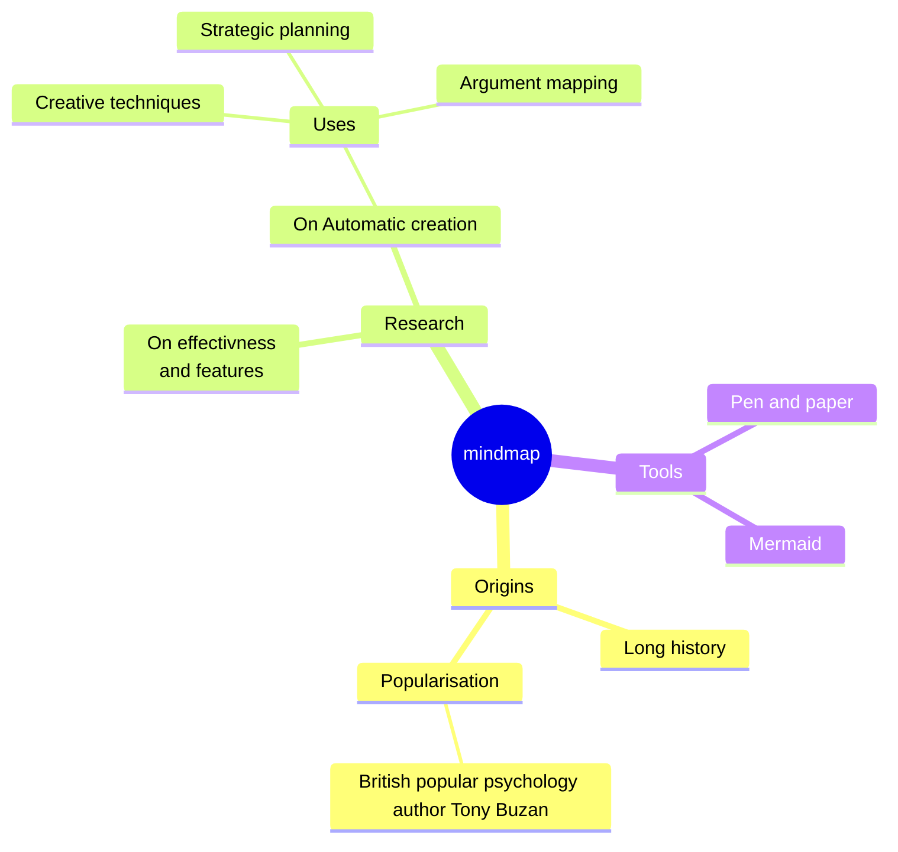
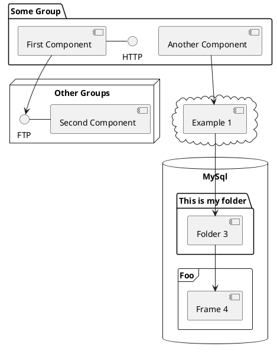

# 什么是 MoonBit

月兔：使用 WASM，为云计算和边缘计算而生的智能开发平台

---
layout: center
---

# 什么是 WASM

WebAssembly(WASM) 是一种新的编码方式，可以在现代的网络浏览器中运行 － 它是一种低级的类汇编语言，具有紧凑的二进制格式，可以接近原生的性能运行，并为诸如 C / C ++等语言提供一个编译目标，以便它们可以在 Web 上运行。

---
layout: center
---

# 什么是云计算

云计算（Cloud Computing）是分布式计算的一种，指的是通过网络“云”将巨大的数据计算处理程序分解成无数个小程序，然后，通过多部服务器组成的系统进行处理和分析这些小程序得到结果并返回给用户。云计算早期，简单地说，就是简单的分布式计算，解决任务分发，并进行计算结果的合并。因而，云计算又称为网格计算。通过这项技术，可以在很短的时间内（几秒钟）完成对数以万计的数据的处理，从而达到强大的网络服务。

---
layout: center
---

# 什么是边缘计算(Edge Computing)


边缘计算(Edge Computing)指的是在网络边缘结点来处理、分析数据。是一种分布式计算模型，它将计算和数据存储放置在靠近数据源头的边缘设备中，而不是在远程的数据中心或云服务器中进行处理。

边缘计算旨在解决传统计算模型中的延迟和带宽限制问题，这些问题在需要实时响应或大规模数据处理时尤为明显。通过在边缘设备上进行本地计算，可以减少数据在网络中传输的时间和成本，并提高应用程序的响应速度和性能。

边缘计算的另一个优点是它可以提高数据隐私和安全性。由于数据不必在云服务器或其他远程数据中心中传输，边缘设备上的数据可以更好地保护隐私，并降低数据泄露的风险。


---

# MoonBit包含哪些东西

* 通用程序语言设计
* 编译器
* 构建系统
* IDE
* 部署工具


<div class="color-[red] mt-10">在语言设计、编译器和构建系统上实现高度的垂直整合，为用户提供更佳的开发体验和性能，致力打造未来世界级的基础软件生态。</div>


---

# MoonBit编程语言

* 定位
  1. Moonbit定位的是工业语言<span class="color-[red]">（根据ReScript的前车之鉴）</span>

* 特点
  1. 编译快
  2. 输出体积小
  3. 运行性能快

---

# MoonBit编程语言: 编译快


<div>
在进行大规模并行编译时的同时，Moonbit能够储存用于分离式编译的高层IR，在链接时保存完整的代码信息，从而在链接时实现更多优化，提升程序的运行性能。这一模式也能更好地进行无用代码剪枝，输出更小的代码体积。
</div>

---

## preload: false

# Animations

Animations are powered by [@vueuse/motion](https://motion.vueuse.org/).

```html
<div v-motion :initial="{ x: -80 }" :enter="{ x: 0 }">Slidev</div>
```

<div class="w-60 relative mt-6">
  <div class="relative w-40 h-40">
    
    
    
  </div>

  <div
    class="text-5xl absolute top-14 left-40 text-[#2B90B6] -z-1"
    v-motion
    :initial="{ x: -80, opacity: 0}"
    :enter="{ x: 0, opacity: 1, transition: { delay: 2000, duration: 1000 } }">
    Slidev
  </div>
</div>

<!-- vue script setup scripts can be directly used in markdown, and will only affects current page -->
<script setup lang="ts">
const final = {
  x: 0,
  y: 0,
  rotate: 0,
  scale: 1,
  transition: {
    type: 'spring',
    damping: 10,
    stiffness: 20,
    mass: 2
  }
}
</script>

<div
  v-motion
  :initial="{ x:35, y: 40, opacity: 0}"
  :enter="{ y: 0, opacity: 1, transition: { delay: 3500 } }">

[Learn More](https://sli.dev/guide/animations.html#motion)

</div>

---

# LaTeX

LaTeX is supported out-of-box powered by [KaTeX](https://katex.org/).

<br>

Inline $\sqrt{3x-1}+(1+x)^2$

Block

$$
\begin{array}{c}

\nabla \times \vec{\mathbf{B}} -\, \frac1c\, \frac{\partial\vec{\mathbf{E}}}{\partial t} &
= \frac{4\pi}{c}\vec{\mathbf{j}}    \nabla \cdot \vec{\mathbf{E}} & = 4 \pi \rho \\

\nabla \times \vec{\mathbf{E}}\, +\, \frac1c\, \frac{\partial\vec{\mathbf{B}}}{\partial t} & = \vec{\mathbf{0}} \\

\nabla \cdot \vec{\mathbf{B}} & = 0

\end{array}
$$

<br>

[Learn more](https://sli.dev/guide/syntax#latex)

---

# Diagrams

You can create diagrams / graphs from textual descriptions, directly in your Markdown.

<div class="grid grid-cols-3 gap-10 pt-4 -mb-6">









</div>

[Learn More](https://sli.dev/guide/syntax.html#diagrams)

---

src: ./pages/multiple-entries.md
hide: false

---

---

layout: center
class: text-center

---

# Learn More

[Documentations](https://sli.dev) · [GitHub](https://github.com/slidevjs/slidev) · [Showcases](https://sli.dev/showcases.html)
