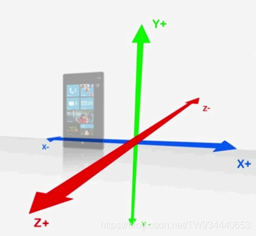

title: webgl
speaker: jmz
plugins:

    - echarts

<slide class="bg-black-blue aligncenter" image="https://source.unsplash.com/C1HhAQrbykQ/ .dark">

# webgl {.text-landing.text-shadow}

By jmz {.text-intro}

<!-- 1 -->
<slide class="bg-black-blue aligncenter">

# 先来几个概念

<br />
<br />
<br />

* canvas
* 渲染上下文
* 着色器
* glsl es
* 缓冲区
* 绘制

<slide class="bg-black-blue aligncenter">

# canvas

<br />
<br />
<br />

* html5之前在网页上显示图像，只能使用html提供的原生方案img标签 ；
* 直到 `html5` 中的 `canvas` ; 
* canvas定义了网页上的 `绘图区域` ；

<slide class="bg-black-blue aligncenter">

# 渲染上下文

<br />
<br />
<br />

* `WebGLRenderingContext` 接口提供绘图上下文，用于在 HTML `<canvas>` 元素内绘图；
* 要获得这个接口的对象，可以通过在 `<canvas>` 元素上调用 getContext() 函数，调用时传入 “webgl” 参数；

``` javascript
const canvas = document.querySelector('#canvas');
const gl = canvas.getContext('webgl');
```

<slide class="bg-black-blue aligncenter">

# 着色器

<br />
<br />
<br />

* webgl系统的绘图程序；
* webgl系统的着色器由两部分组成： 
    - 顶点着色器
        - 顶点：二维或者三维中的一个点，比如二维或者三维图形的端点和交点；
    - 片元着色器
        - 片元：可以理解为像素，图像的单元；

:::{.content-left}

``` javascript
const vertexShaderSource = `
  attribute vec4 a_Position;
  attribute vec4 a_Color;
  attribute float a_PositionSize;

  varying vec4 v_Color;

  void main(){
    gl_Position = a_Position;
    gl_PointSize = a_PositionSize;
    v_Color = a_Color;
  }
`;
```

:::

:::{.content-right}

``` javascript
const fragmentShaderSource = `
  precision mediump float;
  varying vec4 v_Color;

  void main(){
    gl_FragColor = v_Color;
  }
`;
```

:::
<slide class="bg-black-blue aligncenter">

# 专门用来编写着色器的编程语言glsl es

<br />
<br />
<br />

:::{.content-left}

## 数据类型

* 矢量

``` html
(3,7,1)
```

* 矩阵

``` html
[
2,3,4
2,3,4,
3,3,3
]

乘法规则：行 * 列

[ [ [
1,2, * a,b, = 1*a + 2*c , 1*b + 2*d
3,4 c,d 3*a + 4*c , 3*b + 4*d
] ] ]
```

:::

:::{.content-right}

### 存储限定字

* attribute
  + 只能被声明为全局变量; 
  + 只能在顶点着色器中; 
  + 逐顶点；

* uniform
  + 只能被声明为全局变量; 
  + 只读，不能被修改；

* varying
  + 必须是全局变量
  + 任务是从顶点着色器向片元着色器传输数据; 

:::

<slide class="bg-black-blue aligncenter">

# 缓冲区

<br />
<br />

* 是webgl中的一块存储区；可以在缓存区对象中保存想要绘制的所有顶点的数据；

``` javascript
// 1. 创建缓冲区对象(webgl系统中的一块内存区域，将glsl中的变量存储位置指向这块内存)
const vertexBuffer = gl.createBuffer();

// 2. 将缓冲区对象绑定到目标
gl.bindBuffer(gl.ARRAY_BUFFER, vertexBuffer);

// 3. 向缓冲区写入数据
gl.bufferData(gl.ARRAY_BUFFER, new Float32Array([
    -0.5, 0.5,
    -0.5, -0.5,
    0.5, 0.5,
]), gl.STATIC_DRAW);

// 获取webgl中变量a_Position的存储地址
const aPosition = gl.getAttribLocation(gl.program, 'a_Position');

// 4. 将缓冲区对象分配给aPosition
gl.vertexAttribPointer(aPosition, 2, gl.FLOAT, false, 0, 0);

// 5. 连接aPosition变量与分配给它的缓冲对象
gl.enableVertexAttribArray(aPosition);

// 返回顶点  
return vertices.length / 2;
```

<slide class="bg-black-blue aligncenter">

# 绘制

* `gl.drawArrays(type,offset,number)`
* 三种基本图形是webgl可以直接绘制的图形
    - gl.POINTS：
      - 一系列点;
    - gl.LINES：
      - 一系列单独的线段；
    - gl.TRIANGLES：
      - 一系列单独的三角形；

<!-- 2 -->
<slide class="bg-black-blue aligncenter">

# 再来几个概念

<br />
<br />
<br />

* 坐标系
* 变换
* 矩阵变换

<slide class="bg-black-blue aligncenter">

# 坐标系

<br />
<br />
<br />

在三维向量空间中，可以用任意三个线性无关的向量 `x,y,z(坐标系的三个轴)` 把任意 `一个向量w` 表示为`w = a1*x + a2*y+ a3*z` ,标量 `(a1,a2,a3)` 是 `w` 关于基 `x,y,z` 的分量,所以通常认为： `x,y,z` 定义了一个坐标系;

!

<slide class="bg-black-blue aligncenter">

# 变换

<br />
<br />
<br />

移动，旋转和缩放，这样的操作称为`变换或者仿射`

<slide class="bg-black-blue aligncenter">

# 矩阵变换

<br />
<br />
<br />

使用变换矩阵进行变换

<!-- 3 -->
<slide class="bg-black-blue aligncenter">

# 最后来几个概念

<br />
<br />
<br />

* 照相机
* 可视空间

<slide class="bg-black-blue aligncenter">

# 照相机

<br />
<br />
<br />

* 照相机/观察者

* `照相机的状态`  
  + 视点：
    - 观察者的 `位置`  `(eyeX,eyeY,eyeZ)` ；
  + 观察目标点： 
    - `被观察目标` 所在的点，它可以用来确定 `视线`  `(atX,atY,atZ)` ；
  + 上方向：
    - 我们要把观察到的景象绘制到屏幕上，还要知道 `上方向`  `(upX,upY,upZ)` ；
    - 为了固定住场景；

<slide class="bg-black-blue aligncenter">

# 可视空间

<br />
<br />
<br />

三维物体可以放在三维空间的任何地方，但是只有当它在可视范围内时，webgl才会绘制它

* 四棱锥/金字塔可视空间，由 `透视投影` 产生；

* 长方体可视空间/盒状可视空间，由 `正射投影` 产生；