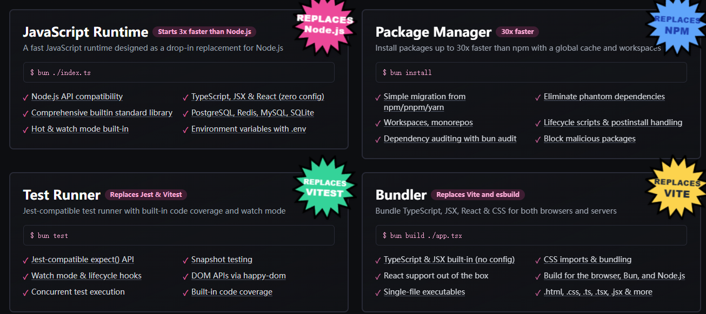
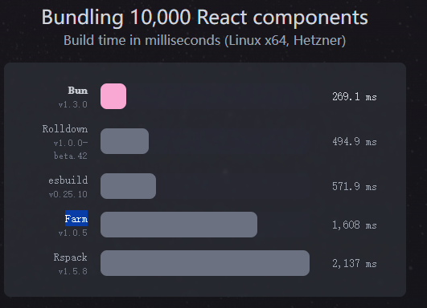
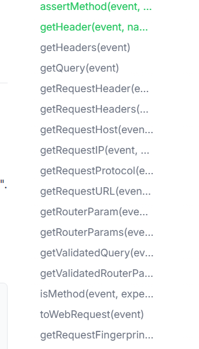
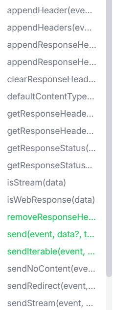
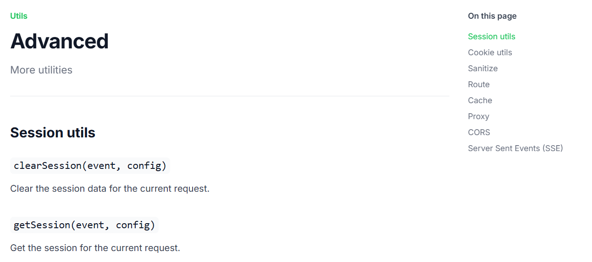
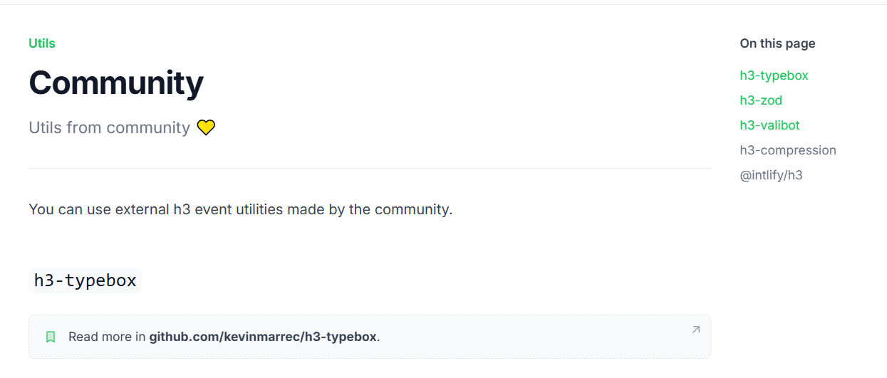
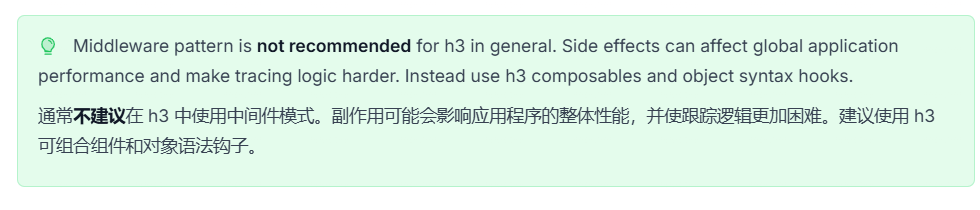

---
# You can also start simply with 'default'
theme: mokkapps
# random image from a curated Unsplash collection by Anthony
# like them? see https://unsplash.com/collections/94734566/slidev
# background: https://cover.sli.dev
# some information about your slides (markdown enabled)
title: H3
# https://sli.dev/features/drawing
drawings:
  persist: false
# slide transition: https://sli.dev/guide/animations.html#slide-transitions
transition: slide-left
# enable MDC Syntax: https://sli.dev/features/mdc
mdc: true
selectable: true
---

# H3

## <span v-mark.highlight.yellow="1">JavaScript运行时</span>的，<span v-mark.highlight.yellow="1">高性能</span>的，<span v-mark.highlight.yellow="1">可移植</span>的<span v-mark.highlight.yellow="1">Http框架</span>

---

# 为什么叫H3？

<div class=" h-[70%] flex flex-col items-center justify-center gap-4">

- 是一个专注于处理HTTP的框架。
- HTTP的简写, <span v-mark.highlight.yellow="1">H(TTP) + 3个字母是3</span>。

</div>

---

# JavaScript运行时

<div class=" h-[70%] flex flex-col items-center justify-center gap-4">

JavaScript运行时是一个Js语言运行的宿主环境，提供了JavaScript代码执行所需的API和功能。

</div>

---

# 有哪些JavaScript运行时？

<div class="  h-[70%] flex flex-col items-center justify-center gap-4">

- Node
- Deno
- Bun

</div>

---

# Node是什么？

<div class=" h-[70%] flex flex-col items-center justify-center gap-4">

Node.js是一个基于Chrome V8引擎构建的JavaScript运行时，提供了丰富的API和模块，使得JavaScript可以在服务器端运行。

</div>

---

# Node架构图


---

# Deno是什么？

<div class=" h-[70%] flex flex-col items-center justify-center gap-4">
Deno是一个由Node.js的原作者Ryan Dahl开发的新的JavaScript和TypeScript运行时，旨在提供更安全、更现代化的开发体验。
</div>

---

# 为啥要有Deno？


---

# Bun是什么？

<div class=" h-[70%] flex flex-col items-center justify-center gap-4">
使用zig开发的一个新的JavaScript运行时，专注于性能和开发者体验（一体化开发套件）。
</div>

---

# 一体化开发套件



---

# 有趣的事情



---

# 高性能

<div class=" h-[70%] flex flex-col items-center justify-center gap-4 pt-6.25">

- 超级轻量，且还支持Tree shaking。
  - 程序加载快速，内存占用小，冷启动快（无服务器 和 边缘计算）
- 超级快速的路由器，集成 <span v-mark.highlight.yellow="1">rou3</span>，基于<span v-mark.highlight.yellow="1">radix tree（多叉搜索树）</span>。
  - 路由基于路径字符串与函数映射，无复杂正则 / 递归匹配，O (1) 或 O (n) 极快查找
- 基于 Web 标准（WHATWG）
  - 直接使用标准 <span v-mark.highlight.yellow="1">Request/Response/Headers</span>，不做自定义 req/res 封装，减少一层抽象与拷贝
- 流式优先
  - 内置 <span v-mark.highlight.yellow="1">ReadableStream/WritableStream</span> 支持，处理大文件/长连接时内存占用更低，内存占用稳定，响应更快
</div>

---

# 可移植

<div class=" h-[70%] flex flex-col items-center justify-center gap-4">

- 基于 <span v-mark.highlight.yellow="1">Web 标准（WHATWG）</span>
  - 标准的 API 设计，天然兼容不同 JavaScript 运行时
- 通过抽象层适配不同运行时的API差异，保持核心代码一致，开发者无需关心底层细节
  - <span v-mark.highlight.yellow="1">web</span> 适配器
  - <span v-mark.highlight.yellow="1">node</span> 适配器
  - <span v-mark.highlight.yellow="1">plain</span> 适配器

</div>

---
layout: two-cols
---

#  H3 程序

```js
// 创建一个 H3 http处理程序

import { createApp, defineEventHandler } from "h3";

export const app = createApp();

app.use(defineEventHandler(() => "Hello world!"));

```

::right::

#  node 适配器

```js
import { createServer } from "node:http";
import { toNodeListener } from "h3";
import { app } from "./app.mjs";

createServer(toNodeListener(app)).listen(process.env.PORT || 3000);

```

---
layout: two-cols
---

#  H3 程序

```js
// 创建一个 H3 http处理程序

import { createApp, defineEventHandler } from "h3";

export const app = createApp();

app.use(defineEventHandler(() => "Hello world!"));

```

::right::

#  web 适配器

```js
import { toWebHandler } from "h3";
import { app } from "./app.mjs";

Deno.serve(toWebHandler(app));

```

---
layout: two-cols
---

#  H3 程序

```js
// 创建一个 H3 http处理程序

import { createApp, defineEventHandler } from "h3";

export const app = createApp();

app.use(defineEventHandler(() => "Hello world!"));

```

::right::

#  plain 适配器

```js
import { toPlainHandler } from "h3";
import { app } from "./app.mjs";

const handler = toPlainHandler(app);

const response = await handler({
  method: "GET",
  path: "/",
  headers: {
    "x-test": "test",
  },
  body: undefined,
  context: {},
});

```

---

# 适配器小结

<div class=" h-[70%] flex flex-col items-center justify-center gap-4">

- h3的app实例是轻量级的，没有任何关于运行时间的逻辑。
- 使用h3适配器，我们可以轻松地将http处理程序与每个运行时集成在一起。
- 服务器的创建由运行时负责创建。

</div>

---

# 组合开发（组合优于继承）

<div class=" h-[70%] flex flex-col items-center justify-center gap-4">

以<span v-mark.highlight.yellow="1">“函数为基本单元”</span>，通过轻量、灵活的组合方式拼装出完整的 HTTP 处理逻辑，把通用逻辑拆成独立的 “小函数”，再按需组合到业务中，既保证代码复用性，又让逻辑清晰可控。

</div>

---

# 组合的优势

<div class=" h-[70%] flex flex-col items-center justify-center gap-4">

- 极致灵活：想给哪个接口加逻辑，就组合哪个接口，不会 “牵一发而动全身”；
- 高度复用：通用逻辑（鉴权、日志、校验）拆成函数后，可在任意接口 / 模块中复用；
- 逻辑清晰：业务逻辑 = 基础处理 + 组合函数，一眼能看出接口依赖哪些逻辑；
- 轻量无冗余：仅加载当前接口需要的逻辑，无全局中间件的性能损耗；

</div>

---
layout: two-cols
---

# 有哪些组合函数？

<div class=" h-[70%] flex flex-col items-center justify-center gap-4">

```js
- Request: 处理请求的工具函数
  - getQuery(event): 获取查询参数对象
  - getRequestHeader(event, name): 获取请求头
  - getRequestHost(event, opts: { xForwardedHost? }): 获取请求主机
  - getRequestIP(event, opts: { xForwardedFor? }): 获取请求IP
  - getRequestProtocol(event, opts: { xForwardedProto? }): 获取请求协议
  - getRouterParam(event, name, opts: { decode? }): 获取路由参数
```

</div>

::right::



---
layout: two-cols
---

# 有哪些组合函数？

<div class=" h-[70%] flex flex-col items-center justify-center gap-4">

```js
- Response: 发送请求的工具函数
  - appendResponseHeader(event, name, value): 添加响应头
  - clearResponseHeaders(event, headerNames?): 清除响应头 
  - defaultContentType(event, type?): 设置默认内容类型
  - isStream(data): 判断是否为流
  - send(event, data?, type?): 发送响应
  - removeResponseHeader(event, name): 移除响应头
```

</div>

::right::





---
layout: two-cols
---

# 有哪些组合函数？

<div class=" h-[70%] flex flex-col items-center justify-center gap-4">

```js
- Request: 处理请求的工具函数
  - getQuery(event): 获取查询参数对象
  - getRequestHeader(event, name): 获取请求头
  - getRequestHost(event, opts: { xForwardedHost? }): 获取请求主机
  - getRequestIP(event, opts: { xForwardedFor? }): 获取请求IP
  - getRequestProtocol(event, opts: { xForwardedProto? }): 获取请求协议
  - getRouterParam(event, name, opts: { decode? }): 获取路由参数
```

</div>

::right::


---

# 有哪些组合函数？


  


---

# 有哪些组合函数？



---

# 兼容第三方中间件

<div class=" h-[70%] flex flex-col items-center justify-center gap-4">

提供与node/connect/express中间件的兼容层。

</div>

---
layout: two-cols
---

# express


```js

var express = require("express");
var morgan = require("morgan");

var app = express();

app.use(morgan("combined"));

app.get("/", function (req, res) {
  res.send("hello, world!");
});

app.listen(3000);
console.log("Express started on port 3000");


```


::right::

#  fromNodeMiddleware 

```js
import morgan from "morgan";
import { defineEventHandler, createApp, fromNodeMiddleware } from "h3";

export const app = createApp();

app.use(fromNodeMiddleware(morgan("combined")));

app.use(
  "/",
  defineEventHandler((event) => {
    return "Hello World";
  }),
);

```

---

# 最小的H3程序


```ts
import { createApp, createRouter, defineEventHandler } from "h3";

// 创建一个 H3 实例
export const app = createApp();

// 创建一个路由器并将其注册到h3实例上
const router = createRouter();
app.use(router);

// 添加一个新的路由，匹配GET请求到/路径
router.get(
  "/",
  defineEventHandler((event) => {
    return { message: "h3" };
  }),
);

```

---

# 运行H3程序1

<div class=" h-[70%] flex flex-col items-center justify-center gap-4">

```
listhen -w --open ./app.ts
```

</div>

---

# 运行H3程序2

<div class=" h-[70%] flex flex-col items-center justify-center gap-4">

```js
import { createServer } from "node:http";
import { toNodeListener } from "h3";
import { app } from "./app.mjs";

createServer(toNodeListener(app)).listen(process.env.PORT || 3000);
```

</div>

---

# Router


<div class=" h-[70%] flex flex-col items-center justify-center gap-4">

通过路由来划分系统，基于radix tree（多叉搜索树）的路由器，提供了极快的路由匹配性能。

</div>

---

# 用法1，普通用法

<div class=" h-[70%] flex flex-col items-center justify-center gap-4">

```js
import {  createRouter } from 'h3'
const router = createRouter();

router.get(
  "/hello",
  defineEventHandler((event) => {
    return "Hello world!";
  }),
);

```

</div>

---

# 用法2，链式定义路由

<div class=" h-[70%] flex flex-col items-center justify-center gap-4">

```js
import {  createRouter } from 'h3'

const router = createRouter()

router
  .get(
    "/hello",
    defineEventHandler((event) => {
      return "GET Hello world!";
    }),
  )
  .post(
    "/hello",
    defineEventHandler((event) => {
      return "POST Hello world!";
    }),
  );

```

</div>

---

# 用法3，路由参数

<div class=" h-[70%] flex flex-col items-center justify-center gap-4">

```js
import {  createRouter } from 'h3'

const router = createRouter()

router.get(
  "/hello/:name",
  defineEventHandler((event) => {
    return `Hello ${event.context.params.name}!`;
  }),
);
```

</div>

---

# 用法4，通配符

<div class=" h-[70%] flex flex-col items-center justify-center gap-4">

```js
import {  createRouter } from 'h3'

const router = createRouter()

router.get(
  "/hello/*",
  defineEventHandler((event) => {
    return `Hello ${event.context.params._}!`;
  }),
);
```

</div>

---

# 用法5，通配符多级路由

<div class=" h-[70%] flex flex-col items-center justify-center gap-4">

```js
import {  createRouter } from 'h3'

const router = createRouter()

router.get(
  "/hello/**",
  defineEventHandler((event) => {
    return `Hello ${event.context.params._}!`;
  }),
);

```

</div>

---

# 组合式开发（组合优于继承）

<div class=" h-[70%] flex flex-col items-center justify-center gap-4">
以“函数为基本单元”，通过轻量、灵活的组合方式拼装出完整的 HTTP 处理逻辑，把通用逻辑拆成独立的 “小函数”，再按需组合到业务中，既保证代码复用性，又让逻辑清晰可控。
</div>

---

# 官方提示



---

# 案例1-Request

<div class=" h-[70%] flex  items-end justify-center gap-4">

```js
import { createApp, createRouter, defineEventHandler, getQuery, getRequestHeader } from "h3";

const router = createRouter().get(
  "/user-agent",
  defineEventHandler((event) => {
 
    // 获取查询参数对象
    const query = getQuery(event);
    // 获取请求头中的 user-agent
    const userAgent = getRequestHeader(event, "user-agent");

    return {
      userAgent,
      query,
    };
  }),
);
```

</div>

---

# 案例1-Response

<div class=" h-[70%] flex  items-end justify-center gap-4">

```js
import { createApp, createRouter, defineEventHandler,  setResponseHeader, getResponseHeaders } from "h3";

const router = createRouter().get(
  "/user-agent",
  defineEventHandler((event) => {

    // 设置响应头content-type
    setResponseHeader(event, "content-type", "text/plain");
    // 设置自定义响应头x-server
    setResponseHeader(event, "x-server", "nitro");

    // 获取所有响应头
    const responseHeaders = getResponseHeaders(event);

    return {
      responseHeaders,
    };
  }),
);
```

</div>

---

# 适配器

<div class=" h-[70%] flex flex-col items-center justify-center gap-4">
通过抽象层适配不同运行时的API差异，保持核心代码一致，开发者无需关心底层细节。
</div>

---

# 案例1-Node适配器

<div class=" h-[70%] flex  items-end justify-center gap-4">

```js
import { createApp, defineEventHandler, toNodeListener} from "h3";
import { createServer } from "node:http";

const app = createApp();

app.use(defineEventHandler(() => "Hello world!"));

createServer(toNodeListener(app)).listen(process.env.PORT || 3000);

```

</div>

---

# 案例1-Deno适配器

<div class=" h-[60%] flex  items-end justify-center gap-4">

```js
import { createApp, defineEventHandler, toWebHandler } from "h3";

const app = createApp();

app.use(defineEventHandler(() => "Hello world!"));

Deno.serve(toWebHandler(app));

```

</div>


---
layout: center
---

[Presentation Slides for Developers](https://sli.dev)