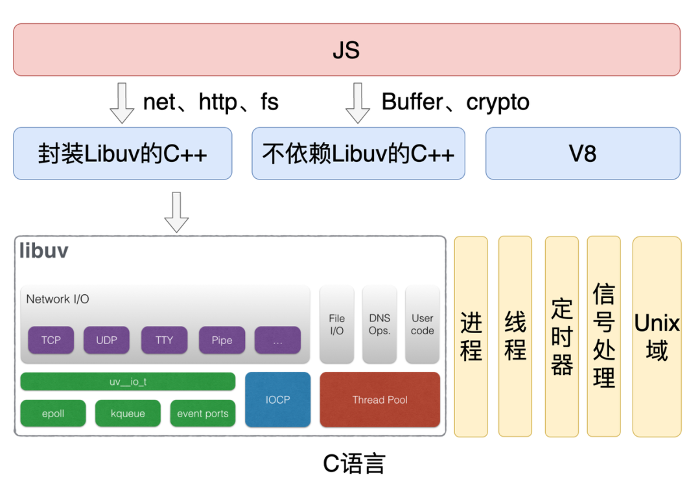

---
# You can also start simply with 'default'
theme: mokkapps
# random image from a curated Unsplash collection by Anthony
# like them? see https://unsplash.com/collections/94734566/slidev
# background: https://cover.sli.dev
# some information about your slides (markdown enabled)
title: H3
# https://sli.dev/features/drawing
drawings:
  persist: false
# slide transition: https://sli.dev/guide/animations.html#slide-transitions
transition: slide-left
# enable MDC Syntax: https://sli.dev/features/mdc
mdc: true
---

# H3(Http)

## 运行于JavaScript运行时上的，高性能的，可移植的Http框架

---

# JavaScript运行时

概念：JavaScript运行时是一个Js语言运行的宿主环境，提供了JavaScript代码执行所需的API和功能。

---

# Node.js 架构图

---
layout: center
---

[Presentation Slides for Developers](https://sli.dev)