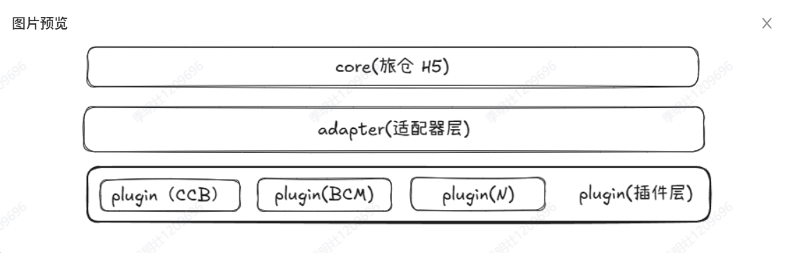
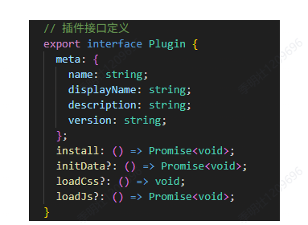
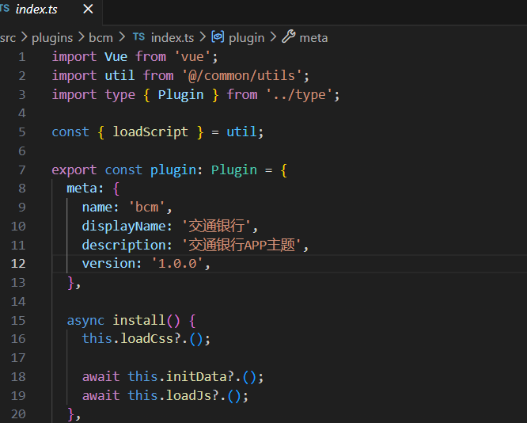
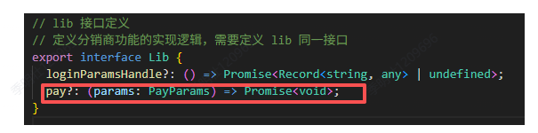
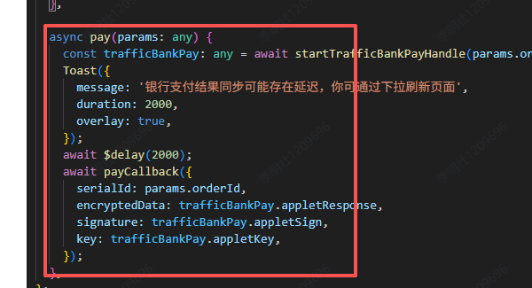
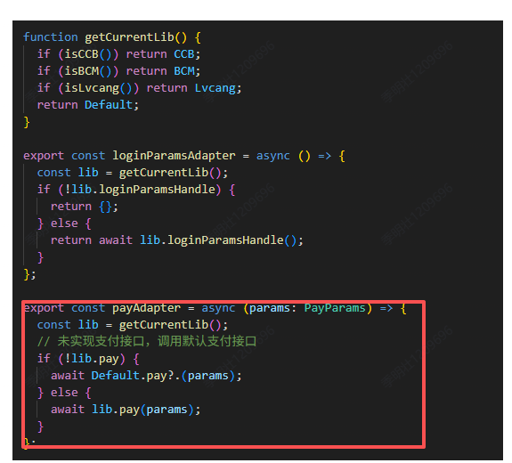
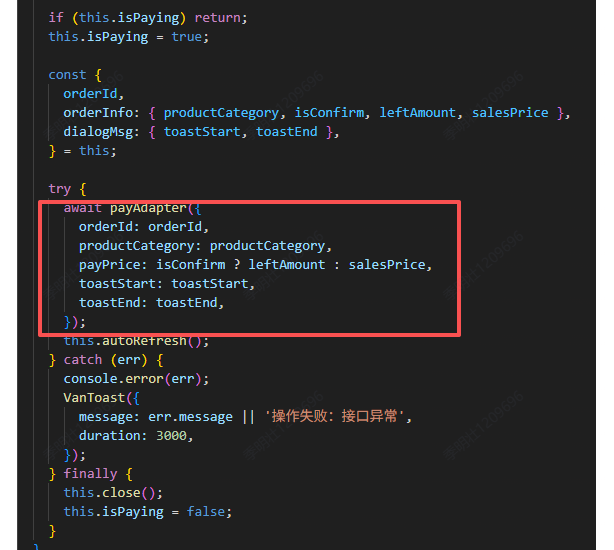

# H5分销系统的多渠道适配

---

# 需求背景

<div class="h-[70%] flex flex-col items-center justify-center gap-4 text-[20px]">
<div>
1. <span v-mark.highlight.red="1">旅仓H5分销系统，首先要是一个H5分销系统，旅仓是我们的分销商。</span> 为了扩大业务规模，我们就需要支持更多的分销商接入分销系统，一般来说，分销商通过嵌入我们的h5分销系统以及指定的接口参数，就可以接入我们的分销系统中来。
</div>
<div>
2. 但是也难免会有一些分销商，<span v-mark.highlight.red="1">他们希望能够定制自己的分销系统</span>，例如页面主题配色，能力（登录，支付等），这样的话我们就需要支持分销商定制化开发。
</div>

</div>

---

# 出现问题

<div class=" h-[70%] flex flex-col items-center justify-center gap-4 text-[20px]">

目前的开发方案都是在<span v-mark.highlight.red="1">核心分销项目</span>中直接根据环境判断进行开发处理，所以有以下问题：

- <span v-mark.highlight.red="1">可维护性差</span>：各个平台判断以及处理逻辑都散落在各个页面中，维护困难，容易遗漏。
- <span v-mark.highlight.red="1">可读性差</span>：各种平台逻辑混杂在一起，导致代码可读性差，难以理解和维护。
- <span v-mark.highlight.red="1">扩展性差</span>：当需要添加新的分销商平台时，需要修改大量的代码，容易引入新的bug。
   
</div>

---

## 改造方案

<div class=" indent-10 h-full flex flex-col items-center justify-center gap-4 text-[20px] leading-[50px]">

为了解决上述问题，我们决定采用<span v-mark.highlight.red="1">插件化架构的方案</span>来改造旅仓H5分销系统。将渠道功能模块化、独立化的设计方法，可以提高系统的可维护性、可扩展性，同时也是制定了基本的开发标准。

可读性和维护性：我们可以将<span v-mark.highlight.red="1">不同分销商的逻辑进行收敛与隔离</span>，避免了代码混杂的问题，提高了代码的可读性和维护性。

扩展性：当需要添加新的分销商平台时，<span v-mark.highlight.red="1">只需要开发一个新的插件</span>，而不需要修改核心旅仓项目的代码，从而提高了系统的扩展性。

</div>

---

## 架构图



<div class="  flex flex-col items-center justify-center gap-4 text-[20px] ">

-  <span v-mark.highlight.red="1">核心层</span>：用于实现分销商无关的H5分销系统核心的业务逻辑流程。
-  <span v-mark.highlight.red="1">适配层</span>：用于根据分销系统的运行环境来适配核心层中各个分销商下的不同行为逻辑，UI组件，向上抹平行为差异。
-  <span v-mark.highlight.red="1">插件层</span>：用于实现每个分销商的具体行为逻辑，UI组件，页面，指令，资源加载（数据，样式，脚本）。

</div>

---

## 适配器层


---

## 插件层


---

## 运行流程


---

## 目录结构-适配器层

<div class="h-full flex flex-col items-center justify-center gap-4 text-[20px]">

```text 
│  ├─ adapter                   适配器
│  │  ├─ business              业务逻辑适配
│  │  │  └─ index.ts          
│  │  ├─ components            UI组价适配
│  │  │  └─ navbarAdapter     导航条适配组件
│  │  │     └─ index.vue
│  │  └─ index.ts              插件资源初始化适配
```

</div>

---
comark: true
---

## 目录结构-插件层

<div class="h-full flex flex-col items-center justify-center gap-4 text-[20px]">

```text 
│  ├─ plugins                        各个分销商插件
│  │  ├─ bcm                        交行插件
│  │  │  ├─ components             交行组件
│  │  │  │  └─ navbar             交行导航条
│  │  │  │     └─ index.vue
│  │  │  ├─ directives             交行指令
│  │  │  │  └─ index.ts
│  │  │  ├─ index.ts               交行插件定义与初始化
│  │  │  ├─ lib                    交行业务逻辑
│  │  │  │  ├─ index.ts
│  │  │  │  └─ trafficBankBridge.ts  交行js sdk 功能封装库
│  │  │  ├─ pages                     交行特有页面
│  │  │  │  └─ auth                  交行权限验证页面
│  │  │  │     ├─ App.vue
│  │  │  │     ├─ index.html
│  │  │  │     └─ main.ts
│  │  │  └─ styles                    交行页面主题样式
│  │  │     └─ theme.less
│  │  └─ type.ts                        插件接口与lib业务功能的接口定义
```

</div>

---

## 开发流程 1

<div class="h-full flex flex-col items-center justify-center gap-4 text-[20px]">

 <div>
  实现分销商插件接口
 </div>

 <div class="flex items-center justify-center gap-4 text-[20px]">





 </div>

</div>

---

## 开发流程 2

<div class="h-full flex flex-col items-center justify-center gap-4 text-[20px]">

 <div>

 定义我们需要在 `lib` 中开发的分销商能力，例如支付能力
 
 </div>

 <div class="flex items-center justify-center gap-4 text-[20px]">



 </div>

</div>

---

## 开发流程 3

<div class="h-full flex flex-col items-center justify-center gap-4 text-[20px]">

 <div>

 在`lib` 下实现具体的支付逻辑
 
 </div>

 <div class="flex items-center justify-center gap-4 text-[20px]">



 </div>

</div>

---

## 开发流程 4

<div class="h-full flex flex-col items-center justify-center gap-4 text-[20px]">

 <div>

为对应的功能开发适配器，对核心层提供统一的外部接口
 
 </div>

 <div class="flex items-center justify-center gap-4 text-[20px]">


 </div>

</div>

---

## 开发流程 5

<div class="h-full flex flex-col items-center justify-center gap-4 text-[20px]">

 <div>

在核心层调用适配器提供的接口
 
 </div>

 <div class="flex items-center justify-center gap-4 text-[20px]">



 </div>

</div>


---
layout: center
---

[Presentation Slides for Developers](https://sli.dev)