---
# try also 'default' to start simple
theme: seriph
# random image from a curated Unsplash collection by Anthony
# like them? see https://unsplash.com/collections/94734566/slidev
# some information about your slides (markdown enabled)
title: Nuxt C端脚手架结项
info: |
  ## Slidev Starter Template
  Presentation slides for developers.

  Learn more at [Sli.dev](https://sli.dev)
# apply UnoCSS classes to the current slide
class: text-center
# https://sli.dev/features/drawing
drawings:
  persist: false
# slide transition: https://sli.dev/guide/animations.html#slide-transitions
transition: slide-left
# enable MDC Syntax: https://sli.dev/features/mdc
mdc: true
# duration of the presentation
duration: 35min
---

# Nuxt C端脚手专项架结项

---
layout: center
---

# 背景

基于对C端应用的页面渲染性能以及交互体验的提升需求，以及在技术社区流行全栈开发的趋势下，前端开发从传统的单页应用（SPA）向更高性能的解决方案转变。Nuxt作为Vue.js的服务端渲染框架，提供了多种渲染模式，包括静态生成（SSG）和服务器端渲染（SSR），为C端应用提供了灵活的选择。

1. 首页白屏时间过长，影响用户体验。
2. 页面渲染无法一气呵成（先加载js渲染页面，在通过js加载接口数据）。
3. 页面只有一种渲染模式，无法根据不同场景选择合适的渲染方式。
4. SEO优化不足，影响搜索引擎排名和流量。

---
layout: center
---

# 目标

开发一个基于Nuxt框架的C端应用脚手架，集成了多种常用功能和公司内部工具集成，旨在帮助开发者快速启动和构建现代C端Web应用工程。


---

# 特性

## 前端

<div class="flex justify-between ">
<div>

1. 兼容性处理，支持旧版浏览器。   
2. 支持移动端自适应开发。                       
3. 集成Tailwind CSS 原子化css开发框架。
4. 集成Vant UI组件库。
5. 集成Pinia状态管理库。
6. 集成VConsole移动端调试工具。
7. 集成modern-normalize，确保样式一致性。
8. 集成Sentry进行错误监控和性能追踪（仅前端）。
9. 定义路由守卫机制，处理权限验证和页面访问控制。
10. 错误页面设计，提供友好的用户体验，可定制。
11. 集成公司轨迹数据收集脚本。
12. 封装公司图片验证码组件。
13. 封装统一业务处理的请求库。

</div>

<div>

14. 封装图片工具库、数学工具库和正则工具库。


</div>
</div>

---

# 特性

## 后端

<div class="flex justify-between ">
<div>

1. 代理服务端接口，解决跨域问题。     
2. 集成趋势库。
3. 集成日志库。
4. 集成Apm库。                  
5. 封装统一业务处理的接口请求库。

</div>

<div>

 

</div>
</div>

---

# 特性

## AI Coding

<div class="flex justify-between ">
<div>

1. 接入Nuxt MCP
2. 接入Nuxt Agent skills 
3. 新增脚手架 Agent skills

</div>

<div>

 

</div>
</div>

---

# 特性

## 工程处理

1. eslint。
2. prettier。
3. 环境变量管理。

---
layout: center
---

# 前端

---

# 兼容性处理

通过 @vitejs/plugin-legacy vite插件，自动为不支持ESM的浏览器生成兼容代码，提升应用的兼容性和用户覆盖面。通过browserslist，配置支持的浏览器版本，确保生成的代码能够在目标环境中正常运行。

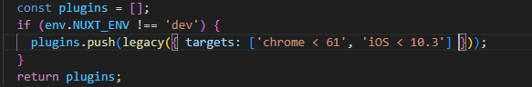


---

# 支持移动端自适应开发

通过在工具链中集成pxtorem插件，页面元标签配置viewport, 配合监听屏幕大小改变根标签字体大小脚本，实现移动端自适应布局。

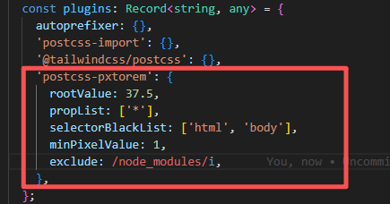


---

# 集成Tailwind CSS 原子化css开发框架

通过postcss插件集成Tailwind CSS，提供丰富的原子化CSS类，简化样式开发，提高开发效率。

---

# 集成Vant UI组件库

提供丰富的UI组件，提升开发效率和用户体验。

1. @vant/nuxt
2. vant

---

# 集成Pinia状态管理库

1. 官方推荐
2. 过往项目有使用经验

---

# 集成VConsole移动端调试工具

<div class="flex justify-center items-center h-40 ">

通过在开发环境中集成VConsole，提供移动端调试工具，方便开发者在移动设备上调试和测试应用。**开箱即用，无需配置，且只会在qa,stage引入。**

</div>

---

# 集成modern-normalize

通过集成modern-normalize，提供一套现代化的CSS reset样式，确保不同浏览器之间的样式一致性，提升用户体验。

浏览器之间的默认样式差异以及浏览器的默认样式本身带来的问题。


---

# 集成Sentry（仅前端）

接入Sentry SDK，提供错误监控和性能追踪功能，帮助开发者及时发现和解决应用中的问题，提升应用的稳定性和性能。


---

# 路由守卫

Nuxt中的路由守卫表现方式是为前端的中间件，提供全局中间件和页面级中间件两种方式，满足不同场景的权限验证和页面访问控制需求。

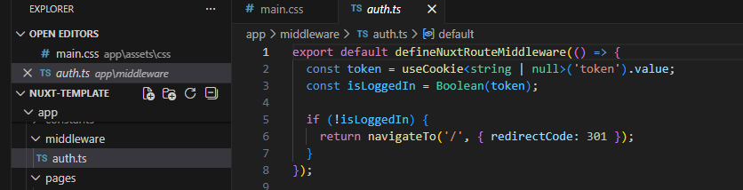


---

# 错误页面设计

通过设计和实现友好的错误页面，提升用户体验。当用户访问不存在的页面或发生错误时，提供清晰的错误信息和导航选项，帮助用户找到正确的路径。


<div class="flex justify-between">
<div>

1. 页面渲染失败
2. 页面加载失败
3. 页面未找到

</div>
<div>

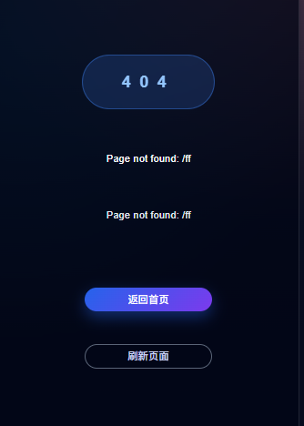
</div>
</div>

---

# 集成公司轨迹数据收集脚本

1. 埋点脚本初始化

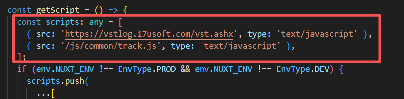

2. 封装页面埋点工具函数

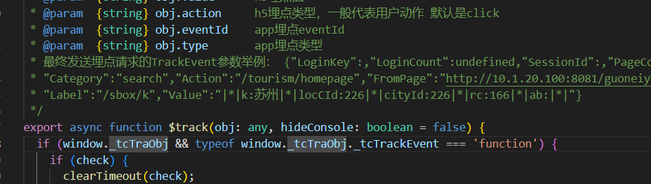

---

# 封装图片验证码组件

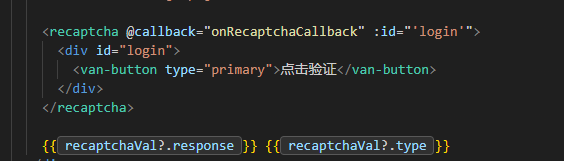

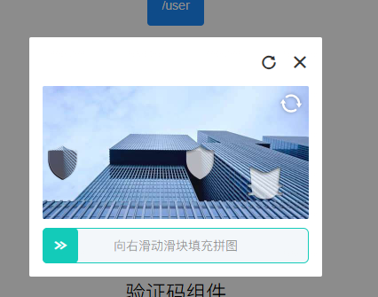

---

# 封装统一业务处理的请求库

通过封装统一的请求库，提供一致的接口请求方式，简化开发者的使用和维护。集成错误处理、请求拦截、响应拦截等功能，提高应用的健壮性和可维护性。

### 代理服务端接口，解决跨域问题。

```ts
 proxyGet<T = any>(url: string, options?: RequestOptions): Promise<T>
 proxyPost<T = any>(url: string, options?: RequestOptions): Promise<T>
```

<br />

### 自定义请求方法，满足不同业务需求。(后端处理了跨域，自己开发接口)

```ts
 getRequest<T = any>(url: string, params?: Record<string, any>, options?: RequestOptions): Promise<T>
 postRequest<T = any>(url: string, data?: Record<string, any>, options?: RequestOptions): Promise<T>
```

---

# 封装图片工具库、数学工具库和正则工具库

1. 图片展示尺寸调整
2. 小数精度处理
3. 常用正则

---

# 环境变量管理

1. 通过环境变量管理，支持不同环境的配置，提升应用的灵活性和可维护性。

2. 通过在项目中定义不同环境的配置文件, .env.dev, .env.qa, .env.stage, .env.prod。

3. Nuxt应用中我们通过在nuxt.config.ts中定义runtimeConfig来管理环境变量，区分公共环境变量和私有环境变量。

<div class="flex justify-between">
<div>

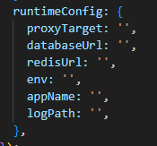

</div>
<div>

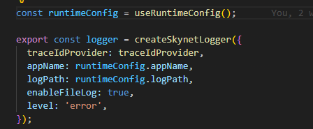

</div>
</div>


---
layout: center
---

# 后端

---

# 代理服务端接口，解决跨域问题

前端请求其他服务器接口时会遇到跨域问题，我们需要提供一个代理接口来转发请求，解决跨域问题。

1. 这个接口时一个nuxt server api, api/proxy/[...path]
2. 在环境变量中配置NUXT_PROXY_TARGET字段，你要代理的服务器地址。
3. 前端通过以下请求方法，进行接口请求。

```ts
 proxyGet<T = any>(url: string, options?: RequestOptions): Promise<T>
 proxyPost<T = any>(url: string, options?: RequestOptions): Promise<T>
```

---

# nuxt server http 请求

1. 为了扩展应用场景，我们还提供了自定义请求方法，满足不同业务需求。(后端处理了跨域，自己开发接口)

```ts
 getRequest<T = any>(url: string, params?: Record<string, any>, options?: RequestOptions): Promise<T>
 postRequest<T = any>(url: string, data?: Record<string, any>, options?: RequestOptions): Promise<T>
```

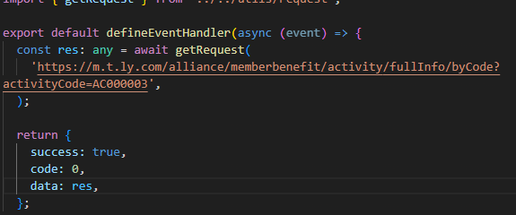

---

# 后端集成

1. 集成趋势库。
2. 集成日志库。
3. 集成Apm库。


---
layout: center
---

# AI Coding


---
layout: center
---

# 接入Nuxt MCP


增强Coding agent搜索nuxt文档解决问题的能力

---
layout: center
---

# 接入Nuxt Agent skills

指导Nuxt开发的规范问题

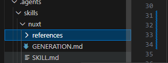

---
layout: center
---

# 新增脚手架 Agent skills

提供脚手架使用和开发的指导

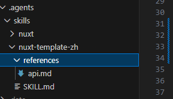


---
layout: center
---

# 工程处理

---
layout: center
---

1. eslint: 代码规范检查工具，帮助开发者保持代码风格一致，提升代码质量。
2. prettier: 代码格式化工具，自动格式化代码，提升代码可读性和维护性。
3. 环境变量管理: 支持不同环境的配置，提升应用的灵活性


---

## 目录结构

```text {*}{maxHeight:'500px'}
nuxt/
├─ app/                              # 前端应用（Nuxt App）
│  ├─ error.vue                      # 全局错误页
│  ├─ assets/                        # 静态资源（参与构建）
│  │  ├─ css/
│  │  │  └─ main.css
│  │  ├─ img/
│  │  └─ js/
│  ├─ components/
│  │  └─ recaptcha.vue               # 图片验证码组件
│  ├─ composables/                   # 组合式函数（hooks）
│  ├─ constants/                     # 常量定义
│  ├─ middleware/
│  │  └─ auth.ts                     # 前端路由守卫
│  ├─ pages/                         # 页面路由
│  │  ├─ index.vue
│  │  ├─ about.vue
│  │  └─ user.vue
│  ├─ plugins/
│  │  └─ error-handler.ts            # 前端错误处理插件
│  ├─ stores/
│  │  └─ user.ts                     # Pinia store
│  ├─ types/
│  │  └─ global.d.ts                 # 全局类型补充
│  └─ utils/                         # 工具库
│     ├─ image.ts
│     ├─ math.ts
│     ├─ request.ts
│     ├─ storage.ts
│     └─ validator.ts
├─ server/                           # Nitro Server（服务端逻辑）
│  ├─ api/
│  │  └─ proxy/
│  │     └─ [...].ts                 # 代理转发入口（解决跨域/统一网关）
│  └─ middleware/
│     └─ error.ts                    # 服务端错误中间件
├─ public/                           # 纯静态资源（原样输出）
│  ├─ css/
│  │  └─ common/
│  │     └─ modern-normalize.css
│  └─ js/
│     └─ common/
│        ├─ flexible.js              # rem 适配脚本
│        ├─ track.js                 # 轨迹/埋点脚本
│        └─ vconsole.min.js          # 移动端调试
├─ modules/
│  └─ fixViteLegacyPlugin.ts         # 构建层：legacy 兼容处理
├─ .env.dev                          # 多环境配置
├─ .env.qa
├─ .env.stage
├─ .env.prod
├─ eslint.config.ts
├─ nuxt.config.ts
├─ tsconfig.json
├─ sentry.client.config.ts
├─ sentry.server.config.ts
├─ package.json
└─ package-lock.json
```
  
---
layout: center
class: text-center
---


# Learn More

[Documentation](https://sli.dev) · [GitHub](https://github.com/slidevjs/slidev) · [Showcases](https://sli.dev/resources/showcases)

<PoweredBySlidev mt-10 />
