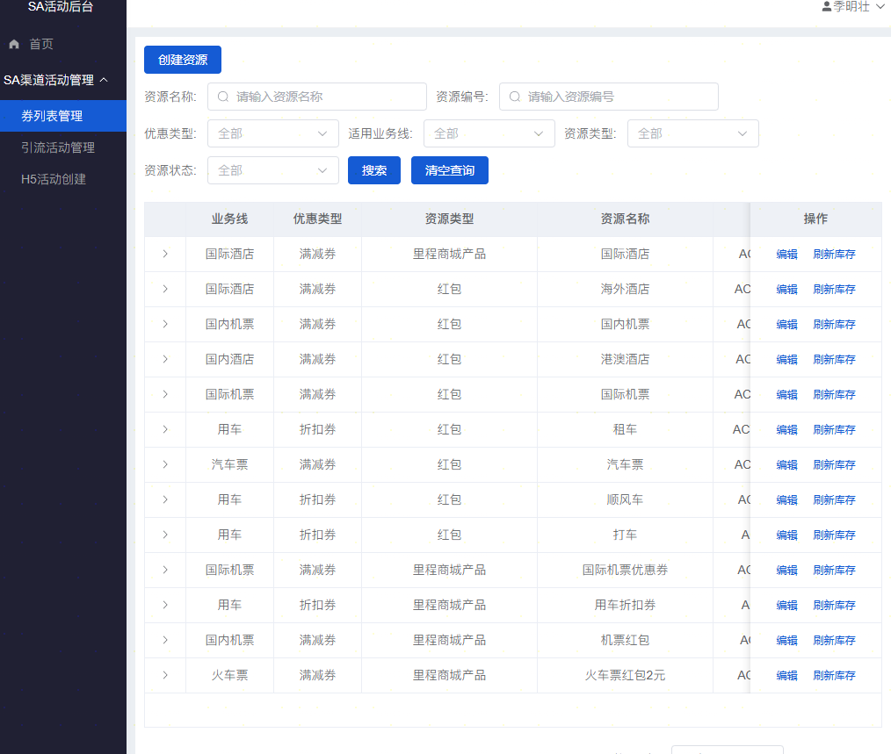
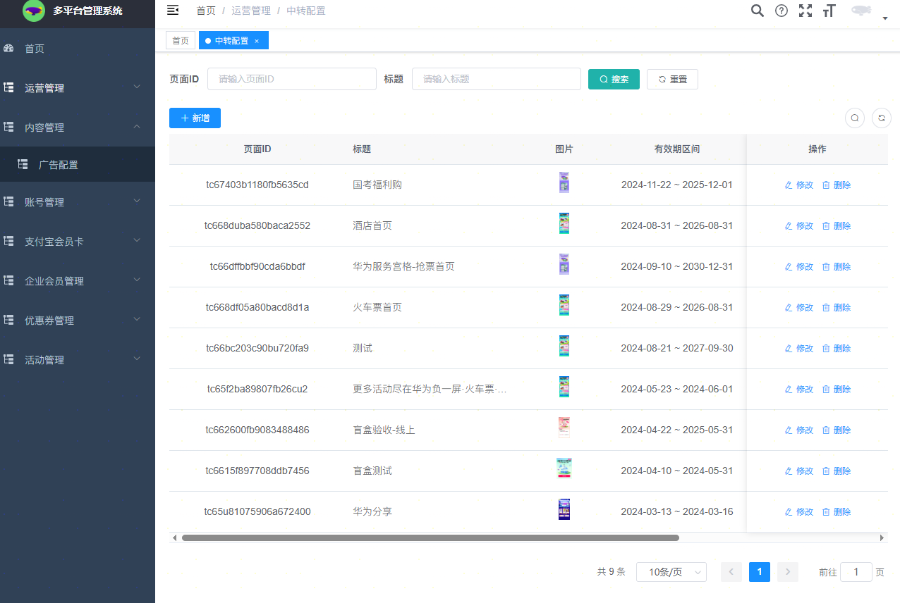
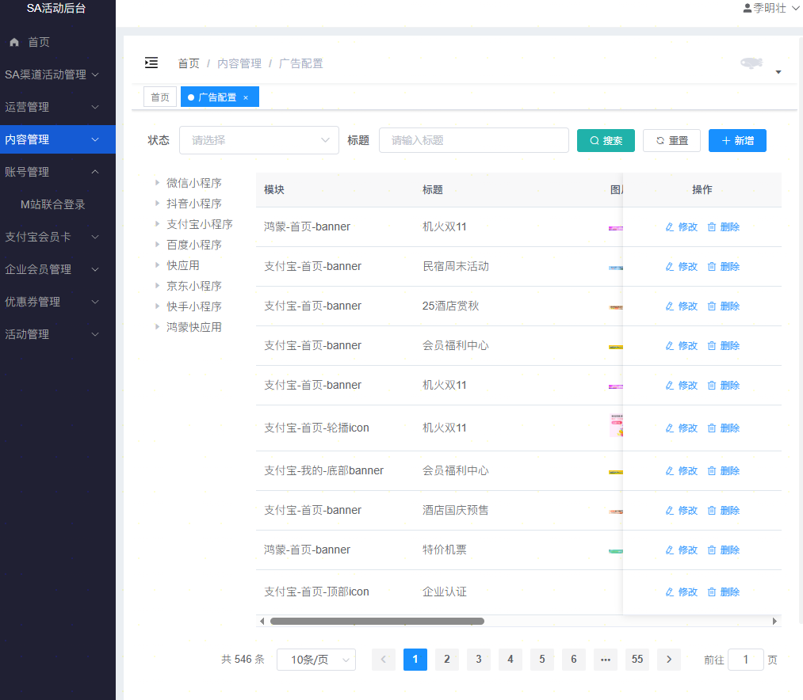
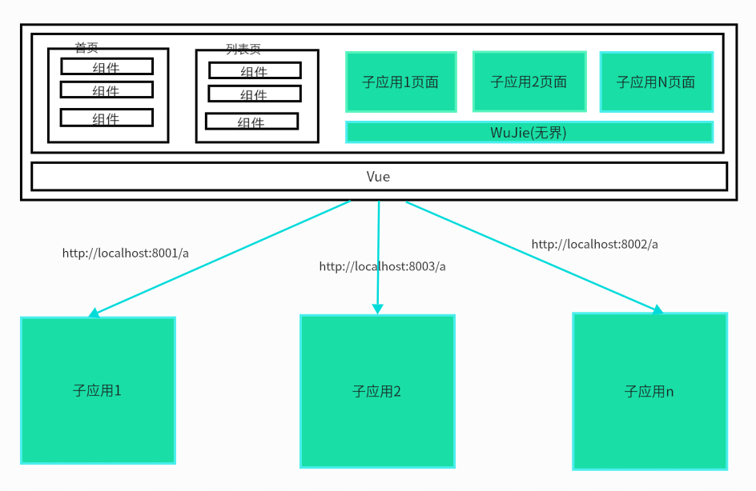
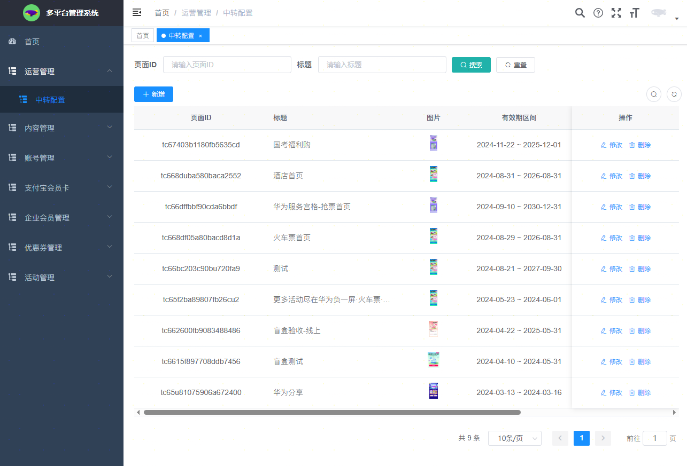
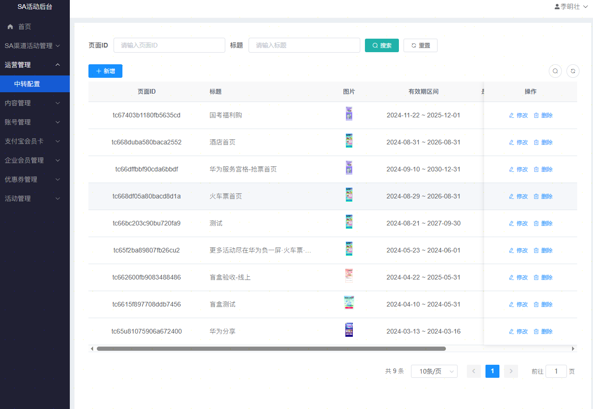
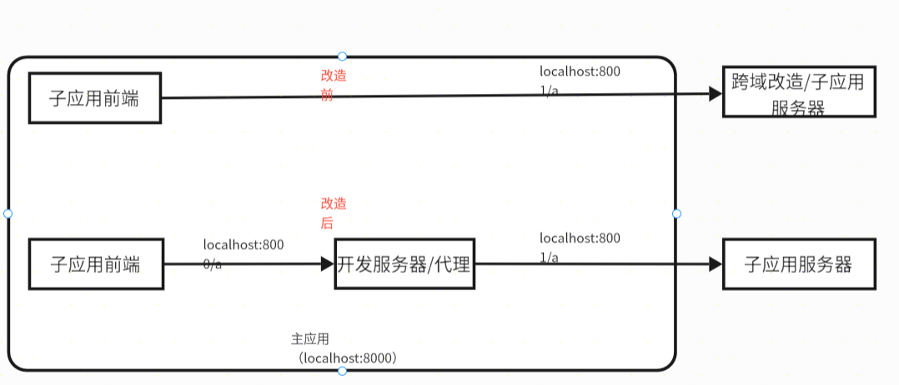
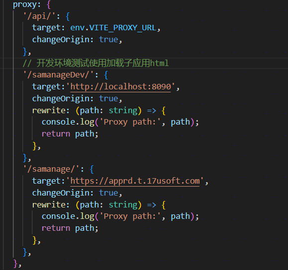
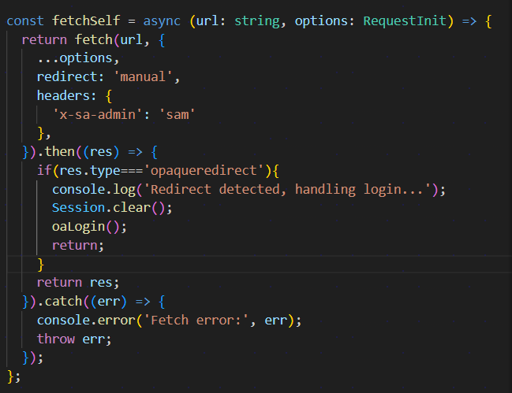

# 微前端架构下的系统融合

<div class="text-right w-100% mt-[50px] mr-[120px]">
 <h2>——季明壮</h2>
</div>

---

  <div class="slidev-layout about-me">
    <div class="flex items-center h-full">
    <figure class="flex justify-center w-1/2 text-[70px]">
       <h1> 目录</h1>
      </figure>
      <div class="flex flex-col gap-4 w-1/2 text-[30px]">
        <ul>
          <li>专项背景</li>
          <li>实现目标</li>
          <li>技术方案</li>
          <li>问题总结</li>
        </ul>
      </div>
    </div>
  </div>

---
layout: section
---

## 专项背景

<br />

<div class="w-[80%]">
  <v-click>
    <div>1. 上段时间移交过来的<span v-mark.highlight.pink="1">SA项目</span> </div>
  </v-click>
  <br />
  <v-click>
  <div>2. <span v-mark.highlight.yellow="1">多平台管理系统</span>属于老项目，技术栈较为陈旧（比如VUE2版本），依赖长久未更新。 不利于项目后续开发维护，<span v-mark.highlight.yellow="1">提高项目可持续性</span>，以及开发人员对技术的更新换代的要求，<span v-mark.highlight.yellow="1">提高大家积极性。</span></div>
  </v-click>
  <br />
  <v-click>
  <div>3. 我们通过新技术栈开发了新的SA活动后台作为补充，在项目<span v-mark.highlight.blue="1">稳定运行的前提下</span>，渐进的迁移老项目。</div>
  </v-click>
  <br />
  <v-click>
  <div>4. <span v-mark.highlight.red="1">sa活动后台</span>和<span v-mark.highlight.red="1">多平台管理系统</span>都是SA管理后台的一部分，面向同一业务部门，理应存在于一个系统中。现在独立存在，导致业务流程复杂。</div>
  </v-click>
  <br/>
</div>

---

## SA活动后台系统

<br />



---

## 多平台管理系统

<br />



---
layout: section
---

# 实现目标

<div class="w-[80%]">
  <v-click>
    <div>1. 将多平台管理系统的功能<span v-mark.highlight.red="1">无缝集成</span>到中sa活动系统，确保业务流程顺畅，提升业务体验，提高工作效率。</div>
  </v-click>
  <br/>

  <v-click>
    <div>2. <span v-mark.highlight.red="1">升级</span>SA多平台管理系统的技术栈。</div>
  </v-click>
  <br/>

  <v-click>
    <div>3. 避免对系统全量重构，确保系统<span v-mark.highlight.red="1">平稳渐进</span>过渡。</div>
  </v-click>
  <br/>

  <v-click>
  <div>4. 统一后台菜单权限与登录信息共享，提升系统的整体<span v-mark.highlight.red="1">一致性</span>。</div>
  </v-click>
  <br/>

  <v-click>
  <div>5. <span v-mark.highlight.red="1">技术无关性</span>，不同系统使用不同的技术栈进行开发和维护，提升技术灵活性。</div>
  </v-click>
</div>

---
layout: outro
---

## 总结

<br />

业务：稳定迭代，流畅操作，可扩展

<br />

技术：技术先进，灵活集成，可扩展


---

## SA管理系统

<br />



---
layout: section
---

# 技术方案

<br />

<div>
  通过<span v-mark.highlight.red="1">WeuJie(无界)</span>微前端框架，以<span v-mark.highlight.red="1">sa活动系统</span>为主应用，<span v-mark.highlight.red="1">多平台管理系统</span>为子应用的技术架构，将两个系统前端页面进行融合到一个系统当中展示与交互。
</div>

---
layout: outro
---

## 微前端介绍

<br />

微前端是一种<span v-mark.highlight.red="1">架构模式</span>，旨在将前端应用<span v-mark.highlight.red="1">拆分为多个独立的子应用</span>，每个子应用可以由不同的团队使用不同的技术栈进行开发和部署。

---

## 微前端基本应用场景

<br />

- <span v-mark.highlight.red="1">大型复杂应用</span>：适用于需要频繁更新和扩展的复杂应用，将不同功能模块拆分为独立子应用，便于团队协作和维护。

<br />

- <span v-mark.highlight.red="1">多技术栈集成</span>：允许不同子应用使用不同的技术栈，满足团队多样化的技术需求。

<br />

- <span v-mark.highlight.red="1">渐进式迁移</span>：适用于需要逐步迁移旧系统的场景，通过微前端架构实现新旧系统的平滑过渡。

---
layout: two-cols
---

## 微前端架构

<br />

<v-click>

- <span v-mark.highlight.red="1">基座应用（主应用）</span>：负责加载和管理子应用，提供统一的用户界面和导航。

</v-click>

<v-click>

- <span v-mark.highlight.red="1">子应用</span>：独立开发和部署的应用，可以是不同的技术栈，通过微前端框架集成到主应用中。

</v-click>

<v-click>

- <span v-mark.highlight.red="1">关键集成机制</span>
    - <span v-mark.highlight.yellow="1">应用注册与加载</span>：主应用通过配置子应用的地址和元数据，实现动态加载。
    - <span v-mark.highlight.yellow="1">通信机制</span>：主子应用之间通过事件总线或共享状态进行通信，确保数据同步和交互。
    - <span v-mark.highlight.yellow="1">隔离机制</span>：避免「污染与冲突」，确保各子应用独立运行。

</v-click>

::right::


---

## SA管理系统技术架构



---
layout: image-right
image: ./image-20.png
---

## 开发工作流方式

核心思路：作为两个独立项目进行开发和维护，会涉及到子应用的<span v-mark.highlight.yellow="1">部分改造与兼容</span>，所有的开发流程<span v-mark.highlight.yellow="1">保持不变。</span>

- 开发环境的搭建 
- 开发工具链的配置 

<br/>

---

## 开发工作事项

<br/>
<v-click>
<div><twemoji-warning />1. 主子应用仍然是独立的代码仓库，仍然可以是独立的站点。</div>
</v-click>
<br/>
<v-click>
<div><twemoji-warning />2. 老系统接口权限兼容。</div>

      2.1 上传文件
      2.2 下载文件
</v-click>
<br/>
<v-click>
<div><twemoji-warning />3. 老系统UI布局兼容。</div>
</v-click>

---

## 子应用(多平台管理系统)
<br/>

* 生产环境与开发环境，都和以前保持基本一致
* 路径跳转，文件下载，上传，UI布局等，需要注意兼容微前端架构主应用

<br/>


---

## 主应用(sa活动系统)
<br/>

* 生产环境与开发环境，会加载对应环境的子应用（多平台管理系统）
* 开发子应用作为项目的一个路由页面，所以不会对其他页面开发造成影响

<br/>


---
layout: section
---

# 问题总结


---

## 开发环境的代理服务处理

开发环境本地<span v-mark.highlight.yellow="1">localhost</span>域名主应用，加载<span v-mark.highlight.yellow="1">预发或者qa环境</span>子应用存在跨域，所以要通过构建工具配置代理服务解决跨域问题。
<br/>


---

## 页面资源被代理服务器拦截
<br/>


---
layout: two-cols
---

## 主应用中运行的子应用的页面访问有权限验证

<br/>

- 页面访问同样有权限验证的问题，而页面加载是在主应用中的微前端框架中实现的，所以需要进行请求改造。

<br/>

- 框架本身也很灵活，有对应的fetch字段来自定义页面的请求方法，这个函数类似与装饰器函数，所以我们可以在页面加载之前，之后都能做些事情，比如性能监控，异常处理，日志等等

::right::



---
layout: two-cols
---

## 子应用下载有权限验证

<br />

- 在测试过程中发现，多平台系统的导出下载功能都是通过http协议的能力实现的，通过配置的Content-Type确定文件类型，Content-Disposition确定下载行为。

<br />

- 前端实现方式为链接跳转，浏览器的http客户端下载，导致在微前端架构下无法将子系统的自定义头字段x-sa-admin:sam带上鉴权用户身份，下载失败。

::right::

```js {4-9}{maxHeight:'500px'}
async function downloadFile(url, filename) {
  try {
    // 1. 发起 fetch 请求（可携带 headers 如认证信息）
    const response = await fetch(url, {
      method: 'GET',
      headers: {
        'x-sa-admin': 'sam', // 如有权限验证
      }
    });

    if (!response.ok) {
      throw new Error(`请求失败：${response.status}`);
    }

    // 2. 将响应转为 Blob 对象（自动识别 MIME 类型）
    const blob = await response.blob();

    // 3. 生成临时 URL
    const objectUrl = URL.createObjectURL(blob);

    // 4. 创建 <a> 标签触发下载
    const a = document.createElement('a');
    a.href = objectUrl;
    a.download = filename || 'download'; // 文件名（可从后端响应头获取）
    document.body.appendChild(a);
    a.click();

    // 5. 清理资源
    document.body.removeChild(a);
    URL.revokeObjectURL(objectUrl); // 释放 Blob URL 占用的内存

  } catch (error) {
    console.error('下载失败：', error);
  }
}
```
---

## 同域名系统下token冲突

<br />

- 因部门内部<span v-mark.highlight.yellow="1">多个系统</span>都是直接挂在同域名https://apprd.t.17usoft.com下的<span v-mark.highlight.yellow="1">二级目录下</span>的，比如crm(crm管理平台),samanage(多平台系统)，saadmin(sa系统)等等，都是<span v-mark.highlight.yellow="1">同域名下的</span>，同时系统都是出自一个前端开发框架。

<br />

- 导致<span v-mark.highlight.yellow="1">cookie，localStroge，sessionStroge</span>等存储冲突。

<br />

- 我们将所有的cookie，localStroge，sessionStroge等等，给其加上系统命名前缀做区分。

<br />

- 为了防止失误，之后会做一个封装库，所有系统都使用这个封装库进行存储操作。这个封装库通过TS类型约束，一个运行时检查，防止误用。

---
layout: outro
---

# 谢谢大家！