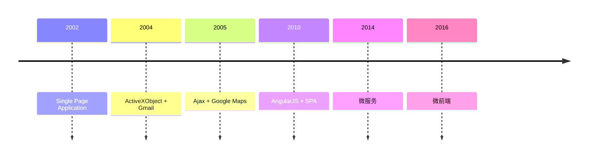

---
# You can also start simply with 'default'
theme: seriph
# random image from a curated Unsplash collection by Anthony
# like them? see https://unsplash.com/collections/94734566/slidev
# background: https://cover.sli.dev
# some information about your slides (markdown enabled)
title: wujie
class: text-center
# https://sli.dev/features/drawing
drawings:
  persist: false
# slide transition: https://sli.dev/guide/animations.html#slide-transitions
transition: slide-left
# enable MDC Syntax: https://sli.dev/features/mdc
mdc: true
background: ./bg.png
---

# wujie(无界)

## 极致的微前端框架

---

# 微前端的发展历程

---
layout: center
---

# 什么是微前端

### 将微服务的思想拓展到前端的一种新兴架构，背后主要思想是将一个单体项目，拆解为多个较小的部分，以便多个相对独立的团队进行分工写作。

---
layout: two-cols
---

# 微前端的三大核心模块

::right::

- 基座应用：作为「容器 + 调度中心」，提供全局路由、公共配置，通过 加载器 管理所有子应用
- 加载器：基座的核心子模块，是「基座与子应用的桥梁」
- 子应用：独立的业务模块

---
layout: center
---

# 微前端的设计原则

1. 技术栈无关：基座不限制微应用的技术栈，微应用可使用 React、Vue 等任意框架，甚至无框架

2. 独立开发 / 部署: 每个微应用是独立的代码库，有自己的 CI/CD 流程，发布不依赖其他微应用；

3. 隔离运行: 微应用的 JS、CSS 不会污染全局环境，运行时状态互不干扰（如全局变量、事件监听、样式冲突）；

4. 用户体验一致: 尽管技术栈不同，微应用间的路由切换、样式风格、交互逻辑需保持统一，让用户感知不到「拆分」

---

# 适合使用微前端的场景

- 大型复杂应用的拆分
- 多团队协作开发
- 技术栈多样化
- 渐进式迁移

---
layout: center
---

# 主流的微前端方案有哪些

- iframe
- single-spa
- qiankun
- wujie

---

# iframe

iframe 是 HTML 中的一个内联框架元素，核心作用是在当前页面中嵌入另一个独立的 HTML 文档（可来自同一域名或跨域名），形成「页面嵌套页面」的效果。嵌入的文档拥有独立的 DOM、BOM、CSS 样式环境和 JavaScript 执行上下文，与父页面完全隔离，互不干扰。

  

    
优点

    
1、非常简单，使用没有任何心智负担

    
2、web应用隔离的非常完美，无论是js、css、dom都完全隔离开来

  

  

    
缺点

    
1、路由状态丢失，刷新一下，iframe的url状态就丢失了

    
2、dom割裂严重，弹窗只能在iframe内部展示，无法覆盖全局

    
3、web应用之间通信非常困难

  

---

# single-spa

single-spa 是 最早（2017 年开源）的微前端核心框架，核心定位是「跨框架应用的加载与生命周期管理器」—— 它不提供样式隔离、全局通信、公共依赖共享等上层能力，而是专注解决「如何在一个页面中加载、切换、卸载不同技术栈的应用（微应用）」这一核心问题

  

    
优点

    
1、定义了微应用的生命周期标准和路由匹配机制

    
2、监听路由自动的加载、卸载当前路由对应的子应用

  

  

    
缺点

    
1、基于路由匹配，无法同时激活多个子应用，也不支持子应用保活

    
2、本身只做「加载与生命周期管理」，样式隔离、通信、资源共享等能力可按需扩展

  

---

# qiankun

它基于 single-spa 封装，补充了 JS/CSS 沙箱隔离、全局通信、公共依赖共享、预加载 等工程化能力，解决了 single-spa 需手动扩展上层能力的痛点，提供「开箱即用」的微前端解决方案

  

    
优点

    
1、监听路由自动的加载、卸载当前路由对应的子应用

    
2、完备的沙箱方案，js沙箱做了SnapshotSandbox、LegacySandbox、ProxySandbox三套渐进增强方案，css沙箱做了两套strictStyleIsolation、experimentalStyleIsolation两套适用不同场景的方案

    
3、路由保持，浏览器刷新、前进、后退，都可以作用到子应用

  

  

    
缺点

    
1、基于路由匹配，无法同时激活多个子应用，也不支持子应用保活

    
2、css 沙箱无法绝对的隔离

    
3、无法支持 vite 等 ESM 脚本运行

  

---

# wujie

核心采用 WebComponent + iframe 的创新架构，主打零侵入接入、原生级隔离与高性能体验，能轻松实现多技术栈子应用的集成，尤其适合旧系统迁移和多团队协作的大型项目

---

# 优点

- 多应用同时激活在线： 框架具备同时激活多应用，并保持这些应用路由同步的能力

- 组件式的使用方式：无需注册，更无需路由适配，在组件内使用，跟随组件装载、卸载

- 应用级别的 keep-alive：子应用开启保活模式后，应用发生切换时整个子应用的状态可以保存下来不丢失，结合预执行模式可以获得类似ssr的打开体验

- 纯净无污染

  - 无界利用iframe和webcomponent来搭建天然的js隔离沙箱和css隔离沙箱
  - 利用iframe的history和主应用的history在同一个top-level browsing context来搭建天然的路由同步机制

- 性能和体积兼具

  - 子应用执行性能和原生一致，子应用实例instance运行在iframe的window上下文中，避免with(proxyWindow){code}这样指定代码执行上下文导致的性能下降，但是多了实例化iframe的一次性的开销，可以通过 preload 提前实例化
  - 体积比较轻量，借助iframe和webcomponent来实现沙箱，有效的减小了代码量

---
layout: center
---

# wujie的运行机制

- js 沙箱：iframe
- css 沙箱：web component

---
layout: center
---

# js 沙箱

### iframe：是 HTML 中的一个内联框架元素，核心作用是在当前页面中嵌入另一个独立的 HTML 文档（可来自同一域名或跨域名），形成「页面嵌套页面」的效果。嵌入的文档拥有独立的 DOM、BOM、CSS 样式环境和 JavaScript 执行上下文，与父页面完全隔离，互不干扰。

  

    一个HTML标签
  

  

    一个DOM NODE 
  

---
layout: center
---

# 基于wujie的系统架构

  

  

---
layout: center
---

[Presentation Slides for Developers](https://sli.dev)