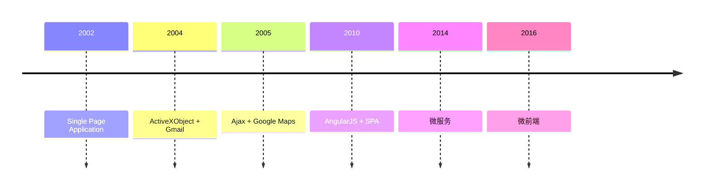
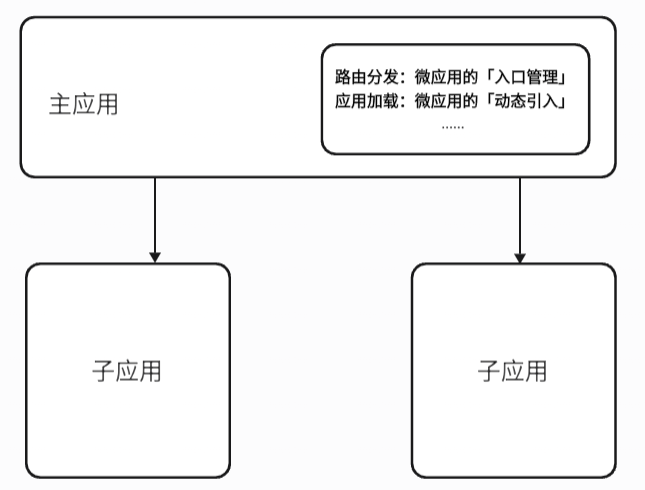
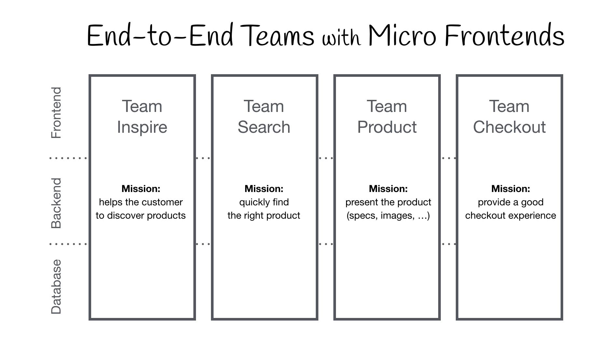
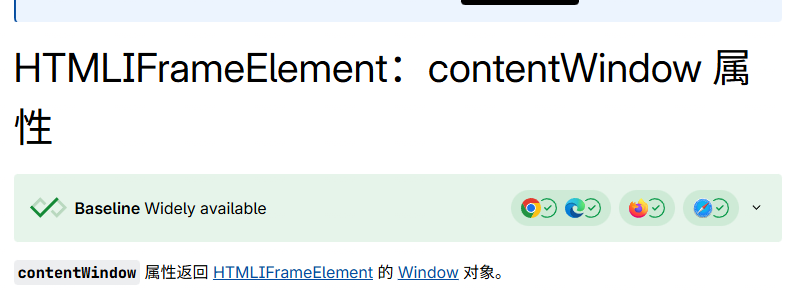
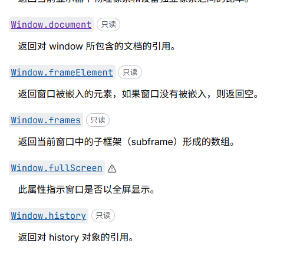
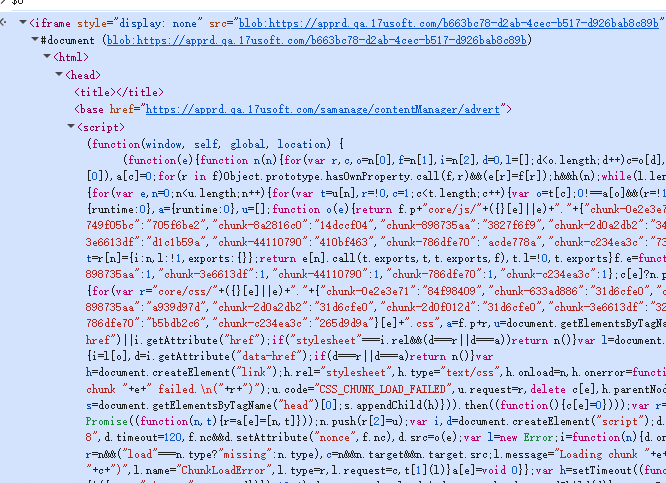
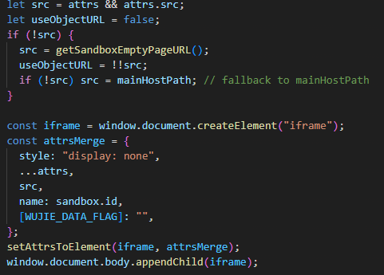
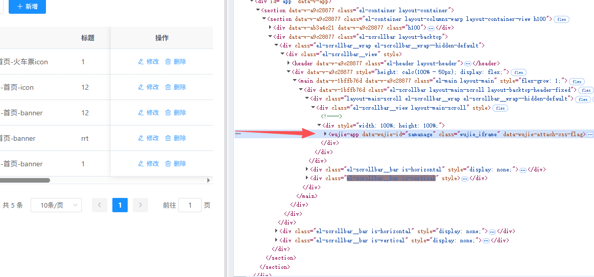
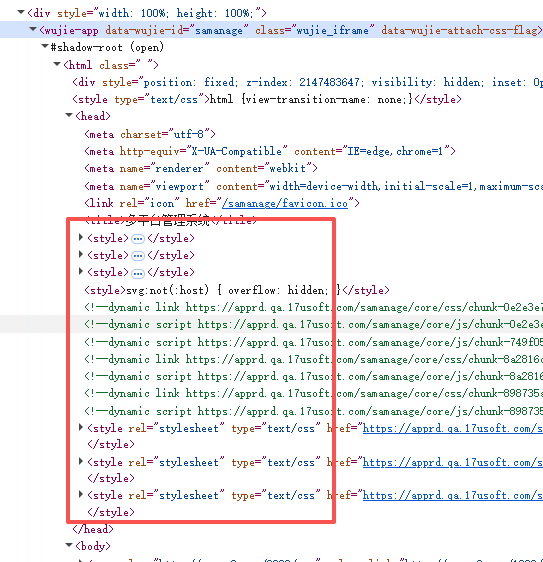
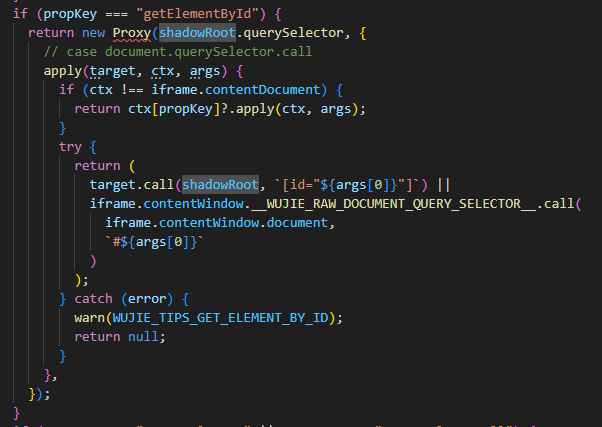

---
# You can also start simply with 'default'
theme: seriph
# random image from a curated Unsplash collection by Anthony
# like them? see https://unsplash.com/collections/94734566/slidev
# background: https://cover.sli.dev
# some information about your slides (markdown enabled)
title: wujie
class: text-center
# https://sli.dev/features/drawing
drawings:
  persist: false
# slide transition: https://sli.dev/guide/animations.html#slide-transitions
transition: slide-left
# enable MDC Syntax: https://sli.dev/features/mdc
mdc: true
background: ./bg.png
---

# wujie(无界)

## 极致的微前端框架

---

# 微前端的发展历程



---
layout: center
---

# 什么是微前端

### 将<span v-mark.highlight.yellow="0">微服务</span>的思想拓展到前端的一种<span v-mark.highlight.yellow="0">新兴架构</span>，背后主要思想是将一个单体项目，拆解为多个较小的部分，以便多个相对独立的团队进行分工写作。

---
layout: two-cols
---

# 微前端的三大核心模块



::right::

<div class="flex flex-col justify-center h-[100%]">

- 基座应用：作为「容器 + 调度中心」，提供全局路由、公共配置，通过 加载器 管理所有子应用
- 加载器：基座的核心子模块，是「基座与子应用的桥梁」
- 子应用：独立的业务模块

</div>

---
layout: center
---

# 微前端的设计原则

<div v-click="1">1. 技术栈无关：基座不限制微应用的技术栈，微应用可使用 React、Vue 等任意框架，甚至无框架</div>
<div v-click="2">2. 独立开发 / 部署: 每个微应用是独立的代码库，有自己的 CI/CD 流程，发布不依赖其他微应用；</div>
<div v-click="3">3. 隔离运行: 微应用的 JS、CSS 不会污染全局环境，运行时状态互不干扰（如全局变量、事件监听、样式冲突）；</div>
<div v-click="4">4. 用户体验一致: 尽管技术栈不同，微应用间的路由切换、样式风格、交互逻辑需保持统一，让用户感知不到「拆分」</div>

---

# 适合使用微前端的场景

- 大型复杂应用的拆分
- 多团队协作开发
- 技术栈多样化
- 渐进式迁移



---
layout: center
---

# 主流的微前端方案有哪些

- iframe
- single-spa
- qiankun
- wujie

---

# iframe

iframe 是 HTML 中的一个内联框架元素，核心作用是在当前页面中嵌入另一个独立的 HTML 文档（可来自同一域名或跨域名），形成「页面嵌套页面」的效果。嵌入的文档拥有独立的 DOM、BOM、CSS 样式环境和 JavaScript 执行上下文，与父页面完全隔离，互不干扰。

<div class="flex gap-[20px]">
  <div>
    <div class="text-[20px] font-bold">优点</div>
    <div>1、非常简单，使用没有任何心智负担</div>
    <div>2、web应用隔离的非常完美，无论是js、css、dom都完全隔离开来</div>
  </div>
  <div>
    <div class="text-[20px] font-bold">缺点</div>
    <div>1、路由状态丢失，刷新一下，iframe的url状态就丢失了</div>
    <div>2、dom割裂严重，弹窗只能在iframe内部展示，无法覆盖全局</div>
    <div>3、web应用之间通信非常困难</div>
  </div>
</div>

---

# single-spa

single-spa 是 最早（2017 年开源）的微前端核心框架，核心定位是「跨框架应用的加载与生命周期管理器」—— 它不提供样式隔离、全局通信、公共依赖共享等上层能力，而是专注解决「如何在一个页面中加载、切换、卸载不同技术栈的应用（微应用）」这一核心问题

<div class="flex gap-[20px]">
  <div>
    <div class="text-[20px] font-bold">优点</div>
    <div>1、定义了微应用的生命周期标准和路由匹配机制</div>
    <div>2、监听路由自动的加载、卸载当前路由对应的子应用</div>
  </div>
  <div>
    <div class="text-[20px] font-bold">缺点</div>
    <div>1、基于路由匹配，无法同时激活多个子应用，也不支持子应用保活</div>
    <div>2、本身只做「加载与生命周期管理」，样式隔离、通信、资源共享等能力可按需扩展</div>
  </div>
</div>

---

# qiankun

它基于 single-spa 封装，补充了 JS/CSS 沙箱隔离、全局通信、公共依赖共享、预加载 等工程化能力，解决了 single-spa 需手动扩展上层能力的痛点，提供「开箱即用」的微前端解决方案

<div class="flex gap-[20px]">
  <div>
    <div class="text-[20px] font-bold">优点</div>
    <div>1、监听路由自动的加载、卸载当前路由对应的子应用</div>
    <div class="w-[400px]">2、完备的沙箱方案，js沙箱做了SnapshotSandbox、LegacySandbox、ProxySandbox三套渐进增强方案，css沙箱做了两套strictStyleIsolation、experimentalStyleIsolation两套适用不同场景的方案</div>
    <div>3、路由保持，浏览器刷新、前进、后退，都可以作用到子应用</div>
  </div>
  <div>
    <div class="text-[20px] font-bold">缺点</div>
    <div>1、基于路由匹配，无法同时激活多个子应用，也不支持子应用保活</div>
    <div>2、css 沙箱无法绝对的隔离</div>
    <div>3、无法支持 vite 等 ESM 脚本运行</div>
  </div>
</div>

---
layout: center
---

# wujie

### 核心采用 WebComponent + iframe 的创新架构，主打零侵入接入、原生级隔离与高性能体验，能轻松实现多技术栈子应用的集成，尤其适合旧系统迁移和多团队协作的大型项目

---

# 优点

- 多应用同时激活在线： 框架具备同时激活多应用，并保持这些应用路由同步的能力

- 组件式的使用方式：无需注册，更无需路由适配，在组件内使用，跟随组件装载、卸载

- 应用级别的 keep-alive：子应用开启保活模式后，应用发生切换时整个子应用的状态可以保存下来不丢失，结合预执行模式可以获得类似ssr的打开体验

- 纯净无污染

  - 无界利用iframe和webcomponent来搭建天然的js隔离沙箱和css隔离沙箱
  - 利用iframe的history和主应用的history在同一个top-level browsing context来搭建天然的路由同步机制

- 性能和体积兼具

  - 子应用执行性能和原生一致，子应用实例instance运行在iframe的window上下文中，避免with(proxyWindow){code}这样指定代码执行上下文导致的性能下降，但是多了实例化iframe的一次性的开销，可以通过 preload 提前实例化
  - 体积比较轻量，借助iframe和webcomponent来实现沙箱，有效的减小了代码量

---
layout: center
---

# wujie的运行机制

- js 沙箱：iframe
- css 沙箱：web component

---
layout: center
---

# js 沙箱

### iframe：是 HTML 中的一个内联框架元素，核心作用是在当前页面中嵌入另一个独立的 HTML 文档（可来自同一域名或跨域名），形成「页面嵌套页面」的效果。嵌入的文档拥有独立的 DOM、BOM、CSS 样式环境和 JavaScript 执行上下文，与父页面完全隔离，互不干扰。

<div class="flex justify-center items-center h-[100%] w-[100%] gap-[50px] mt-[30px] text-[30px]">
  <div v-click="1">
    <span v-mark.highlight.yellow="1">一个HTML标签</span>
  </div>
  <div v-click="2">
    <span v-mark.highlight.yellow="2">一个DOM NODE </span>
  </div>
</div>

---
layout: center
---

# 如何创建一个iframe

```html
<iframe
  src="https://example.com"
  width="600"
  height="400"
  style="border:none;"
></iframe>
```

```js
const iframe = document.createElement('iframe');
iframe.src = 'https://example.com';
iframe.width = '600';
iframe.height = '400';

document.body.appendChild(iframe);
```

---
layout: center
---



---
layout: center
---



---
layout: center
---



---
layout: center
---




---
layout: center
---

# Proxy 对象

### Proxy 是 ES6 引入的元编程（Meta Programming）对象，核心作用是为目标对象（如对象、数组、函数）创建一个「代理层」，拦截并自定义目标对象的基础操作（如属性访问、赋值、删除、函数调用等），无需修改目标对象本身即可实现逻辑增强。

---
layout: center
---

```js
(function(window, self, global, location) {
  console.log('This is running inside the iframe sandbox');
}).bind(window.__WUJIE.proxy)(
  window.__WUJIE.proxy,
  window.__WUJIE.proxy,
  window.__WUJIE.proxy,
  window.__WUJIE.proxyLocation,
);
```

---
layout: center
---

# css 沙箱

## web component ：Web 组件是一套不同技术的集合，允许开发者创建可重用的自定义元素，并在网页和 Web 应用中使用这些元素。Web 组件主要由四个核心技术组成：
<br />

- 自定义元素（Custom Elements）：允许开发者定义自己的 HTML 标签及其行为。
- <span v-mark.highlight.yellow="0"> Shadow DOM：为自定义元素提供封装的 DOM 和样式，防止样式和脚本冲突。</span>
- HTML 模板（HTML Templates）：定义可重用的 HTML 结构。

---
layout: center
---

```html
  <user-card></user-card>
  <script>
    class UserCard extends HTMLElement {
      constructor() {
        super();
        const shadow = this.attachShadow({ mode: 'open' });
        const style = document.createElement('style');
        style.textContent = `
          .card {
            border: 1px solid #ddd;
            border-radius: 8px;
            padding: 20px;
            width: 200px;
            box-shadow: 0 2px 8px rgba(0,0,0,0.1);
          }`;
        const card = document.createElement('div');
        card.className = 'card';
        card.innerHTML = `
          
          <div class="name">${this.getAttribute('name')}</div>`;
        shadow.appendChild(style);
        shadow.appendChild(card);
      }
    }
    
    customElements.define('user-card', UserCard);
  </script>
```

---
layout: center
---



---
layout: center
---



---
layout: center
---



---
layout: center
---

# 基于wujie的系统架构

<div class=" flex items-center justify-center h-[100%] w-[100%]">
  <div class=" flex items-center justify-center h-[100%] w-[70%]">


  </div>
</div>

---

# 微前端框架集成与开发

1. 安装依赖

```bash
npm install wujie-vue3 --save
```

2. 在基座应用中集成 wujie

```js
setupApp({
  name: "samanage",
  url: import.meta.env.VITE_APP1_URL,
  alive: true
});
```

3. 展示子应用

```html 
<template>
	<WujieVue v-if="multPlatformUrl" width="100%" height="100%" name="samanage" :url="multPlatformUrl" :fetch="fetchSelf"></WujieVue>
</template>
```

---

# 问题解决

1. 开发环境的代理服务处理： 开发环境本地`localhost`域名主应用，加载`预发或者qa环境`子应用存在跨域，所以要通过构建工具配置代理服务解决跨域问题。


---

# 页面加载为携带http header 标识

```ts
const fetchSelf = async (url: string, options: RequestInit) => {
	return fetch(url, {
		...options,
    redirect: 'manual',
		headers: {
			'x-sa-admin': 'sam'
		},
	}).then((res) => {
    if(res.type==='opaqueredirect'){
      Session.clear();
      oaLogin();
      return;
    }
    return res;
  }).catch((err) => {
    console.error('Fetch error:', err);
    throw err;
  });
};
```

---

# 问题解决

-  子应用下载有权限验证

在测试过程中发现，多平台系统的导出下载功能都是通过http协议的能力实现的，通过配置的Content-Type确定文件类型，Content-Disposition确定下载行为。前端实现方式为链接跳转，浏览器的http客户端下载，导致在微前端架构下无法将子系统的自定义头字段x-sa-admin:sam带上鉴权用户身份，下载失败。

```js
async function downloadFile(url, filename) {
  try {
    // 1. 发起 fetch 请求（可携带 headers 如认证信息）
    const response = await fetch(url, {
      method: 'GET',
      headers: {
        'x-sa-admin': 'sam', // 如有权限验证
      }
    });

    if (!response.ok) {
      throw new Error(`请求失败：${response.status}`);
    }

    // 2. 将响应转为 Blob 对象（自动识别 MIME 类型）
    const blob = await response.blob();

    // 3. 生成临时 URL
    const objectUrl = URL.createObjectURL(blob);

    // 4. 创建 <a> 标签触发下载
    const a = document.createElement('a');
    a.href = objectUrl;
    a.download = filename || 'download'; // 文件名（可从后端响应头获取）
    document.body.appendChild(a);
    a.click();

    // 5. 清理资源
    document.body.removeChild(a);
    URL.revokeObjectURL(objectUrl); // 释放 Blob URL 占用的内存

  } catch (error) {
    console.error('下载失败：', error);
  }
}
```

---

# 问题解决

- 子系统（多平台管理系统）文件上传组件文件上传失败

新的微前端系统架构中，子系统需要将所有的请求都携带上http header 标识，页面加载，接口请求等等，文件上传组件的请求并没有统一封装，都散落在各个页面中，没进行新架构的兼容处理。

因为文件上传组件都散落在各个页面当中，为了避免下次维护开发时的失误，所以将其进行封装，统一开发维护

---

# 问题解决

- 同域名系统下token冲突

因部门内部多个系统都是直接挂在同域名https://apprd.t.17usoft.com下的二级目录下的，比如crm(crm管理平台),samanage(多平台系统)，saadmin(sa系统)等等，都是同域名下的，同时系统都是出自一个前端开发框架，导致对于token的处理一致，都是存储到cookie当中，当多个系统互相打开时，其他系统会因为token错误重新登录，返回其他系统后会出现同样问题，包括localStroge,sessionStroge等等都存在相同问题。


1. 我们将所有的cookie，localStroge，sessionStroge等等操作原本硬编码到代码里的方式统一放到单独文件模块中进行管理，给其加上系统命名前缀做区分。
2. 为了防止失误，封装通过TS类型约束，一个运行时检查，防止误用。


---

# 问题解决

- 融合后的整体页面兼容性检查与调整等


---

# 问题解决

- elelment-plus popover弹框组件在微前端框架wujie中定位偏移

微前端框架wujie中,为了隔离子应用之前的运行环境，js运行在iframe中，css运行在shadow dom中，导致fixed定位的元素的位置计算是根据iframe的位置进行定位，但iframe又只是真个页面的一部分，当shadow dom中的元素使用iframe中计算的位置设置就会出现偏差。

因为fixed固定定位是相对于浏览器窗口定位的，所以我们只要将fixed定位的元素通过css 样式权重的方式将元素样式强制设置成absolute决定定位的方式，因为absolute定位是相对于带有relative相对定位的父元素的定位的，只要在body元素上设置relative定位即可修正问题

---
layout: center
---

[Presentation Slides for Developers](https://sli.dev)